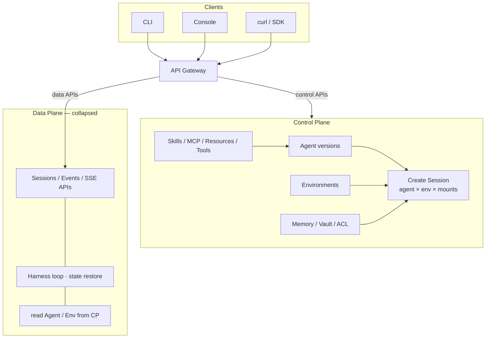
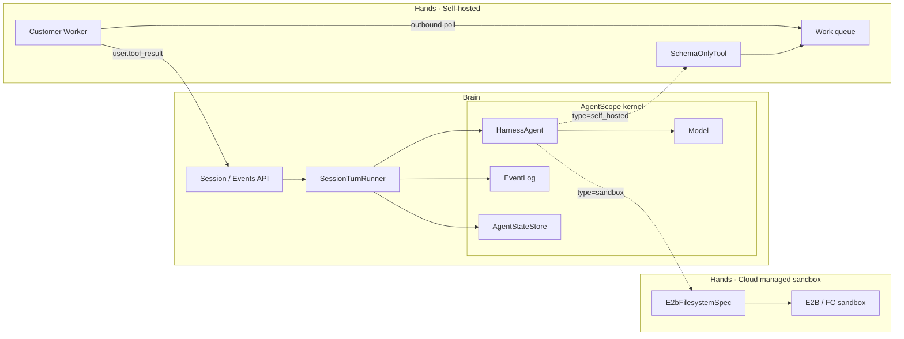
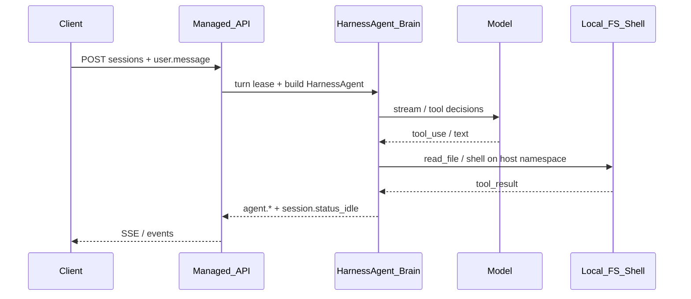
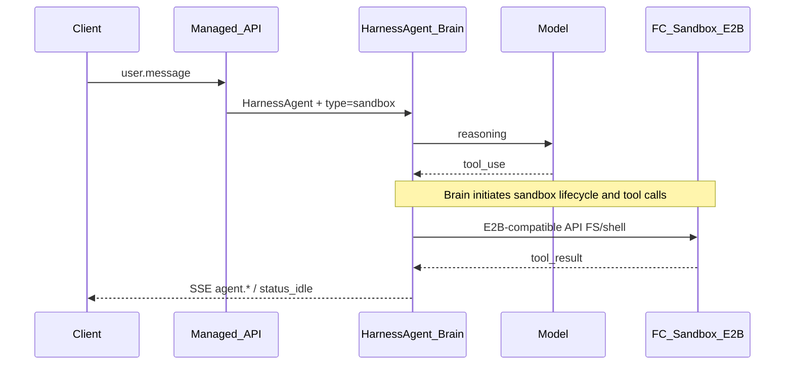
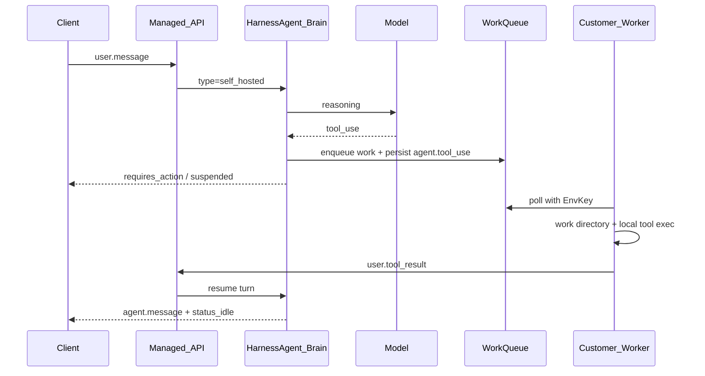

# 基于 AgentScope 2.0 构建 Managed Agents：从 Harness 到 Brain / Hands 分离

本文面向希望把 Coding Agent / Harness 能力产品化的架构师与开发者。文中“对等”主要指 **Agent、Environment、Session、Events、HITL 和 Self-hosted Worker 等资源与交互模型同构**，不表示当前开源实现已经覆盖 Claude Managed Agents 或其他产品的全部 Files、Threads、网络策略、Worker SDK 与 SLA。当前实现边界以仓库中的 `MANAGED_AGENTS_API.md`、`SANDBOX_GAPS.md` 和 `SELF_HOSTED_GAPS.md` 为准。

我们基于 AgentScope 2.0 研发了一套 Managed Agents 平台。它在 Agent、Environment、Session、Events、HITL 和 Self-hosted Worker 等核心资源上，采用了与 Claude Managed Agents、LangChain Managed Agents 相近的产品抽象；在实现上，则直接复用 AgentScope 2.0 的 Harness 与 Sandbox 能力，并在外围补齐 SaaS API、多租治理和运维体系。

> 如果您看过我们此前发布的开源 Agent Builder，可以把 Managed Agents 理解为它的产品化升级：底层运行时和主要代码路径没有换，变化的是资源模型、API 契约、执行面边界以及面向多租户的治理方式。
>

这套产品化工作不是「再写一套 agent loop」，而是把 AgentScope 2.0 中已经工程化的 `HarnessAgent` 直接作为 Brain 运行时。长期运行、工作区、会话恢复、可选压缩、Skills、Subagents、文件系统与沙箱抽象都由内核提供；控制面资源（Agent / Environment / Memory / Vault / Deployment）和数据面契约（Session / Events / SSE）则把这些能力组织成可多租、可审计、可运维的托管产品。简而言之：**内核提供稳定的推理与 Harness 能力，外围负责租户、权限、版本、事件和执行面选型。**

开源仓库入口在 `agentscope-service`；产品指南见同目录下 `docs/guide/`。下文既讲「为什么这样设计」，也用可复制的 HTTP 示例走通 Local / Cloud Sandbox / Self-hosted 三条执行路径。

> **先说结论**
>
> - Managed Agents 不是把低代码画布换成 API，而是把过去由应用开发者自行拼装的记忆、压缩、状态恢复、技能加载和沙箱生命周期收进一套受版本约束的 Harness。
> - Agent 定义“做什么”，Environment 决定“在哪里动手”，Session 保存“这一次运行发生了什么”，Events 则是客户端与运行时之间唯一稳定的数据面语言。
> - Local、Cloud Sandbox、Self-hosted 的 Agent 定义可以相同；变化的是 Hands 所处的信任边界，以及谁负责发起工具调用和管理沙箱生命周期。
> - AgentScope 2.0 的价值不是多提供几个工具，而是让 HarnessAgent 实例可以被重建；会话、记忆和事件从共享状态恢复，工作区连续性则由 BaseStore、沙箱快照或客户侧持久化保证。

## Managed Agents 背景
从本质上来讲，我不认为 Managed Agents 产品与以往的低代码 agent 平台在产品形态上有多大区别，它们本质上都是给你一个包含 “Agent 定义 & 运行” 能力的托管平台，只不过在产品表现形式上，Managed Agents 在 harness 时代更突出以下两点：

1. **不再让业务开发者拼装 Harness。**传统平台常常把记忆维护、上下文压缩、状态恢复、工具权限和子任务回收拆成大量配置项。Managed Agents 把这些通用工程能力收进统一 Harness，开发者主要定义与业务相关的 Skills、Tools、Subagents 和权限策略。平台保证机制的一致性与可升级性，但最终任务效果仍取决于模型、system prompt、Skill 质量、工具返回值和业务评测。
2. **让客户掌握工具执行和数据回传边界。**对企业用户而言，Agent 真正产生价值的地方是与企业数据资产连接，而 shell、文件读写、MCP 和业务工具正是数据流动的入口。为此，系统刻意拆分 **Brain（推理编排）** 与 **Hands（工具执行）**：Brain 负责下一轮推理、状态恢复和上下文管理；Hands 负责真正接触文件、网络与业务系统。Hands 可以运行在平台托管的 Cloud Sandbox，也可以运行在客户 VPC 内的 Self-hosted Worker。

这种分离并不意味着“所有数据天然不出域”。当前开源参考 Worker 外化的是内置 shell / 文件系统工具，如 `execute`、`read_file`、`write_file`；客户自定义工具注册 SPI、内网 MCP 包装入口仍是 P0 缺口。Agent body 中声明的 stdio / HTTP MCP 也不会自动迁移到客户 Worker。Self-hosted 能明确保证的是：**已接入 Worker 协议的工具在客户侧执行**；与此同时，工具 schema、调用参数以及客户选择回传的结果仍会进入 Brain。生产部署必须逐项确认执行位置、网络路径与结果回传策略。

第一点真正改变的是平台的抽象层级。传统低代码平台往往让用户决定“什么时候总结记忆、超长上下文怎么截断、工具异常重试几次、子任务怎样回收”。这些选项看起来灵活，实际上把 Harness 的工程责任转嫁给了业务开发者：同一个 Agent 因为配置者经验不同，效果和稳定性可能完全不同。Managed Agents 则只暴露业务差异，例如角色提示、Skills、MCP、工具权限和 Environment；至于压缩时机、会话恢复、工具结果淘汰、长期记忆刷新等，交给持续演进的 Harness。平台升级 Harness 后，所有 Agent 都能获得同一套工程改进，而不必逐个修改流程图。

第二点改变的是信任边界。模型决定“要调用什么”，不等于模型所在的进程必须“亲自执行什么”。只要工具调用被表示为稳定的 schema、`tool_use_id` 和结果事件，Hands 就可以被迁移到平台云沙箱或客户 VPC，而不改变 Brain 中的推理循环。这让安全团队能够分别回答三个问题：模型能看到哪些上下文？工具能访问哪些网络和文件？工具结果中哪些内容可以回传给 Brain？这三个问题被拆开以后，权限审核和故障定位都比“一整个 Agent 容器”清晰得多。

回到 Claude Managed Agents，它被开发者接受的一个重要背景，是 Claude Code 已经证明了成熟 Coding Agent Harness 的产品价值。用户看到的是模型推理和任务结果，平台真正托管的却是 **可恢复的会话状态、工程化运行策略和可替换的 Hands**。AgentScope 2.0 采用了相似的分层思路：`HarnessAgent` 处理长任务、上下文溢出、状态恢复和任务委派，Managed Agents 再向外补上多租户资源、Environment 与稳定的数据面契约。

有了 Managed Agents 后，Anthropic 在个人、企业用户之间几个不同层次都有对应的解决方案，层层递进：

+ **Claude Code CLI** 面向个人或单机开发工作流，Agent 与本地工作区、终端和会话记录直接结合。
+ **Claude Agent SDK** 把 Session、事件流和工具交互 API 化，适合嵌入企业应用；身份、租户和资源隔离仍由接入方负责。
+ **Managed Agents** 进一步把 Agent、Environment、Session 与执行面变成托管资源，由平台处理版本、权限和运行时治理。

这三层的区别不只是“封装越来越厚”，而是状态归属逐步上移：

| 形态 | 主要状态在哪里 | 谁负责隔离 | 适合谁 |
|---|---|---|---|
| CLI / 单机应用 | 本机目录与本地会话 | 操作系统用户 | 个人提效 |
| SDK / Harness | 应用提供的 SessionStore / StateStore | 应用开发者 | 单个企业应用 |
| Managed Agents | 平台控制面、共享状态库、Session 事件日志 | 平台按 User / Agent / Environment 管理 | 多团队、多租户平台 |

这张表是本文为了讨论状态归属而做的作者抽象，并不是 Anthropic 的官方产品分级。相关产品能力应以 [Claude Managed Agents overview](https://platform.claude.com/docs/en/managed-agents/overview)、[sessions](https://platform.claude.com/docs/en/managed-agents/sessions) 和 [events reference](https://platform.claude.com/docs/en/managed-agents/reference) 为准；“企业级”“多租”也应通过具体的身份、ACL、数据驻留和 SLA 条款验证，而不是仅根据产品名称推断。

所以 Managed Agents 的核心门槛并不是再加一个 REST Controller，而是要让同一份 Agent 定义在不同用户、不同版本、不同执行面上仍保持可解释的行为。Agent 版本记录定义变化，RuntimeContext 解决“当前是谁、在哪个 Session”，Environment 解决“工具在哪里执行”，事件日志解决“发生过什么以及怎样恢复”。版本是否真正隔离，还取决于运行时是否完整按快照重建所有字段。

映射到 AgentScope 生态，大致是：单机 / 单应用直接用 `HarnessAgent`（类似 CLI/SDK 心智）；要给团队或公司用，就上 Builder / Managed Agents——同一套内核能力，多了一层用户隔离、版本化 Agent、Environment 选型与 Session 事件契约。我们内部常说的一句话是：**只是给你自己用，请用 claw；同样的能力要给一个团队、一家公司用，那就是 Builder。**

这里的 `claw` 是内部对单用户 Harness 应用形态的简称，不是本文定义的公共 API 或部署类型。外部读者可以把它理解成“直接使用 `HarnessAgent` 构建单用户应用”；Builder 则是在同一内核上增加多租、版本、Environment、Session 与审计。


## 为什么 AgentScope 2.0 适合做 Managed Agents 底座
AgentScope 2.0 的模型抽象、工具与 MCP、消息与事件、状态存储、远程文件系统 / 分布式 BaseStore，以及可插拔沙箱，都为进程外持久化和多副本部署预留了扩展点。这使 Managed Agents 无需从零实现会话恢复、工具结果落盘与跨请求上下文延续，但水平扩展仍有明确前提：数据面副本必须共享 `AgentStateStore`、Workspace 后端和 `CoordinationStore`，并正确处理 turn 租约与节点切换。

其中，Workspace 是 Agent 使用的逻辑目录，Filesystem / Sandbox 是承载它的物理后端。两者通过 `AbstractFilesystem` 解耦：同一套文件工具既可以指向本机目录，也可以指向分布式 BaseStore 或 E2B 沙箱。正因为逻辑工作区与物理执行面分离，Agent 定义才能在不改业务提示词的情况下切换隔离策略。

具体来说，`agentscope-harness` 在 `ReActAgent` 之上通过 Hook / Toolkit 装配长期运行所需的工程默认项，例如：

- **工作区驱动的人格与知识**：`AGENTS.md` / `MEMORY.md` / `KNOWLEDGE.md` 等注入系统提示；
- **会话持久化**：按 `sessionId` 恢复 agent 状态，进程重启后仍能续聊；
- **压缩与溢出处理**：Harness 默认启用 compaction 与 tool-result eviction，并允许业务覆盖阈值或显式关闭；
- **Skills / Subagents**：工作区 skills、任务委派（`task` 等）开箱可用；
- **统一文件系统抽象**：本地、远程 KV、云沙箱（E2B 等）走同一套工具语义，便于 Managed Agents 用 Environment `type` 切换执行面而不改 Agent 业务定义。

这些能力不是互相独立的名词。一次长任务可能先从 `SessionPersistenceHook` 恢复消息与 agent state，再由工作区 Hook 注入 `AGENTS.md` 和已安装 Skills；推理过程中如果上下文逼近窗口上限，压缩 Hook 会收敛历史，而较大的工具结果可以被淘汰到文件系统中，仅把可检索引用留在上下文里；需要并行研究时，主 Agent 又可以把任务交给 Subagent。最终，无论文件系统落在本地、远程 KV 还是 E2B，模型看到的工具语义保持一致。这种**组合后的稳定性**才是 Harness 作为平台内核的意义。

`HarnessAgent.Builder` 默认装配 compaction 与 tool-result eviction：前者根据模型上下文窗口计算触发阈值，后者默认在工具结果累计达到约 80k 字符时执行淘汰；只有调用 `disableCompaction()` / `disableToolResultEviction()` 或传入空配置时才关闭。Builder 当前继承这套默认行为。生产上线前仍应根据模型窗口、工具结果体积和任务长度覆盖阈值，并通过长会话回归验证。

另外，HarnessAgent 与 Session 不是同一个生命周期。前者是在具备共享 `AgentStateStore` 与可恢复 Workspace 后端的数据面节点上重建的运行对象，后者是有稳定 ID、事件序列和持久状态的产品资源。分清这两者，才能做真正的水平扩展：节点挂掉时可以丢弃 Java 对象，但对话与长期记忆必须从共享状态恢复；工作区是否连续则取决于 BaseStore、沙箱快照或客户侧持久化，Local 目录并不具备这一保证。

“可以重建”不等于“每个请求都重新 `new` 一个实例”。当前 Builder 会按 `(owner, agent, version, environment, mounts)` 缓存并复用 `HarnessAgent`；只有首次构建、版本或挂载变化、缓存失效以及节点切换时才重建。可水平恢复成立的依据是**权威状态外置**，实例缓存只是性能优化，不能被当作状态真相源。

从单个企业智能体应用走向 Managed Agents，关键不是改写推理内核，而是把运行能力提升为稳定的平台资源。这里所说的“一层平台 API”绝不只是增加几个 Controller；真正产品化还要补齐租户 ACL、Agent 版本快照、Session 状态机、append-only 事件、turn 租约、HITL ticket、Environment key、Worker 队列、共享协调存储和归档审计。Harness 让平台不必重写 agent loop，但这些分布式职责仍是独立的工程系统。

由此可以形成一条清晰的产品组合：SaaS 控制面负责资源治理，AgentScope 2.0 提供运行内核，FC Sandbox / E2B 或客户 Worker 承接不同信任边界下的 Hands。

在 Builder 实现里，对外入口包括 `/api/agents`（版本化定义）、`/api/environments`（执行面模板）、`/api/sessions` + `/events`（运行与事件），以及 `self_hosted` 下的 Worker work 队列。符合 Builder 所需 E2B 接口子集并通过读写、执行、回收与隔离验收的 FC Sandbox，可以作为 `type=sandbox` 的 Hands，无需另造一套私有沙箱协议。

## Managed Agents 平台详解
### 总体部署架构

下面拆成两张图：**控制面**（定义与创建）与 **数据面**（Brain / Hands 运行）。原先合在一张的总览图仍可对照内网 SVG；此处以可移植 mermaid 为准。

#### 图 1 · 控制面

CLI / Console / curl 先打到 **API Gateway**；Gateway 按 API 面把请求路由到 **控制面** 或 **数据面**。本图重点在控制面：定义 Skills、MCP、Resources、Agent，创建 Environment / Session（含 Memory、Vault、ACL）。数据面同样对外暴露 API（Sessions / Events / SSE），此处只作折叠示意。



#### 图 2 · 数据面（Brain / Hands）

数据面展开 Brain 推理闭环，以及两类 Hands：**Cloud managed sandbox**（Brain 主动调 E2B/FC）与 **Self-hosted Worker**（出站 poll + `user.tool_result` 续跑）。`HarnessAgent` / Model / EventLog / AgentStateStore 属于 **AgentScope 内核**。



结合实现，可以把整套系统读成四层（与 Claude MA 的 Brain / Hands 叙事一致）：

| 层 | 职责 | Builder 中的落点 |
|---|---|---|
| **控制面** | 租户资源、Agent 版本、Environment、Memory/Vault、ACL | `/api/agents`、`/api/environments`、`/api/memory-stores`、`/api/vaults` 等 |
| **数据面** | Session 生命周期、事件落库、SSE、turn 租约 | `/api/sessions`、`SessionEventLog`、`SessionTurnRunner` |
| **运行时 Brain** | 解析定义、命中缓存或重建 → 按 RuntimeContext 恢复 → `HarnessAgent.streamEvents` | AgentScope `HarnessAgent` |
| **Hands** | 真正碰文件 / shell / 外化工具 | `local` 本机、`sandbox`=E2B/FC、`self_hosted`=用户侧 Worker |

四层之间通过“引用”和“事件”而不是进程内对象耦合。控制面里的 Agent 与 Environment 都是可重复使用的模板；Session 保存 Agent 版本、Environment ID 和挂载资源等引用；数据面节点按这些引用构建运行时。Environment 因而可以在不复制 Agent 定义的情况下复用。需要注意的是，对于用户创建的 Agent，当前版本 pin 对 name、system、model、maxIters 等核心字段生效，但 tools / MCP / skills / multiagent 还没有全部从历史快照重建；全局 Agent 也尚未走同一套历史恢复路径。缓存失效后仍可能读取当前 Workspace 配置，因此不能把 pin 理解为完整定义的强隔离。对运维来说，控制面适合低频强一致管理，数据面则面对高频消息与 SSE，两者可采用不同的缓存和扩缩容策略。

实现上这里是“按引用解析并构建或命中缓存”：首次请求创建运行时，后续相同构建键可以复用实例；节点切换或缓存失效后，再结合当前已应用的快照字段、Workspace 配置与外置状态重建。事件日志只负责客户端补流与审计，`AgentStateStore` 负责 Brain 状态，Workspace / Sandbox 与外部业务系统分别保存文件和副作用，四者各有自己的真相边界。

多副本时：权威业务状态在共享 JDBC（Agent 目录、Session 事件、`AgentStateStore`）；短时协调（turn 租约、HITL 票、work 队列）走 `CoordinationStore`（默认同库表，可换 Redis）。流式 `event_deltas` 仅 turn-owner best-effort，**落库事件才是真相源**。

### 创建一个托管 Agent 并运行
下面先完成最小初始化：登录 Builder，创建一个可复用的 Workspace Copilot Agent，再让它分别运行在 Local、Cloud Sandbox 和 Self-hosted 三种 Environment 中。三条路径共用同一个 `$AGENT_ID`，便于直观看到“Agent 定义不变，Hands 位置改变”。

下文假设 Builder 已启动在 `http://localhost:8080`，并已配置模型密钥（如 `DASHSCOPE_API_KEY`）。默认种子账号 `admin` / `admin`（生产务必改密）。完整步骤亦可对照 `docs/guide/03-quickstart.md`。

**0. 登录**

```bash
export BASE=http://localhost:8080
TOKEN=$(curl -fsS -X POST "$BASE/api/auth/login" \
  -H 'Content-Type: application/json' \
  -d '{"username":"admin","password":"admin"}' | jq -er .token)
```

**1. 定义示例 Agent（后续三种 Environment 共用）**

我们创建一个偏「工作区助手」的 Agent：系统提示简短，放开 `read_file` / `list_files` / `write_file`，便于演示工具与 Hands 差异。

```bash
AGENT=$(curl -fsS -X POST "$BASE/api/agents" \
  -H "Authorization: Bearer $TOKEN" \
  -H 'Content-Type: application/json' \
  -d '{
    "name": "Workspace Copilot",
    "description": "blog demo agent",
    "system": "You are a workspace copilot. Prefer tools when listing or reading files. Keep answers concise.",
    "tools": [{
      "type": "agent_toolset",
      "defaultConfig": {
        "enabled": true,
        "permissionPolicy": { "type": "always_allow" }
      },
      "configs": [
        { "name": "read_file", "enabled": true },
        { "name": "list_files", "enabled": true },
        { "name": "write_file", "enabled": true }
      ]
    }]
  }')
AGENT_ID=$(echo "$AGENT" | jq -er .id)
echo "AGENT_ID=$AGENT_ID"
```

Agent body 已收拢 `system` / `tools[]`（含 `permissionPolicy`）/ `mcpServers` / `skills`。Session 会记录 Agent 版本，当前运行时可据此恢复 name、system、model、maxIters 等核心字段；tools / MCP / skills / multiagent 的完整历史重建仍在完善。对于 `agent_toolset` 中需要 HITL 的内置工具，可把 `permissionPolicy.type` 设为 `always_ask`。

这里有两个设计细节值得展开。第一，`agent_toolset` 不是简单的工具名列表，而是“工具集合 + 默认策略 + 单工具覆盖”：可以让整组内置工具默认可用，再把写文件、发布、转账之类高风险动作单独设为 `always_ask` 或 `deny`。当前确认策略只解析 `agent_toolset`，不能据此推断 `mcp_toolset` 已具备同样的 HITL 语义。第二，Agent 更新会形成新版本；创建 Session 时可以引用最新版，也可以 pin 到指定版本。现阶段 pin 适合固定核心模型与提示配置，但完整定义回放仍需等待 tools / MCP / skills / multiagent 的快照重建闭环。

接下来三种模式复用同一个 `$AGENT_ID`。它们不是三种不同 Agent，而是同一 Brain 定义在三条 Hands 路径上的运行方式：

| 模式 | 工具在哪里执行 | 谁发起工具调用 | 数据边界 | 典型用途 |
|---|---|---|---|---|
| Local | Builder 宿主机 | Brain 进程 | 托管集群内部 | 开发与可信环境 |
| Cloud Sandbox | E2B / FC 云沙箱 | Brain 通过 E2B 兼容 API | 平台云沙箱 | 托管隔离执行 |
| Self-hosted | 客户 Worker / 客户沙箱 | 客户 Worker poll 后执行 | 客户 VPC | 私有工作区与内置 shell / FS 工具 |

这个对比也说明了 Environment 的产品价值：它不是 Agent 上一个布尔开关，而是独立、可复用、可授权和可轮换密钥的执行模板。已有 Session 不支持中途切换 Environment；要更换信任边界，应创建新 Session，以免同一条事件历史跨越不同执行语义。

Builder 还支持 `remote` Environment：它把 Workspace 映射到分布式 KV / `BaseStore`，适合多副本共享文件状态，但不提供 shell 执行。因此本文把它作为存储后端能力，而没有列入 Local、Cloud Sandbox、Self-hosted 三条完整 Hands 主路径。

#### Local
Local 模式最适合开发联调。Session、Harness 推理、模型请求和工具执行都由 Managed 集群发起，文件与 shell 直接落在 Brain 进程可见的本地环境中。



在 **Local** 模式下，Environment `type=local`：文件系统与（若启用的）shell 都在托管集群宿主机命名空间内完成，**没有**独立 Hands 队列，也**不**调用云沙箱。适合开发联调与可信内网；不是企业数据面的默认生产选型。

这里的“宿主机”具体指当前 Brain 进程或 Pod 可见的本地文件系统：多副本之间不会天然共享，也不等于为每个租户提供容器级隔离。若希望副本切换后仍看到同一工作区，需要使用共享 BaseStore、可恢复云沙箱或客户侧持久化执行面。

Local 最容易理解，也最容易被误用。它验证的是“Agent 定义、Session、事件和工具链是否工作”，而不是强隔离能力：工具进程与 Brain 共享宿主机安全边界，资源限制和网络访问都取决于应用进程本身。因此，Local 应用于开发、CI 测试或高度可信的单租环境；一旦工具可能执行不受信代码，或不同租户需要 OS 级隔离，就应该切换到 Cloud Sandbox 或 Self-hosted。好处是 Agent 定义无需变化，只需为新 Session 换一个 `environmentId`。

先创建 Local Environment 并保存其 ID：

```bash
ENV_LOCAL=$(curl -fsS -X POST "$BASE/api/environments" \
  -H "Authorization: Bearer $TOKEN" \
  -H 'Content-Type: application/json' \
  -d '{"name":"blog-local","type":"local","config":{}}')
ENV_LOCAL_ID=$(echo "$ENV_LOCAL" | jq -er .id)
```

再用 Agent 与 Local Environment 创建 Session：

```bash
SESSION_LOCAL=$(curl -fsS -X POST "$BASE/api/sessions" \
  -H "Authorization: Bearer $TOKEN" \
  -H 'Content-Type: application/json' \
  -d "{\"agent\":\"$AGENT_ID\",\"environmentId\":\"$ENV_LOCAL_ID\"}")
SESSION_LOCAL_ID=$(echo "$SESSION_LOCAL" | jq -er .id)
```

Session 创建后，可以一边订阅 SSE，一边投递 `user.message`。

另开终端订阅 SSE（可选打字机预览）：

```bash
curl -N "$BASE/api/sessions/$SESSION_LOCAL_ID/events/stream?event_deltas=agent.message" \
  -H "Authorization: Bearer $TOKEN"
```

投递用户消息：

```bash
curl -fsS -X POST "$BASE/api/sessions/$SESSION_LOCAL_ID/events" \
  -H "Authorization: Bearer $TOKEN" \
  -H 'Content-Type: application/json' \
  -d '{"events":[{"type":"user.message","payload":{"text":"List files in the workspace root."}}]}' | jq .
```

观察：`session.status_running` → `span.model_request_*` / `agent.tool_use` / `agent.tool_result` / `agent.message` → `session.status_idle`。历史可用 `GET /api/sessions/$SESSION_LOCAL_ID/events` 拉取。

#### Cloud Sandbox
Cloud Sandbox 保留托管 Brain，但把文件和 shell 移入独立沙箱。Harness 推理、模型请求以及工具调用的发起方仍在 Managed 集群；真正的命令执行和文件读写发生在 FC Sandbox / E2B 兼容环境中。



Builder 的 `type=sandbox` 通过 E2B 客户端协议申请容器，并在容器内执行 shell / FS 操作，**Brain 主动发起调用，Worker 不参与**。若使用兼容 E2B 协议的 FC Sandbox，需要先准备服务地址、模板和 API Key。凭证解析优先级为 Environment `config.apiKey` → `BUILDER_E2B_API_KEY` / `builder.e2b.api-key` → `E2B_API_KEY`；缺少有效凭证时，创建 `sandbox` Environment 会返回 400。

仓库能够直接验证的是 Builder 接入了 `E2bFilesystemSpec` 及其 `apiBaseUrl`、`domain`、`templateId`、认证和超时配置；具体 FC Sandbox 版本是否完整兼容 E2B，需要以服务端官方文档与部署验收为准。初始化时至少应验证：创建 sandbox、同一 sandbox 内连续读写、shell 执行、超时回收、凭证轮换，以及 Session 隔离。不要只因为接口地址可配置就把“协议兼容”当成已经完成的生产认证。

准备好凭证后，创建云沙箱 Environment：

```bash
# 已 export BUILDER_E2B_API_KEY=... 或把 apiKey 写入 config（勿提交仓库）
ENV_SBX=$(curl -fsS -X POST "$BASE/api/environments" \
  -H "Authorization: Bearer $TOKEN" \
  -H 'Content-Type: application/json' \
  -d '{
    "name": "blog-sandbox",
    "type": "sandbox",
    "config": {
      "sandboxTimeoutSeconds": 300,
      "isolationScope": "SESSION"
    }
  }')
ENV_SBX_ID=$(echo "$ENV_SBX" | jq -er .id)
```

可选 `config` 字段还包括 `templateId`、`workspaceRoot`、`apiBaseUrl`、`domain`、`persistenceMode` 等（以当前 `EnvironmentSpecFactory` / 产品文档为准）。**不要**再依赖已废弃的本机 Docker `builder.sandbox.*` 键来驱动 Managed `type=sandbox`。

执行面不能在 Session 中途切换，因此需要创建一个绑定云沙箱的新 Session：

```bash
SESSION_SBX=$(curl -fsS -X POST "$BASE/api/sessions" \
  -H "Authorization: Bearer $TOKEN" \
  -H 'Content-Type: application/json' \
  -d "{\"agent\":\"$AGENT_ID\",\"environmentId\":\"$ENV_SBX_ID\"}")
SESSION_SBX_ID=$(echo "$SESSION_SBX" | jq -er .id)
```

注意：换执行面必须 **新 Session**；已有 Local Session 不能中途改 `environmentId`。

向该 Session 投递写文件任务，即可验证工具是否真正落在云沙箱：

```bash
curl -fsS -X POST "$BASE/api/sessions/$SESSION_SBX_ID/events" \
  -H "Authorization: Bearer $TOKEN" \
  -H 'Content-Type: application/json' \
  -d '{"events":[{"type":"user.message","payload":{"text":"Create notes/hello.txt with one line: hi from sandbox."}}]}' | jq .
```

工具实际落在云端沙箱文件系统；Brain 集群只编排序列并发起 E2B 兼容调用。验收时可对照 `docs/guide/14-validation.md` 路径 B。

Cloud Sandbox 的托管边界可以拆成三个动作：**创建沙箱、在沙箱里执行、在 Session 结束或超时后回收/持久化**。Builder 通过 `E2bFilesystemSpec` 把文件和 shell 工具映射到同一沙箱上下文；`isolationScope=SESSION` 时，不同 Session 默认不会共享工作目录。若选择快照或 TAR 等持久化模式，恢复策略还需要与 `AgentStateStore` 一起考虑：恢复了模型上下文却没有恢复文件，或反过来，都会造成“Agent 记得做过、工作区却不存在”的不一致。生产系统必须把两者当作一个恢复单元设计。

FC Sandbox 兼容 E2B 的意义也在这里：Builder 依赖的是协议与文件系统抽象，而不是某家沙箱内部实现。平台可以替换后端容器服务，同时保持 Agent、Session 与事件 API 不变。这是一种比“给每个 Agent 写一套 Docker 启动脚本”更稳定的产品边界。

#### Self-hosted
Self-hosted 把 Hands 进一步移动到客户环境。Brain 仍在 Managed 集群中完成 Harness 推理，但工具任务进入队列，由客户侧 Worker 主动出站轮询、管理本地工作目录或沙箱，并把结果回传给 Brain。整个过程中，Brain 不需要进入客户网络。



在 Self-hosted 下，Brain **关闭本地 shell/FS 实执行**，把相关工具注册为外化 schema；模型一旦 `tool_use`，事件落库并进入挂起/排队，由用户侧 Worker 持 Environment Key **出站** poll → 管理本地工作目录并执行，或接入客户自有沙箱 → 回传 `user.tool_result` 续跑。这与 Cloud Sandbox「Brain 主动打沙箱 API」正好相反：**执行发起权在用户侧；是否使用以及如何管理沙箱，也由客户侧实现决定**。

Self-hosted 的目标场景是让数据库、代码仓库和发布系统等企业资源留在客户边界内，但当前参考 Worker 开箱支持的范围是内置 shell / FS 工具。数据库、自定义业务工具与内网 MCP 仍需要后续 Worker 扩展 SPI，或由使用方自行在 Worker 外封装。对于已经接入 Worker 协议的工具，Brain 能看到 schema、调用参数和最终回传结果，但不必直接连入客户 VPC；Worker 只需主动向平台发起 HTTPS 请求，并可在回传前做结果脱敏、大小限制和审计。

可靠性也比同步 RPC 更复杂。Worker poll 到任务后需要 ack 并持续 heartbeat；进程崩溃或心跳超时，任务才有机会被重新认领。由于工具可能有副作用，Worker 应围绕 `workId` / `tool_use_id` 实现幂等，特别是发布、写数据库和发送通知这类操作。队列保证的是可重试交付，不会自动保证业务动作恰好执行一次。

首先创建 Self-hosted Environment，并立即保存只展示一次的 Environment Key：

```bash
ENV_SH=$(curl -fsS -X POST "$BASE/api/environments" \
  -H "Authorization: Bearer $TOKEN" \
  -H 'Content-Type: application/json' \
  -d '{"name":"blog-self-hosted","type":"self_hosted","config":{}}')
# 响应中的 environmentKey 明文只出现一次，立刻保存
echo "$ENV_SH" | jq '{id, environmentKey}'
ENV_SH_ID=$(echo "$ENV_SH" | jq -er .id)
ENV_KEY=$(echo "$ENV_SH" | jq -er .environmentKey)
```

随后创建绑定该执行面的 Session：

```bash
SESSION_SH=$(curl -fsS -X POST "$BASE/api/sessions" \
  -H "Authorization: Bearer $TOKEN" \
  -H 'Content-Type: application/json' \
  -d "{\"agent\":\"$AGENT_ID\",\"environmentId\":\"$ENV_SH_ID\"}")
SESSION_SH_ID=$(echo "$SESSION_SH" | jq -er .id)
```

投递消息后，Brain 会产生外化工具调用，再由独立 Worker 获取并执行：

```bash
curl -fsS -X POST "$BASE/api/sessions/$SESSION_SH_ID/events" \
  -H "Authorization: Bearer $TOKEN" \
  -H 'Content-Type: application/json' \
  -d '{"events":[{"type":"user.message","payload":{"text":"Write a short file via tools."}}]}' | jq .
```

进程内 Worker 已随四层拆分移除，开发与生产同一形态：独立运行 `io.agentscope.builder.worker.HandsWorkerMain`（随 service-scheduler jar 发布），并携带 `--environment-key`（详见后文 worker 部署与 `docs/guide/08-hands-worker.md` / `13-operations.md`）。

### 事件机制说明
Managed Agents 不把 SSE 当作一条孤立的输出流，而是围绕 **追加写事件日志** 建立完整的数据面协议。客户端用统一的 `{domain}.{action}` 事件驱动 Session，也用同一套事件消费状态、模型输出、工具调用和错误；SSE 只是这套协议的实时传输方式。

**投递（入站）**：`POST /api/sessions/{id}/events`，body 形如 `{"events":[{"type":"…","payload":{…}}]}`，整批失败则不部分提交；未知 type → 400（`unknown_event_type`）。

| 入站 type | 作用 |
|---|---|
| `user.message` | 落库并触发一轮 turn |
| `user.interrupt` | 中断进行中的 turn |
| `user.tool_confirmation` | HITL 批准/拒绝（推荐 `tool_use_id`） |
| `user.tool_result` | Self-hosted / 外化工具结果，驱动续跑 |
| `user.custom_tool_result` | 自定义工具结果续跑 |
| `system.message` | 仅改本 Session 有效 system，不写回 Agent |
| `user.define_outcome` | 记录 outcome（骨架能力） |

**订阅（出站）**：

- `GET /api/sessions/{id}/events`：仅**已持久化**事件（可 `after` 游标）。
- `GET /api/sessions/{id}/events/stream`：SSE；可选重复查询参数 `event_deltas=agent.message` 等，推送不落库的 `event_start` / `event_delta` 做打字机，最终仍以落库的完整 `agent.message` / `agent.thinking` 为准。

常见出站类型：

| 出站 type | 含义 |
|---|---|
| `session.status_running` / `_idle` / `_requires_action` / `_terminated` | 会话状态机 |
| `session.error` | 类型化错误（与 HTTP 错误体同形） |
| `agent.message` / `agent.thinking` | 助手输出与思考 |
| `agent.tool_use` / `agent.tool_result` | 工具边界 |
| `span.model_request_start` / `_end` | 模型调用跨度（end 可带 usage） |
| `session.interrupted` / `session.requires_action` | 中断与 HITL 细节 |

一次典型 Local turn：`user.message` → `session.status_running` → `span.model_request_*` →（可选工具对）→ `agent.message` → `session.status_idle`。Self-hosted 在工具处会多出挂起与 `user.tool_result` 续跑。完整契约见 `docs/events/README.md` 与 `docs/DATA_PLANE_CONTRACT.md`。

为什么要同时保留“历史拉取”和“SSE 订阅”？因为 SSE 是低延迟通知通道，不是唯一真相源。客户端断线后不需要让模型重跑，只需带最后处理的 `seq` 调用历史接口补齐，再恢复订阅。`event_start` / `event_delta` 更进一步，它们只用于交互预览，可能因节点切换而缺失；客户端应把最终持久化事件当作提交，把 delta 当作尚未提交的 UI 草稿。这个区分能避免多副本场景下把“打字机掉字”误判成“会话状态丢失”。

持久化事件 envelope 至少包含 `id`、`seq`、`sessionId`、`type`、`payload`、`createdAt`。`seq` 提供同一 Session 内的顺序游标：客户端记录最后提交的 `seq`，断线后先请求 `GET .../events?after=<lastSeq>`，按 `id` 或 `seq` 去重并提交补流结果，再重新订阅 SSE。恢复时应清空尚未提交的 delta 草稿，等待最终持久化事件覆盖 UI。

当前 `POST .../events` 没有对外承诺客户端幂等键，所以 HTTP 超时后的盲目重试可能重复触发 turn。调用方应自行保存业务请求 ID，并在确认事件列表中不存在对应请求后再重试；涉及写操作时还要在工具侧围绕 `tool_use_id` 去重。`user.interrupt` 也受 turn owner 和租约约束，多副本下无法路由到执行副本时可能返回 409，客户端需要把它显示为“中断未确认”，而不是假设任务已经停止。

事件也是平台可观测性的共同语言。模型耗时可由 `span.model_request_*` 计算，工具成功率由 `agent.tool_use` 与 `agent.tool_result` 关联，HITL 等待时长由 `requires_action` 到确认事件计算，最终失败则统一进入 `session.error`。Console、CLI、告警和离线审计因此不需要各自理解 Harness 内部 Java 类型。

### 一个更复杂的 Agent Team 编排示例
#### 定义多个 Agent
下面用 AgentDev 场景展示一个三角色团队。输入是一项 Java 库发布规划任务：Repo Surgeon 从代码质量视角给出检查项，Ops Publisher 从发布流程视角生成工单草案，Team Lead 汇总风险与验收清单。拆成三个 Agent 不是为了堆叠角色，而是为了分别约束工作区权限、外部系统接入和汇总职责。

Repo Surgeon 只拥有工作区读取与检索能力；Ops Publisher 在本次演示中只生成文本草案，外部 MCP 接入作为可选配置单独说明；Team Lead 尽量不直接接触业务数据，只负责委派和汇总。这样做的收益是最小权限与独立审计，而不是把所有工具塞进一个超级 Agent 后只靠提示词约束。

先创建可直接参与 fan-out 的 Ops Publisher。它只生成发布草案，不调用外部系统，因此不会让 `/api/multiagent/run` 卡在人工确认阶段：

```bash
OPS_BODY=$(jq -n '{
  name: "Ops Publisher",
  system: "Draft changelogs and ticket outlines. Do not invoke tools or modify external systems.",
  tools: [{
    type: "agent_toolset",
    defaultConfig: {
      enabled: false,
      permissionPolicy: {type: "deny"}
    },
    configs: [{
      name: "read_file",
      enabled: true,
      permissionPolicy: {type: "always_allow"}
    }]
  }]
}')

# 发布规划 Agent：本次只生成文本草案
OPS=$(curl -fsS -X POST "$BASE/api/agents" \
  -H "Authorization: Bearer $TOKEN" \
  -H 'Content-Type: application/json' \
  -d "$OPS_BODY")
OPS_ID=$(echo "$OPS" | jq -er .id)
```

如果要在生产中接入工单 MCP，可在 Agent body 中增加如下片段；`enableTools` 只暴露明确允许的工具，URL 与工具名必须替换为真实值：

```json
{
  "mcpServers": [{
    "name": "ticket-mcp",
    "url": "https://mcp.example.com/tickets",
    "transport": "http",
    "enableTools": ["draft_ticket"]
  }]
}
```

如需发布 Skill，也可以在确认 Workspace 已安装对应内容后增加 `"skills": [{"type": "workspace", "name": "release-notes"}]`。当前 `mcp_toolset.defaultConfig.permissionPolicy` 不会进入 `ToolConfirmationMiddleware`，因此高风险 MCP 写操作还需要在 MCP 网关侧做身份、审批与幂等控制，不能只依赖 Agent body 中的 `always_ask`。随后创建只读访问代码工作区的 Repo Surgeon：

```bash
# 操作用户侧资源 —— 例如「代码/仓库」类 Agent：偏 filesystem tools + skills
REPO=$(curl -fsS -X POST "$BASE/api/agents" \
  -H "Authorization: Bearer $TOKEN" \
  -H 'Content-Type: application/json' \
  -d '{
    "name": "Repo Surgeon",
    "system": "You review the user workspace in read-only mode and report release risks.",
    "tools": [{
      "type": "agent_toolset",
      "defaultConfig": { "enabled": true, "permissionPolicy": { "type": "always_allow" } },
      "configs": [
        { "name": "read_file", "enabled": true },
        { "name": "grep_files", "enabled": true },
        { "name": "list_files", "enabled": true }
      ]
    }]
  }')
REPO_ID=$(echo "$REPO" | jq -er .id)
```

如果已安装代码审查 Skill，可再加入 `"skills": [{"type": "workspace", "name": "code-review"}]`。最后创建 Team Lead。它保留委派与结果收集工具，并通过真实 `MultiagentSpec` 记录前两个成员；当前运行入口不会仅凭这个字段自动启动成员，实际执行仍由下面的 Harness 委派或平台 fan-out 发起。

```bash
LEAD_BODY=$(jq -n --arg repo "$REPO_ID" --arg ops "$OPS_ID" '{
  name: "Team Lead",
  system: "You coordinate Repo Surgeon and Ops Publisher. For a direct task, delegate concrete work and collect results. When the prompt already contains member results, do not call tools or spawn sessions; only summarize risks and produce the final checklist. Use sessions_pending_completions for finished child sessions and wait_async_results only for the generic async inbox.",
  tools: [{
    type: "agent_toolset",
    defaultConfig: {
      enabled: true,
      permissionPolicy: {type: "always_allow"}
    },
    configs: [
      {name: "sessions_spawn", enabled: true},
      {name: "sessions_list", enabled: true},
      {name: "sessions_pending_completions", enabled: true},
      {name: "wait_async_results", enabled: true}
    ]
  }],
  multiagent: {
    type: "agent_team",
    agents: [
      {type: "agent", id: $repo},
      {type: "agent", id: $ops}
    ]
  }
}')

LEAD=$(curl -fsS -X POST "$BASE/api/agents" \
  -H "Authorization: Bearer $TOKEN" \
  -H 'Content-Type: application/json' \
  -d "$LEAD_BODY")
LEAD_ID=$(echo "$LEAD" | jq -er .id)
printf 'OPS_ID=%s\nREPO_ID=%s\nLEAD_ID=%s\n' "$OPS_ID" "$REPO_ID" "$LEAD_ID"
```

`MultiagentSpec` 的 wire schema 是 `type + agents[]`，成员引用包含 `type`、`id` 和可选 `version`。`wait_async_results` 用于阻塞等待通用异步 inbox；`sessions_pending_completions` 用于枚举已经完成但尚未消费的子 Session 结果。两者服务于不同的异步模式，因此 Team Lead 同时启用它们，但应由 system prompt 明确什么时候使用哪一种。

#### 编排在一起
系统提供两种不同的多 Agent 运行方式：

- **Harness 原生委派**：Team Lead 在推理过程中使用 `sessions_spawn` / Subagent 工具动态拆解任务，父子任务之间存在明确的委派与结果回收关系。
- **平台 fan-out**：`/api/multiagent/run` 为多个 Agent 分别创建 Managed Session，并把同一消息顺序或并行发送给它们，适合独立分析、批处理和投票。

下面用两阶段调用演示完整聚合：先并行运行两个成员，再把它们的结果交给 Team Lead 汇总。把 `$REPO_ID` / `$OPS_ID` / `$LEAD_ID` / `$ENV_LOCAL_ID` 换成上一步 `printf` 打出的真实 ID 即可。

```bash
# 阶段 1：并行跑 Repo Surgeon + Ops Publisher
curl -fsS -X POST "$BASE/api/multiagent/run" \
  -H "Authorization: Bearer $TOKEN" \
  -H 'Content-Type: application/json' \
  -d "{
    \"agentIds\": [\"$REPO_ID\", \"$OPS_ID\"],
    \"environmentId\": \"$ENV_LOCAL_ID\",
    \"message\": \"Independently identify risks and required checks for releasing a Java library. Do not invoke external systems.\",
    \"parallel\": true
  }" | jq '.results[] | {agentId, sessionId, status, reply, error}'

# 阶段 2：把上一命令输出的 results 粘进 message，交给 Team Lead 汇总
curl -fsS -X POST "$BASE/api/multiagent/run" \
  -H "Authorization: Bearer $TOKEN" \
  -H 'Content-Type: application/json' \
  -d "{
    \"agentIds\": [\"$LEAD_ID\"],
    \"environmentId\": \"$ENV_LOCAL_ID\",
    \"message\": \"Summarize risks and produce a final acceptance checklist from these member results: <paste stage-1 results here>\",
    \"parallel\": false
  }" | jq '.results[0] | {agentId, sessionId, status, reply, error}'
```

响应中的每项都带 `agentId`、`sessionId`、`status`、`reply` 和 `error`，因此一个成员失败不会抹掉其他成员的结果。`parallel=false` 按输入顺序执行，适合限流；`parallel=true` 并发运行多个独立 Session，但完成顺序不保证。平台 fan-out 不会自动传递成员输出，所以示例显式增加第二阶段聚合；如果希望 Team Lead 在推理过程中自主拆解和回收任务，则应使用 Harness 原生委派。当前 `/api/multiagent/run` 也不接收 Session `resources[]`，实际仓库分析需要预先准备各 Agent 的 Workspace，或改用可挂载资源的 Session 编排。占位 MCP / Skill 未替换时，应从 Agent body 删除对应条目。

### 深入了解工作原理
前文从使用者视角介绍了三种 Environment 和 Agent Team。下面进一步拆开控制面、数据面与 Worker，说明每一层保存什么状态、承担什么故障责任，以及 AgentScope 2.0 在其中扮演什么角色。

**一句话**：控制面管「定义与权限」，数据面管「跑起来并记下来」，Worker 管「在谁的机器上动手」；AgentScope 2.0 的 `HarnessAgent` + 文件系统/沙箱抽象是数据面与 Hands 的内核，SaaS API 不重新实现推理循环。

#### 控制面
控制面负责“定义什么可以运行，以及谁可以使用它”。它管理 Agent 静态定义及其版本，也管理 Model、Skills、MCP、Tools、Environment、Memory、Vault 和 Resources 等可复用资源。资源既可以属于单个用户并按 owner / ACL 隔离，也可以由平台全局预置，例如公共 Skill、MCP 目录和内置工具集。

这些资源可以按“定义、引用、挂载”三种关系理解。Model、Tools、MCP、Skills 进入 Agent 版本定义；Environment 独立存在，由 Session 引用；Memory Store、Vault、Files/Resources 则在 Session 创建时挂载。全局预置资源提供平台默认能力，用户资源带 owner / share ACL。这样既避免每个 Agent 重复复制公共 Skill，也不会因为共享目录而让不同租户相互看见数据。

控制面还承担变更治理。Agent 更新生成新版本，旧 Session 可以继续记录并恢复当前已支持的历史字段；Environment key 可以 rotate；资源可以 archive 而不是立即物理删除；高风险内置工具权限随版本记录。对生产平台而言，这些能力往往比“能否调用一个新模型”更关键，因为它们决定回滚、灰度和事故追责是否可行。

在 Builder 里，每次 Agent create / update 都会固化版本快照，Session 也可以记录所用版本。对于用户创建的 Agent，当前重建路径已使用快照中的 name、description、system、model、maxIters 和 skill repositories；tools / MCP / skills / multiagent 尚未全部从历史快照应用，Managed Session 的执行面则由 Environment 决定。全局 Agent 的 managed clone 也尚未走同一套历史快照恢复，因此现阶段提供的是**部分版本固定**，还不能承诺完整定义回放。内置工具策略（`always_allow` / `always_ask` / `deny`）写在 `agent_toolset` 上，运行时由确认中间件与 HITL 事件衔接；Shares（RUN/EDIT）覆盖 Agent / Environment / Memory / Vault 等资源，JWT 标识用户。

Environment 与 Session 容易混淆，但两者属于不同层次。本文采用如下边界：

- **Environment 归属控制面**：它是「执行面模板」（local / sandbox / remote / self_hosted + config + environment key），可被多个 Session 引用，带归档与分享，本身不产生对话事件。
- **Session 归属数据面**：它是 Agent × Environment 的一次运行实例，带状态机与事件日志；创建参数会引用控制面的 agentId / environmentId，但生命周期 API（events / stream / interrupt）是数据面核心。

因此：

+ 发起 session → **数据面**（下一节展开）
+ 定义 Environment → **控制面**（`POST /api/environments`，rotate key，archive）

Deployments（cron/webhook）偏控制面「何时触发」，触发后创建的 Session 仍走数据面。

#### 数据面
数据面负责“让一个记录了 Agent 版本的 Session 真正运行起来，并完整记录过程”。它承载模型调用、ReAct loop、Harness hooks、turn 租约、Session 状态机、事件持久化与 SSE 推送，也处理 interrupt、HITL 和外化工具结果续跑。

典型 API：`POST/GET /api/sessions`、`POST …/events`、`GET …/events`、`GET …/events/stream`、`POST …/archive`、`user.interrupt` / HITL 确认、`GET …/hands-stats` 等。

这些操作不是普通 CRUD 的补充，而是围绕状态机展开：创建 Session 记录 Agent 版本和 Environment 引用；`user.message` 把状态从 idle 推向 running；工具确认把 requires_action 恢复为 running；interrupt 尝试取消当前 turn；archive 终止后续使用但保留审计历史；delete 才清理会话及事件。客户端应该根据事件驱动 UI，而不是轮询某个内部线程是否仍然存活。

数据面由对等 SaaS 副本组成，请求可以到达任意实例。副本先通过 `agentId` 找到控制面的版本定义，再根据 Agent 版本、Environment 与挂载信息计算构建键：命中缓存就复用 `HarnessAgent`，未命中才重新构建。每个 turn 都通过包含 `userId`、`sessionId` 的 `RuntimeContext` 定位会话状态，因此这里的“无状态副本”是指不持有不可替代的权威状态，而不是每个请求都重新创建 Java 对象。

`RuntimeContext` 可以理解为一次运行的“身份与资源定位器”，而不是把所有状态塞进一个 Map。`userId` 决定多租命名空间与 ACL，`sessionId` 定位可恢复的短期 brain state；Environment 决定文件系统/沙箱实现；Memory Store 与 Vault 则在构建阶段解析成文件系统路由和凭证。Harness 只依赖这些稳定抽象，因此同一个请求打到另一台副本时，可以重新装配出语义等价的运行环境。

数据面实际托管了四类生命周期不同的状态：

| 状态层 | 典型内容 | 生命周期 / 真相源 |
|---|---|---|
| Agent 版本 | name、system、model、tools、skills、MCP 等 | 控制面保存完整快照；当前运行时仅对部分字段完成历史重建 |
| Session 事件 | user.message、tool_use、agent.message、status | 追加写日志，审计与客户端补流的真相源 |
| Agent brain state | 模型消息、压缩后的上下文、Hook 状态 | `AgentStateStore`，按 userId/sessionId 恢复 |
| Workspace / Sandbox | 文件、任务产物、工具副作用 | Local / BaseStore / E2B / Self-hosted 执行面 |

这四层不能用一个“保存对话历史”概括。比如 Session 事件能证明模型曾请求写文件，但不能代替文件本身；AgentStateStore 能恢复上下文，却不自动恢复外部数据库的副作用。恢复流程必须分别恢复每一层，再用事件 ID、tool call ID 和资源引用把它们重新关联起来。

当 Harness 推理需要调用工具时，具体机制由 Environment 决定。Cloud Sandbox 直接复用 Harness 的 filesystem / sandbox 抽象，由 Brain 发起 E2B 兼容调用；Self-hosted 则把工具替换为 schema-only 定义，在 `agent.tool_use` 后挂起 turn，经 work queue 和 Worker 协议回传结果。后者不是简单地把 Harness sandbox 远程化，还依赖协调存储、心跳、结果续跑与幂等。

再落到实现细节，一轮 turn 大致是：

1. 入站 `user.message` 落库；
2. `SessionTurnRunner` 抢 turn 租约（冲突 409）；
3. `session.status_running`；
4. 按当前已支持的版本字段 + Environment + Memory/Vault 挂载构建/复用 `HarnessAgent`；
5. `streamEvents` → `SessionEventMapper` 写成对外事件；增量走 PreviewBus；
6. 成功 `status_idle`，失败 `session.error` + `terminated`，self_hosted 工具处可 `requires_action`；
7. 释放 Hands / turn 租约。

AgentScope 2.0 在这里的角色非常明确：**提供 HarnessAgent 与 FS/Sandbox 抽象，保证「效果默认项」和「执行面可替换」**；Builder 负责租约、事件契约、多租与 ACL，而不是再包一层私有 ReAct。

#### Worker
Worker 章节关注工具如何从 Brain 到达真正的执行环境。系统有两条路径，区别在于谁发起工具调用、谁管理沙箱生命周期。

在全托管模式下，Brain 负责创建和回收 Sandbox，也主动通过 E2B 兼容 API 发起文件或 shell 调用。后台可以由 FC Sandbox 等兼容服务承接，工具进程与工作目录都位于沙箱实例中。平台掌握完整句柄，因此可以统一设置超时、隔离范围和持久化策略。

在 Self-hosted 模式下，Brain 收到模型的 tool call 后，不会连接客户 VPC，而是持久化 `agent.tool_use` 并创建 work item。客户侧 Worker 主动 poll 队列，在自己的主机或沙箱中执行工具，再通过 `user.tool_result` 回传结果，使 Brain 恢复下一轮推理。

两者在故障恢复上的责任也不同。全托管模式下，Brain 知道沙箱句柄并可以统一设置超时、快照和回收策略；Self-hosted 下，Brain 只知道 work 状态和工具结果，客户 Worker 必须负责本地沙箱是否仍存活、重复任务是否安全、结果是否需要脱敏。平台提供协议和状态机，但不能替客户定义业务工具的幂等语义。

Work 状态机为 `queued → starting → active → stopping → stopped`；API 包括 `poll`、`ack`、`heartbeat`、`stop`、list 和 stats，鉴权使用 `X-Builder-Environment-Key`。

部署独立 Worker 时，需要同时配置 Brain 和客户侧进程。下面给出最小启动方式与生产检查项。

最小生产注意：

1. 创建 `self_hosted` Environment 并保存一次性 `environmentKey`；
2. 在用户 VPC 启动：

```bash
java -cp service-scheduler-*.jar io.agentscope.builder.worker.HandsWorkerMain \
  --base-url https://managed-brain.example.com \
  --environment-id env_xxx \
  --environment-key ebk_xxx \
  --hands-root /var/lib/agentscope/hands \
  --worker-id worker-1
```

3. Worker **只需出站 HTTPS** 访问 Brain，无需对 Brain 开入站端口；无共享盘时注意当前沙箱句柄约束（见 `docs/FOLLOW_UP_PRODUCTION.md`）。

生产部署还应完成以下检查：

- Brain 与 Worker 之间强制 TLS，Environment Key 只进入密钥系统；轮换时支持新旧 Worker 平滑交接，日志不得打印 key、完整工具参数或敏感结果。
- 围绕 `workId` / `tool_use_id` 做业务幂等，并分别为 poll、ack、heartbeat、tool-results 配置超时与退避；stale reclaim 已有协议路径，但上线前必须做跨机断连与副作用回归。
- 为 `/var/lib/agentscope/hands` 设置容量、保留期和 GC。当前参考 Worker 不保证 Session 结束后自动清理目录，也不提供每 Session 独立容器 / uid。
- 监控 Worker 在线数、队列深度、stale work、工具延迟 / 失败率、结果大小和 skills 同步失败；SIGTERM 时停止领取新 work，并给当前工具执行预留 drain 时间。
- 明确现阶段边界：仅 Java 参考 Worker，缺客户自定义工具 / MCP Worker SPI、Files API / `file_id` 拉取和完整 GitHub staging；独立进程、无共享盘、Worker 故障场景仍需业务侧 E2E 验收。

## 总结
AgentScope 2.0 让我们能够复用成熟 Harness，而不必重写推理循环、会话恢复、工作区和沙箱抽象；Builder / Managed Agents 再把这些能力组织成面向多租户的 Agent、Environment、Session 与 Events。它缩短了平台内核的研发路径，但产品设计、分布式协调、数据边界和生产运维仍需要独立建设。

全文可以归纳为三个可验证结论：第一，状态连续性来自 Agent 版本、Session 事件、`AgentStateStore` 与 Workspace / Sandbox 的分层持久化，而不是某个 Java 实例永远存活；第二，工具执行位置由 Environment 决定，Local 与 Cloud Sandbox 由 Brain 发起，Self-hosted 通过出站 Worker 外化当前已支持的 shell / FS 工具；第三，事件日志是客户端审计和补流的真相源，但不能代替文件、Brain state 与外部副作用。

路线图也应分层理解：**已经支持**的是 Agent 版本记录与部分字段固定、四类 Environment、Session / Events / SSE、内置工具 HITL、内置工具 Self-hosted 路径与 Worker 状态机；**下一步**是完整版本快照重建、MCP HITL、客户自定义工具 / MCP Worker SPI、跨机 E2E、Files / skills 分发、幂等与可观测性收口；**长期方向**才是对外 Threads、更多语言 Worker SDK、精细网络策略和更完整的资源恢复单元。这样看待“快速搭建”，既能看到 Harness 带来的复用价值，也不会低估平台工程与生产验证。

就 Builder 现状而言，MCP 已可在 Agent body 的 `mcpServers` / `mcp_toolset` 中声明并进入版本快照；Harness 默认装配工作区注入、会话持久化、compaction、tool-result eviction 和沙箱生命周期等标准能力，Builder 可以按 Agent / Environment 覆盖具体配置。平台接下来还要补齐 tools / MCP / skills / multiagent 的历史快照重建、MCP HITL、一等 Files 资源、Session 中途更新 tools / MCP、对外 Threads API、MCP 工具分型事件、Vault OAuth 自动刷新和多副本 interrupt（详见 `docs/guide/12-limitations.md` 与 `FOLLOW_UP_PRODUCTION.md`）。

从更大的企业架构视角看，分布式智能体目前有两条主要构建路线：

1. **经典 Agent Framework 路线**：使用 AgentScope、Spring AI Alibaba、LangChain（Deep Agents）、ADK 等框架，显式设计工作流、节点和容错。
2. **Coding Agent / Harness 路线**：以成熟 Harness 处理开放式长任务，再通过统一控制面管理身份、版本、Environment、Session、Events 和审计。

第一条路线从业务流程出发：开发者显式设计节点、消息、工具和容错，适合审批流、固定 SOP、行业规则密集且需要精确控制的系统。第二条路线从成熟 Harness 出发：开发者提供目标、工作区和权限边界，让模型在更开放的任务空间里规划与执行，适合研发协作、研究分析、运维排障等长任务。所谓“统一控制面”，不是强行把两种 Agent 变成一种实现，而是用统一的身份、版本、Environment、Session、Events 和审计去管理不同运行内核。

实际企业系统通常会混合使用：核心交易链路由经典 Framework 保证确定性，外围知识工作交给 Harness 型 Agent；Framework 节点可以启动 Managed Session，Managed Agent 也可以通过 MCP/工具调用确定性服务。治理平台要关注的是它们是否遵循同一套资源权限、事件追踪和执行面策略，而不是底层类名是否相同。

作为 AgentScope 研发负责人，我反而不希望大家把企业 Agent 开发限定在某一种框架里。确定性流程可以继续使用 Agent Framework，开放式长任务则值得探索 Coding Agent / Harness 路线。面对多种运行内核，真正需要统一的是身份、权限、版本、执行面、事件和可视化治理；这也是我们接下来持续探索的方向。

在我们看来，Framework 路线与 Coding Agent / Managed Agents 路线会长期并存：前者适合深度定制工作流与领域 DSL，后者适合「效果默认项 + 数据面可控」的企业托管。AgentScope 2.0 选择同时打通两条路——既做分布式 Agent Framework，又用同一套 Harness 撑起 Managed Agents——正是为了让企业不必在「自己拼积木」和「完全黑盒托管」之间二选一。
