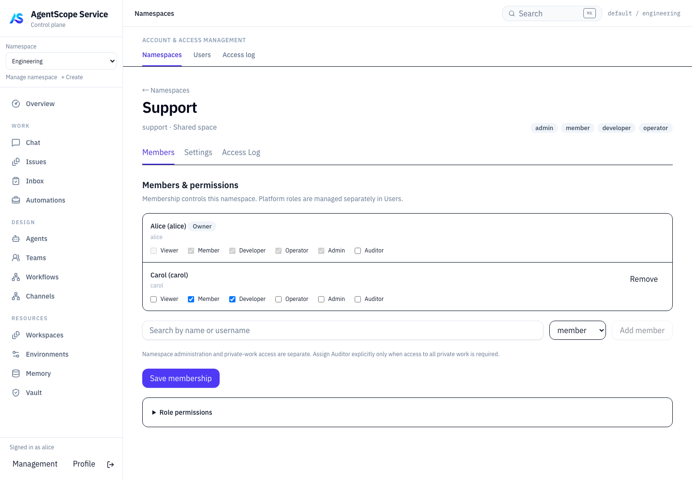
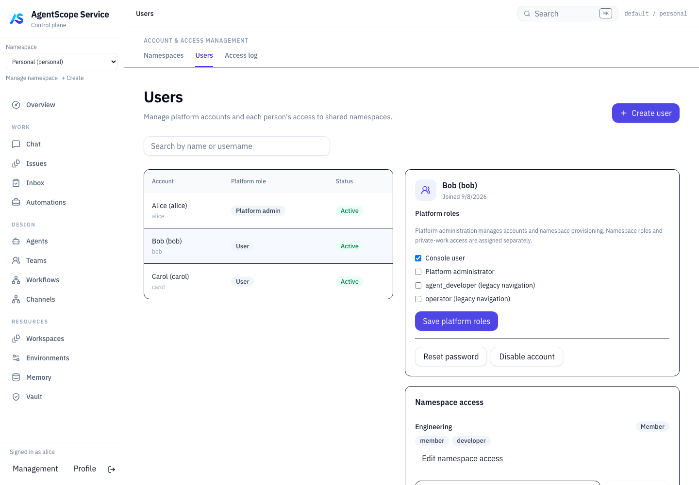
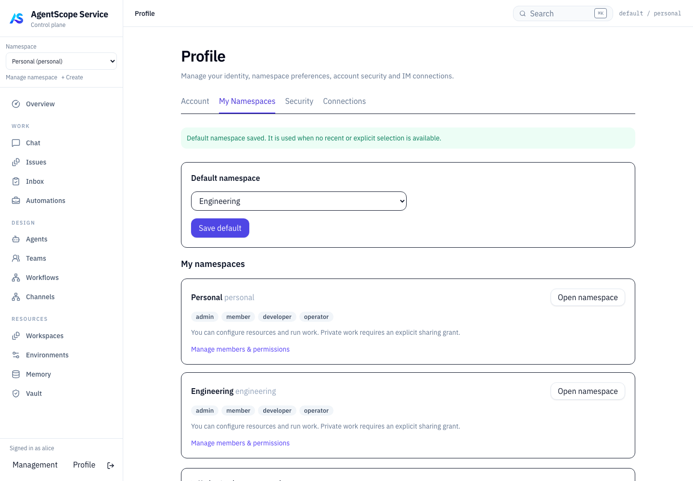

# Account / Namespace / Profile 验收记录

日期：2026-09-08。

实施位置：`/Users/ken/agentscope-2/agentscope-java`，当前分支 `agentscope-service-v5`。直接在主目录完成，保留原有和其他会话中的 Channel、MCP、Team 等改动，没有创建 worktree，没有提交或部署。

功能与接口说明见 [账号、Namespace 与个人设置改造](../../controlplane/account-namespace-management.md)。

## 结果

| 验证 | 结果 | 证据 |
| --- | --- | --- |
| `go test ./...`，启用独立 PostgreSQL | 全部通过，37 个有测试的包 | [日志](go-tests.log) |
| HTTP / Product / PostgreSQL / memory 专项 | 全部通过，包含真实登录与权限接口联合验证 | [日志](postgres-integration.log) |
| `npm test` | 29 个测试文件、126 个测试通过 | [日志](frontend-tests.log) |
| `npm run build` | TypeScript 与 Vite 生产构建通过 | [日志](frontend-build.log) |
| Playwright 权限管理流程 | 3 条通过，无页面脚本错误 | [日志](browser-tests.log) |
| `go build -o /tmp/agentscope-access-aistiod ./cmd/aistiod` | 构建通过 | 二进制位于该临时路径 |
| 本次改动格式检查 | Go 文件 gofmt 检查和相关文件 git diff --check 通过 | 未自动格式化其他会话的文件 |

PostgreSQL 使用本次独立创建的 PostgreSQL 17 测试容器，未连接运行中的业务数据库。全量 Go 测试仍可复用已通过的 Go 测试缓存。浏览器测试使用生产前端和模拟 API；后端权限与持久化正确性由真实 PostgreSQL 测试独立验证，不将模拟浏览器流程描述为真实 IM 平台联调。

## 关键断言

- 只有平台管理员能创建共享空间；可指定其他有效账号为 owner，并保留创建人的管理权限及显式 auditor 授权。
- 普通成员不能读取管理账号目录、修改授权或查看授权审计；不存在或停用的账号不能获得新授权，目录不可用时不写入。
- 成员修改和所有权转交受版本约束；旧版本写入冲突，授权和审计一起持久化。
- 所有权转交保留旧 owner 的 admin；只有 owner/平台管理员可以归档、恢复；归档立即使成员能力失效。
- 管理库存超过 500 个 Namespace 时仍能列出后续空间和用户归属。
- 真实 Product + HTTP middleware + PostgreSQL 联合测试覆盖账号搜索、默认空间保存、非法默认空间拒绝、所有权停用保护、撤销成员后的默认空间回退、停用后旧 JWT 在两套 API 被拒绝。
- 平台角色变更立即影响后端校验；拒绝越权修改个人资料、未知平台角色、过期版本、停用自己和移除最后一位有效平台管理员。
- 两次登录得到不同会话；用户不能撤销他人会话；撤销其他登录及修改密码会拒绝已登记和未使用过的旧凭据；管理员重置及停用/恢复不会复活旧会话。
- 个人 IM 设置只返回和解除自己的绑定，不返回其他人的身份或集成密钥；停用账号不能以 Channel actor 身份读写工作。
- 浏览器验证旧入口跳转、空间创建、搜索选人、成员能力保存、Users 方向授权、空间切换清理草稿、角色撤销后隐藏菜单并离开管理页、Profile 默认空间和其他会话撤销。

## 界面记录

## 交付边界

前端产物已更新到主目录的 `agentscope-service/aistio/ui`，产物包含当前主目录中并行工作的前端代码。新增账号字段和表通过 Product 启动迁移幂等创建，空间状态使用已有 JSON payload。未重启服务、未修改生产数据库、未执行 Maven 构建：本次实施修改的是 Go 服务和前端，没有修改 Java 源码。

账号停用保留历史；归档暂停成员访问但不会自动取消已经运行的任务。跨空间访问、私有 Issue 策略以及平台管理员不自动获得 auditor 的规则继续沿用既有权限模型。
