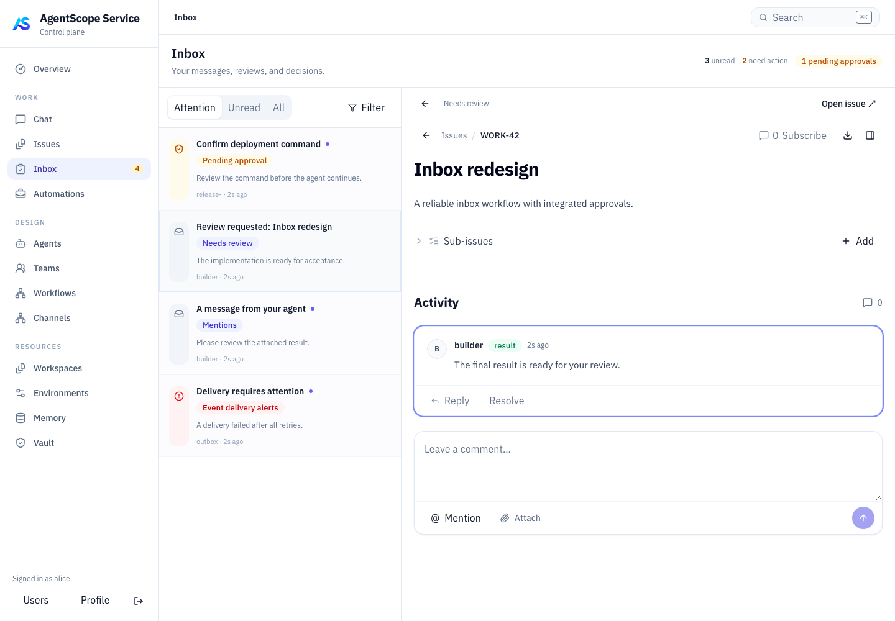
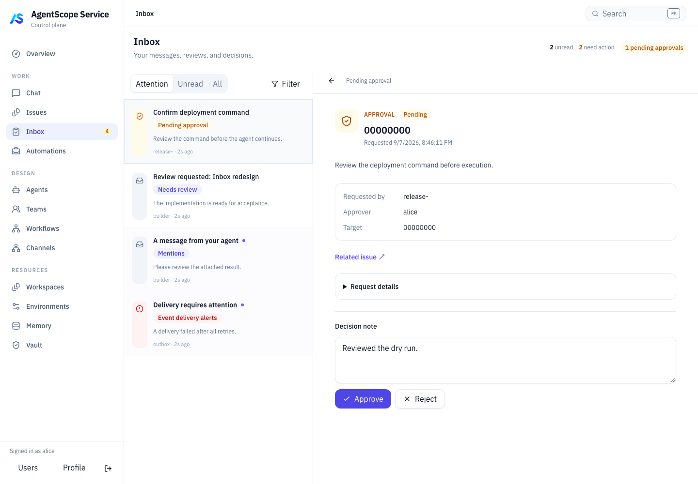
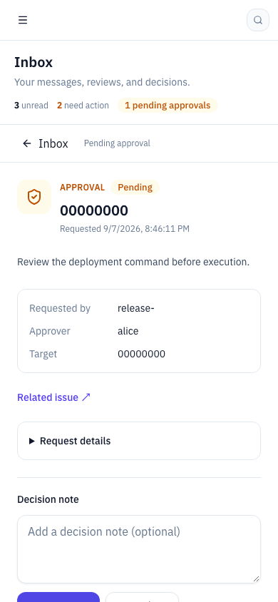

# Inbox 改造实施与验证

日期：2026-09-07。代码直接位于 `/Users/ken/agentscope-2/agentscope-java`，分支 `agentscope-service-v5`。未创建 worktree，未提交代码，保留用户原有和并行修改。未部署、未重启用户服务、未对运行环境数据库执行迁移。

## 已实现

1. **统一 Inbox**：审批直接作为消息出现在列表中，不再另列 Pending approvals。待审批使用盾牌、琥珀色和文字标记；新增待关注、未读、全部，以及类型、待处理、已归档筛选。列表支持服务端游标分页，导航及概览使用全量摘要，超过 100 条不会漏计。
2. **左右布局**：左侧列表、右侧详情，独立滚动。Issue 使用抽取后的完整 `IssueDetailContent`，支持评论定位、讨论和原有操作；属性默认收起。审批使用独立 `ApprovalDetail`，保留版本校验、有效期和现有执行绑定约束。窄屏切换列表/详情；URL 恢复所选消息和筛选；旧审批地址重定向至 `/work/inbox`。
3. **自动已读**：仅当所选详情成功加载后标记该消息；失败可重试。未读筛选下暂留当前选中项，避免内容消失。切换审批后保留各自意见草稿。`read/readAt` 与 `needsAction/resolvedAt` 独立，阅读不批准审批、不唤醒 Agent。未完成的行动项不能手动归档；完成后保留详情结果。
4. **通知与执行联动**：在相同事务或内存锁内处理状态及通知，覆盖普通 Issue transition、任务开始、Run 完成、结果评论复用和两种任务失败路径。统一 memory/PostgreSQL 行为，并修复人类评论触发任务时责任账户的补全。

## 事件规则

| 事件 | Inbox 行为 |
| --- | --- |
| 普通/工具审批 pending | 指定审批人收到一项持续待处理消息；决策、取消后关闭，不伪造阅读 |
| 主工作 Issue blocked | 负责人收到持续待处理的阻塞通知；恢复或终结后关闭；再次阻塞生成新一轮 |
| 主工作 Issue in_review，人工验收策略 | 负责人收到待验收项；订阅者收到知会；与同次完成的结果评论通知合并 |
| 显式分配给人的子 Issue blocked/in_review | 按人工处理事项通知；其余内部子任务不直接升级给用户 |
| 显式 @ 用户、给用户的回复/结果 | 精确投递，和同条评论的订阅通知去重 |
| 工作完成、取消、阻塞后恢复或重新打开 | 通知工作负责人及订阅者；不重复提醒自己触发的普通更新 |
| 根/独立任务终态失败 | 通知责任人；Team worker 失败留给 leader；已有主 Issue 阻塞项时不再创建重复失败通知 |
| progress/status/system 评论、正常内部执行过程 | 不创建普通订阅消息，保留在 Issue/执行记录中 |
| 既有 SLA、路由、投递异常 | 继续支持原有消息类型与详情；本次未改变其运维收件配置 |

工作负责人优先取人类 assignee，其次根执行 accountableHumanRef，再回退 human creator。仅 `user_work/work_hub` 根工作或明确分配给人的子工作产生工作状态通知，避免 Endpoint 等内部运行记录刷屏。

## 数据与实现位置

- `aistio/internal/store/inbox.go`：共享通知规则、去重键、排序游标和摘要计算。
- `aistio/internal/store/{memory,postgres}/collaboration_inbox.go`：等价的持久化、阅读、生命周期处理。
- `aistio/internal/httpapi/inbox_handler.go`：列表、摘要、按 ID 查询、已读和归档；绑定当前用户和资源 scope。
- `aistio/internal/store/postgres/migrations/0105_inbox_attention.up.sql`：增加行动/阅读/结束字段和索引；恢复并去重旧待审批项、补齐当前阻塞和待验收、关闭失效历史 review、清理重复订阅与过程消息。
- `frontend/src/features/inbox/InboxPage.tsx`、`frontend/src/features/approvals/ApprovalDetail.tsx`、`frontend/src/features/issues/IssueDetailPage.tsx`：统一入口、审批详情与嵌入 Issue。

实现采用 `needsAction` 布尔投影和类型/实体引用，未引入原方案中完整的 actionKind/actionState 状态模型。保留现有 Outbox 刷新机制并增加 Inbox 缓存失效与轮询；未新增第二套事件消费者。账号引用统一解析、可配置运维收件人、负责人转移时重投递以及周期性修复投影，是尚未纳入本次的后续增强。原有硬编码运维收件人逻辑未改动。

## 验证结果

| 检查 | 结果 |
| --- | --- |
| Go `go test ./...`，独立 PostgreSQL 17 | 通过，37 个包；涵盖 memory/PostgreSQL 同一套契约测试、HTTP、协作和控制器测试，见 [日志](go-all.log) |
| PostgreSQL 历史迁移专项 | 通过；验证待审批恢复/去重/保留已读、遗漏消息补齐、阻塞回填、负责人和订阅者区分、旧 review 关闭、隐藏工作过滤，见 [日志](migration.log) |
| Inbox/审批相关 Vitest | 3 文件、9 测试通过，见 [日志](focused-vitest.log) |
| Chromium 浏览器测试 | 5 项通过，见 [日志](e2e.log)；覆盖桌面双栏、精准自动已读、错误重试、审批决策及意见保留、未读筛选稳定选择、类型筛选、窄屏返回、旧路由 |
| Go `go build -o /tmp/agentscope-inbox-aistiod ./cmd/aistiod` | 通过；仅验证编译，未替换运行中二进制 |
| 最后一次前端全量 `npm test` | 18 文件通过、1 文件失败；52 测试通过、4 失败。失败均在并行变化的 `agentNavigation.test.ts`，见 [日志](vitest.log) |
| 最后一次 `npm run build` | TypeScript 阶段被并行变化的 Agent 详情导航阻塞：`AgentCatalogDetailPage.tsx` 仍比较 `sessions/related-work/entrypoints`，`AgentDetailTabId` 已改为另一组值；见 [日志](frontend-build.log) |

前端全量测试和构建在较早工作区状态曾通过；上表以最终检查为准，不将之前的成功视为当前完整工作区通过。此次未修改上述 Agent 导航文件，也未绕过类型检查生成最终发布包。独立 PostgreSQL 测试与浏览器 API fixture 测试分开运行；浏览器测试不等同于连接用户运行环境的全链路部署验收。Java 代码未改动，未执行完整 Maven verify。

测试代码：`aistio/internal/store/storetest/inbox.go`、`aistio/internal/store/postgres/inbox_migration_test.go`、`aistio/internal/httpapi/inbox_handler_test.go`、`frontend/src/features/inbox/inboxModel.test.ts`、`frontend/e2e/inbox.e2e.ts`。浏览器测试入口为 `npm run test:e2e`，首次使用需 `npx playwright install chromium`。

## 界面检查

1440×1000 桌面和 390×844 窄屏截图已逐张检查，确认左右布局、选中态、待审批标记、内置操作和窄屏返回入口；窄屏审批操作区可滚动到达。

