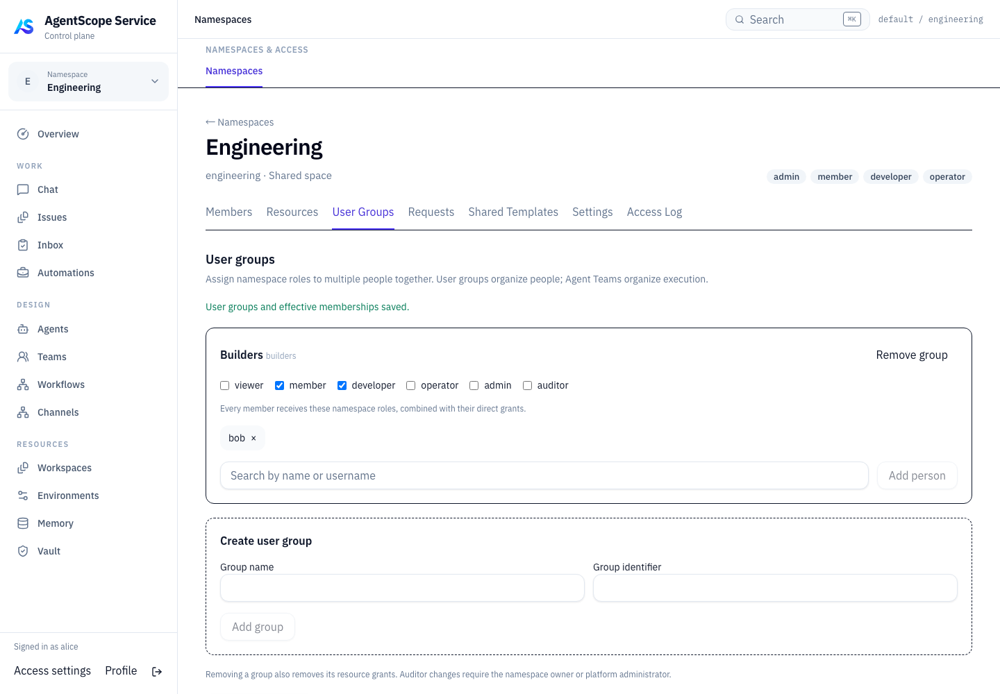
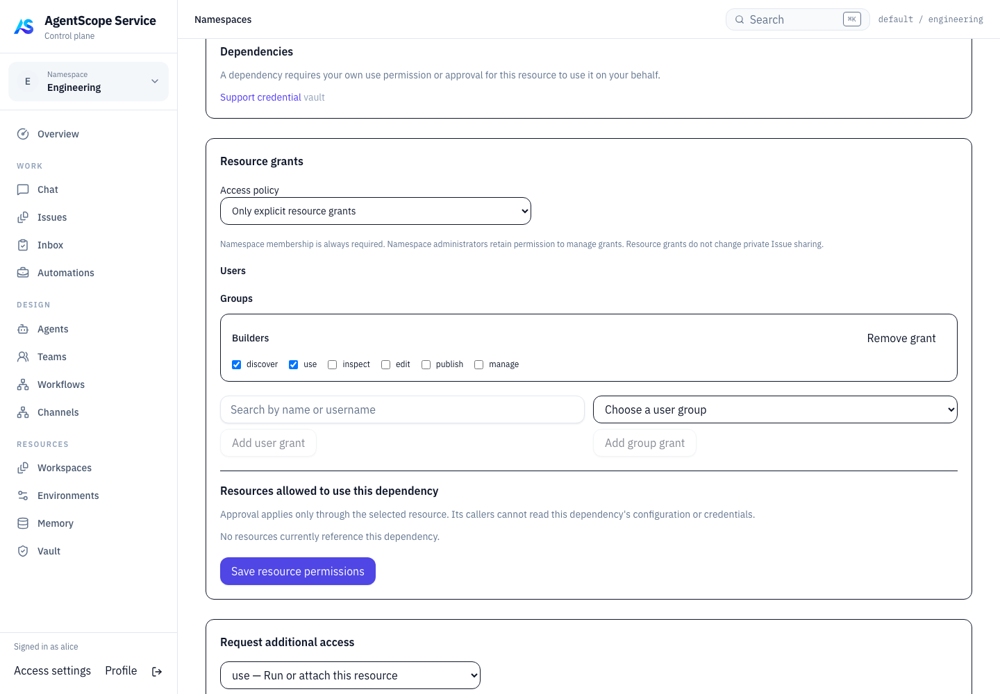
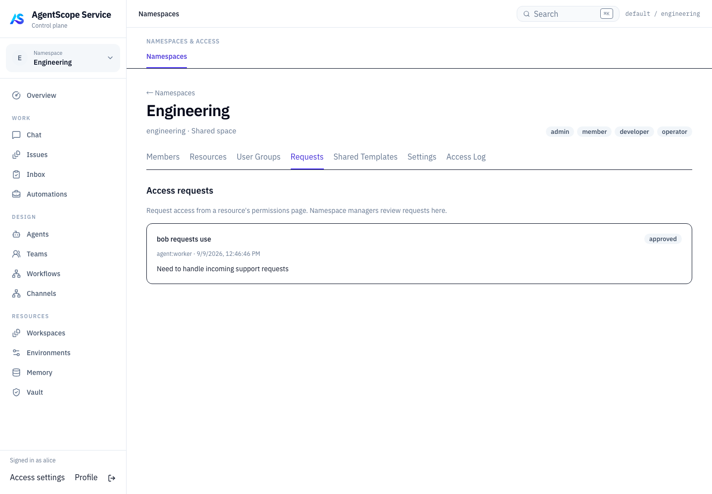
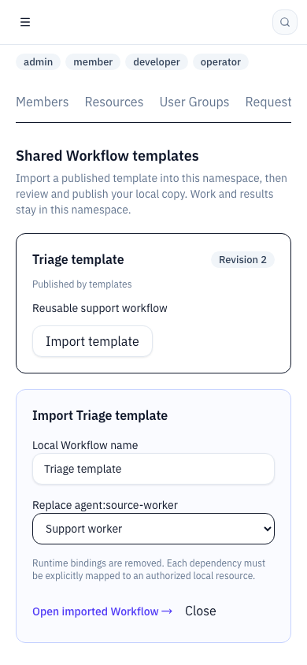

# Namespace 资源权限验收记录

日期：2026-09-09。代码位于 `/Users/ken/agentscope-2/agentscope-java`，分支 `agentscope-service-v5`。

## 验收结果

| 检查 | 结果 |
| --- | --- |
| Aistio `go test ./...` | 通过；37 个包含测试的 package，PostgreSQL 专项另行运行 |
| PostgreSQL 17 专项 | 新建空测试数据库；httpapi / product / store-postgres 三个完整 package 串行通过 |
| 后端构建 | `go build -o /tmp/agentscope-aistiod-resource-management-20260909 ./cmd/aistiod` 通过 |
| 前端构建 | `npm run build` 通过；TypeScript 检查和 Vite 生产构建完成，更新 aistio/ui |
| 前端单测 | `npm test`：30 个文件、134 个测试通过 |
| 资源管理浏览器测试 | 3 条流程通过：人员组与资源授权、申请审批、移动端模板导入 |
| 既有管理界面回归 | 4 条流程通过：建空间/成员、Users 授权、Profile、键盘与移动端空间切换 |
| 差异检查 | `git diff --check` 通过 |

## 关键行为证据

- 直接与用户组权限合并，restricted 模式、依赖 consumer、权限撤回、循环依赖拒绝。
- 资源策略 CAS 冲突、成员申请与原子审批、非所有者空间管理员无法自授 auditor。
- 原生资源列表过滤先于分页；PostgreSQL 的组成员查询、Agent 分页与排除条件；Vault 列表与计数不泄露未授权资源。
- 旧 Managed 定义的配置入口不能绕过对应 Catalog Agent 限制；真实 JWT + Product PostgreSQL HTTP 集成检查资源操作和个人 Session 创建。
- AgentTask 派发读取最新组授权；已有 Chat 和 Session 消息入口拒绝权限撤回后的执行。
- publish 不隐含 use；模板导入要求本地依赖映射，清除源运行 binding；源导出撤回后拒绝导入。
- Channel 线程规则优先；不把聊天级允许与线程限制合并；接待目标授权拒绝时不创建 Issue；窗口组权限撤回后取消排队投递并拒绝新工作。
- 权限与组变更刷新相关查询及 scope 权限版本；Users/Profile 展示组来源；审计页面显示资源、组与审批快照。

## 测试方法与适用范围

后端 HTTP 测试使用真实服务中间件。涉及产品持久化与身份认证的新增集成测试使用 PostgreSQL；权限模型、图遍历和其他接口测试也使用 memory 存储。

浏览器验收通过 Playwright 访问 **Vite 生产预览**，API 使用可变的测试夹具，以验证页面交互、版本参数、授权编辑和手机布局。它不代表已对接真实 IM 平台进行投递。Channel 验证使用持久化队列和内部 claim 接口，没有向用户的聊天软件发送消息。

数据库容器为本轮创建的 `agentscope-resource-tests-20260909`，监听 `127.0.0.1:59619`，与用户服务分离；最终验收后已删除该测试容器及其临时数据库。首次多 package 并行迁移遇到迁移锁死锁，随后使用全新数据库和 `go test -p 1` 完整验证通过，没有更改生产迁移逻辑。开发中修正了测试夹具的已下线路由及按钮名称；最终日志均为修正后的验收结果。

跨 Namespace 当前支持已发布 Workflow 模板导入，包含嵌套 Workflow 的模板会明确拒绝。没有开放跨空间直接执行或 Vault 内容共享。业务记录可见性继续由既有 ACL 控制。

未运行全仓 Java Maven 验证：本轮未修改 Java。没有提交代码、重启或部署用户服务；已有目录内的其他修改保留。

## 日志

- [Go 全包测试](go-test.log)
- [PostgreSQL 验证](postgres-test.log)
- [Channel 边界测试](channel-boundaries.log)
- [前端构建](frontend-build.log)
- [Vitest](vitest.log)
- [资源管理浏览器验收](browser-resources.log)
- [已有管理页面浏览器回归](browser-permissions.log)

## 界面记录

