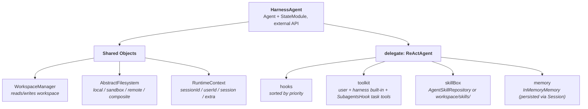
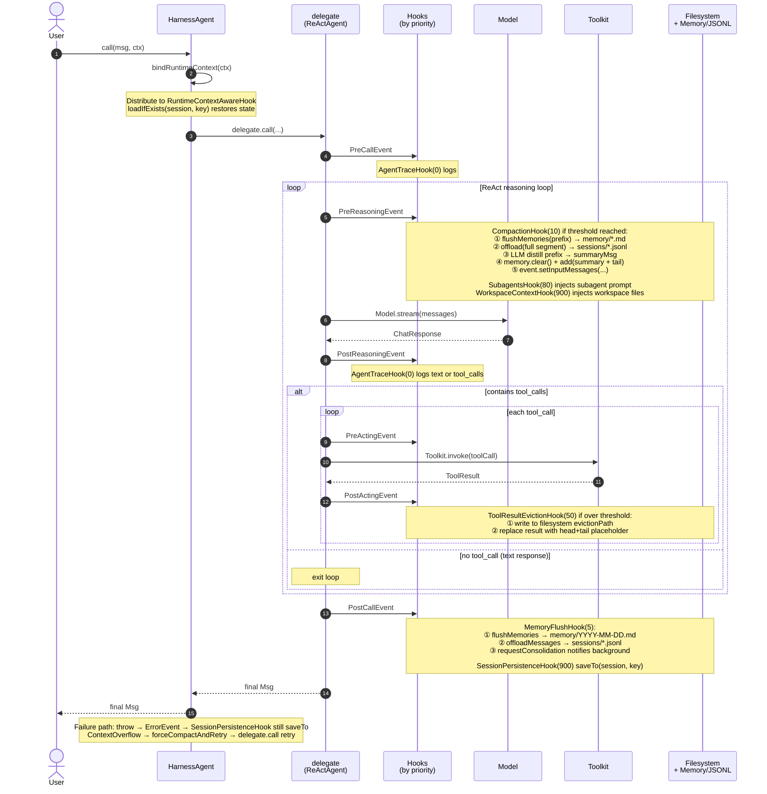
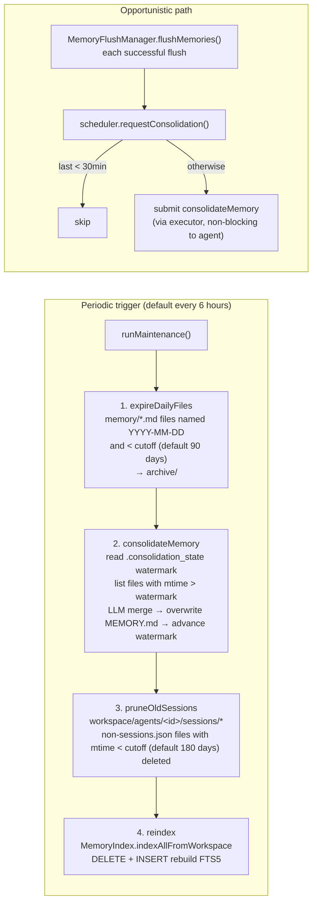
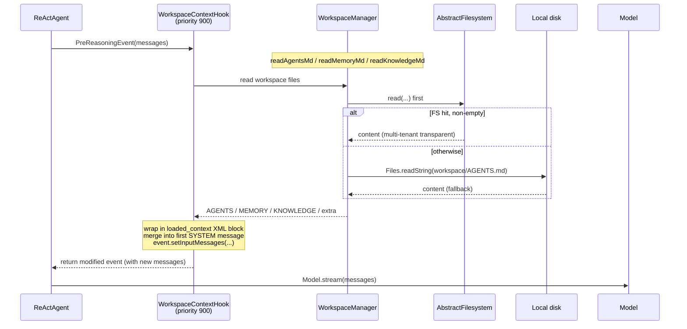
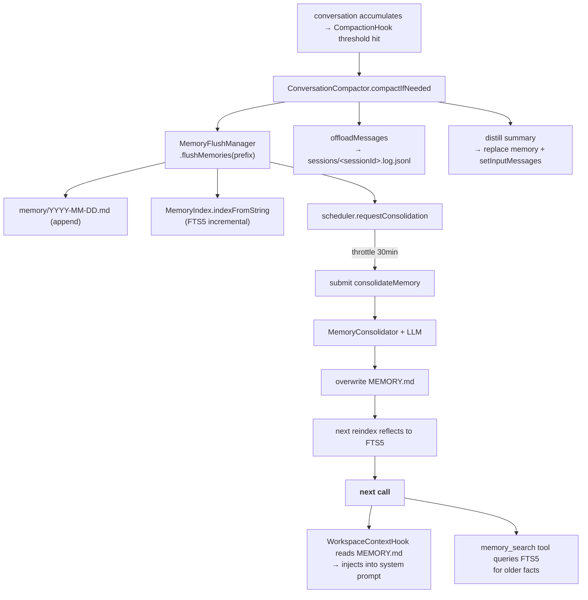
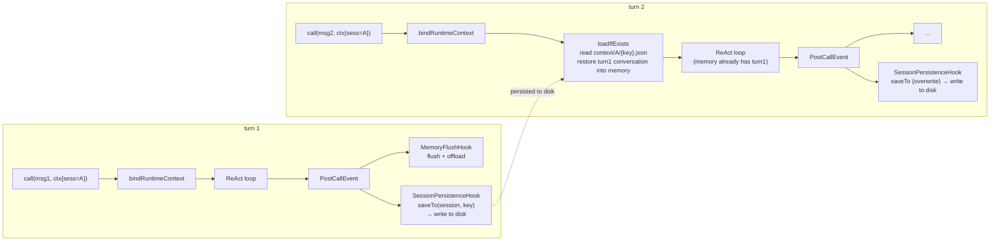
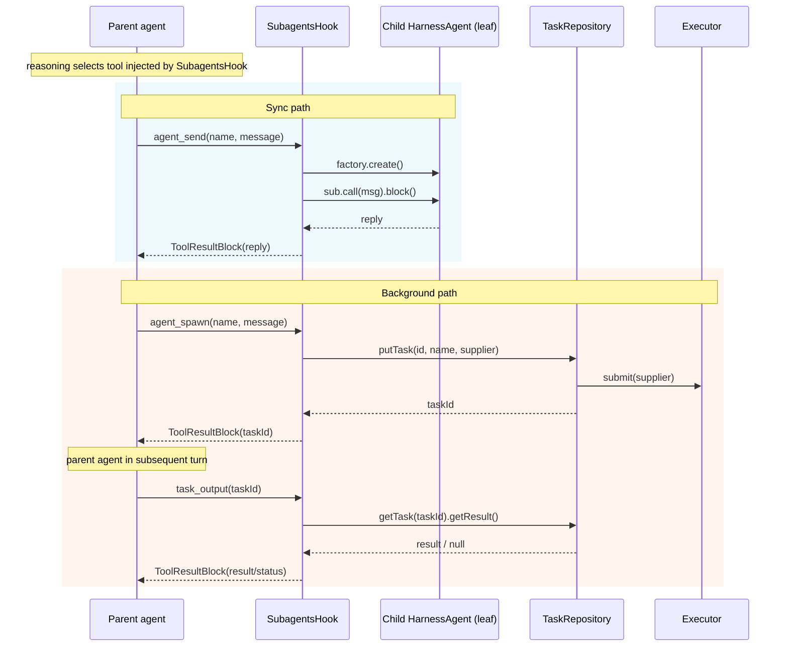

# Harness Architecture

[Overview](./overview.md) organizes Harness capabilities by "what problem they solve". This page switches perspective: explaining each component's **definition, behavior, trigger timing, and collaborators**, then using sequence diagrams to show how they cooperate inside a single `call()`.

> This page focuses on a medium-grain user-facing view — clarifying "who, when, what, and with whom" — without expanding call stacks or implementation details; those are covered in sub-documents ([memory](./memory.md), [workspace](./workspace.md), [filesystem](./filesystem.md), [sandbox](./sandbox/index.md), [subagent](./subagent.md), [session](./session.md), [tool](./tool.md)).

## 1. Top-Level Structure

`HarnessAgent` is not a new reasoning loop — it is a thin wrapper around `Agent` + `StateModule`, internally holding a `ReActAgent delegate`. All `call` / `stream` / `observe` / `saveTo` / `loadFrom` are forwarded to it. All Harness capabilities are assembled through the three existing extension points of `ReActAgent`:



**Injection happens in `HarnessAgent.Builder.build()`**: after constructing the three shared objects, the hook list is assembled in a fixed order, built-in tools are appended to the user's toolkit, the skillBox is wired from workspace/repo, and everything is handed to `ReActAgent.builder()`.

At the start of each `agent.call(msg, ctx)`, `HarnessAgent.bindRuntimeContext(ctx)` distributes the current `RuntimeContext` to all hooks implementing `RuntimeContextAwareHook` (workspace context, memory flush, compaction, session persistence), and auto-restores state from `Session` as needed.

## 2. Three Shared Objects

These three objects are the common language through which hooks collaborate. Understanding them means understanding how Harness is "coupled".

### 2.1 RuntimeContext

The identity carrier for the current `call()`: not persisted, re-distributed to `RuntimeContextAwareHook` on every `call`.

- **`sessionId`** — determines persistence paths and JSONL filename
- **`userId`** — threaded to `AbstractFilesystem.NamespaceFactory` for multi-tenant isolation
- **`session` + `sessionKey`** — explicitly specified, or defaults to `WorkspaceSession + SimpleSessionKey.of(sessionId)`
- **`extra`** — custom key-value pairs; tools/hooks read via `ctx.get(key)`

### 2.2 WorkspaceManager

A stateless workspace accessor. **Two-layer semantics**: reads hit filesystem first, fall back to local disk; writes always go through filesystem; list operations merge and deduplicate both layers. Expected layout:

```
workspace/
├── AGENTS.md / MEMORY.md
├── memory/YYYY-MM-DD.md / .consolidation_state / archive/
├── memory_index.db                # SQLite FTS5
├── knowledge/KNOWLEDGE.md / **/*
├── skills/<skill>/SKILL.md
├── subagents/*.md                 # YAML front matter + body
└── agents/<agentId>/
    ├── context/<sessionId>/{key}.json     # written by WorkspaceSession
    └── sessions/<sessionId>.log.jsonl     # offloaded by MemoryFlushManager
```

### 2.3 AbstractFilesystem

The physical storage backend for the workspace — pluggable. Base interface: `ls/read/write/edit/grep/glob/upload/download`; the extending interface `AbstractSandboxFilesystem` adds `execute/id`.

| Implementation | Use | Key Characteristics |
|---|---|---|
| `LocalFilesystem` | Local disk | `virtualMode` anchors `rootDir` to prevent traversal; no shell |
| `LocalFilesystemWithShell` | Local + host shell | Declarative `LocalFilesystemSpec` and the **default when no `filesystem` is configured**; registers `shell_execute` when `instanceof AbstractSandboxFilesystem` |
| `BaseSandboxFilesystem` / `SandboxBackedFilesystem` | Sandbox backend | Files and commands run inside sandbox; see [Sandbox](./sandbox/index.md) |
| `RemoteFilesystem` | KV store | Combined with `LocalFilesystem` via `CompositeFilesystem` under `RemoteFilesystemSpec`; no shell |
| `CompositeFilesystem` | Prefix routing | Implements only `AbstractFilesystem` (**not** `AbstractSandboxFilesystem`), does **not** trigger `ShellExecuteTool`; longest-prefix-first |

> **Multi-tenant and isolation**: `NamespaceFactory` is called on every operation; `RemoteFilesystemSpec` / `SandboxFilesystemSpec` can also configure `IsolationScope` (aligned with sandbox/shared-storage naming). **Which mode registers `ShellExecuteTool`** is the key distinction — see [filesystem](./filesystem.md#three-declarative-modes).

## 3. Hook List

Below are the common built-in Harness hooks assembled in `Builder.build()` (**sandbox mode** additionally includes `SandboxLifecycleHook` — see [Sandbox](./sandbox/index.md)). `ReActAgent` executes hooks in **ascending `priority()` order**; same-priority hooks preserve assembly order.

| Hook | Priority | Event | Enabled by Default | Key Dependencies |
|------|----------|-------|-------------------|-----------------|
| `AgentTraceHook` | 0 | all | ✓ (default; disable with `.agentTracing(false)`) | — |
| `MemoryFlushHook` | 5 | `PostCallEvent` | ✓ (requires `model`) | `WorkspaceManager`, `Model`, `MemoryFlushManager` |
| `MemoryMaintenanceHook` | 6 | `PostCallEvent` (throttled) | ✓ (requires `model`) | `MemoryConsolidator`, `WorkspaceManager` |
| `CompactionHook` | 10 | `PreReasoningEvent` | ✗ (requires explicit `.compaction(...)`) | `WorkspaceManager`, `Model`, `CompactionConfig`, `MemoryFlushManager` |
| `SandboxLifecycleHook` | 50 | `PreCall` / `PostCall` / `Error` | Only when `filesystem(SandboxFilesystemSpec)` | `SandboxManager`, `SandboxBackedFilesystem` |
| `ToolResultEvictionHook` | 50 | `PostActingEvent` | ✗ (requires explicit `.toolResultEviction(...)`) | `AbstractFilesystem`, `ToolResultEvictionConfig` |
| `SubagentsHook` | 80 | `PreReasoningEvent` + `tools()` | ✓ (non-leaf with `model`) | subagent list, `TaskRepository` |
| `WorkspaceContextHook` | 900 | `PreReasoningEvent` | ✓ | `WorkspaceManager`, `RuntimeContext`, token budget |
| `SessionPersistenceHook` | 900 | `PostCallEvent` + `ErrorEvent` | ✓ | `RuntimeContext` |

> Hooks implementing `RuntimeContextAwareHook` (workspace context, memory flush, compaction, session persistence) are re-injected with the current `RuntimeContext` via `bindRuntimeContext` on every `call()`.

### 3.1 Context Injection: `WorkspaceContextHook` (priority 900)

**Purpose**: before every reasoning turn, merges workspace files into the first SYSTEM message as a `<loaded_context>` XML block.

**Trigger**: `PreReasoningEvent`. Priority 900 lets it run after compaction and subagents, layering on top of the final system prompt.

**Key logic**: reads AGENTS / MEMORY / KNOWLEDGE (including file listing) + user-specified `additionalContextFiles` → estimates tokens (chars/4) and retains fixed sections within `maxContextTokens` budget, truncates `MEMORY.md` tail when over budget and appends a `memory_search` hint.

### 3.2 Memory Management: `MemoryFlushHook` + Background

**Purpose**: `MemoryFlushHook` (priority 5) on `PostCallEvent` hands the current memory to `MemoryFlushManager`, which does two things:

- **flushMemories**: LLM extracts facts → appends to `memory/YYYY-MM-DD.md` (daily log) → incrementally updates FTS5
- **offloadMessages**: raw message sequence written to `agents/<id>/sessions/<sessionId>.log.jsonl`

Four components share the work:

| Component | Responsibility | Frequency |
|---|---|---|
| `MemoryFlushManager` | Layer 1: daily log + JSONL | Each `call()` end + before each compaction |
| `MemoryConsolidator` | Layer 2: curated `MEMORY.md` | 6-hour cycle / opportunistic (30-min throttle) |
| `MemoryIndex` | SQLite FTS5 index `memory_index.db` | Incremental (on write) + full (maintenance cycle) |
| `MemoryMaintenanceScheduler` | Scheduling + old file archival/cleanup | Daemon thread 6-hour cycle |

> **Two-layer semantics**: the daily log is append-only and never modified; `MEMORY.md` is completely rewritten by the consolidator (outputs a full new version, not a diff). Layer 1 is the facts stream; layer 2 is a curated view. No overlap with `CompactionHook`: compaction manages the compressed prefix, this hook manages the retained tail.

### 3.3 Context Length Control: `CompactionHook` + Overflow Safety Net

**Purpose**: `CompactionHook` (priority 10) on `PreReasoningEvent` delegates to `ConversationCompactor.compactIfNeeded`.

**Trigger condition**: message count ≥ `triggerMessages` or token count ≥ `triggerTokens` (defaults: 50 / 80K).

**On trigger**: first calls `flushMemories(prefix)` to extract facts, `offloadMessages(full segment)` to save JSONL, then uses a structured prompt (SESSION INTENT / SUMMARY / ARTIFACTS / NEXT STEPS) for the LLM to distill a summary, yielding `[summaryMsg + tail]` written back to both `Memory` and `event.setInputMessages`. Tail length controlled by `keepMessages` / `keepTokens` (default 20 messages).

**Overflow safety net**: `HarnessAgent.call()` catches model `ContextOverflow`-class exceptions → `forceCompactAndRetry` forces the most aggressive compaction → retries `delegate.call()` once. This is the last line of defense when thresholds are misconfigured.

### 3.4 Tool Result Offloading: `ToolResultEvictionHook` (priority 50)

**Purpose**: when a single tool result is too large, saves it to disk and keeps only a head+tail preview + placeholder in context.

**Trigger**: `PostActingEvent` (before memory writes, so downstream only sees the placeholder).

**Key logic**: exceeds `maxResultChars` (default 80K chars ≈ 20K tokens) → writes to `{evictionPath}/{agent}/{toolCallId}` → replaces with `Tool output too large, saved to ...` + 2K head + 2K tail. `excludedToolNames` (read/write/edit, grep/glob/ls, memory/session search) are skipped — these tools have their own pagination or back-read loops.

> Independent from compaction: compaction manages depth (accumulated message length), eviction manages width (single message length).

### 3.5 Session Persistence: `SessionPersistenceHook` + `WorkspaceSession`

**Purpose**: `SessionPersistenceHook` (priority 900) on both `PostCallEvent` and `ErrorEvent` tries `agent.saveTo(session, sessionKey)` (`HarnessAgent` implements `StateModule`). Priority 900 lets `MemoryFlushHook` (5) finish writing memory before the snapshot.

**`WorkspaceSession`** is a `JsonSession` subclass whose `baseDir` is locked to `<workspace>/agents/<agentId>/context/`, ultimately writing `<workspace>/agents/<agentId>/context/<sessionId>/{key}.json`.

The next `call()` start, `bindRuntimeContext` calls `loadIfExists` to restore memory — this is the source of "same sessionId remembers across calls".

### 3.6 Subagent Orchestration: `SubagentsHook` + `TaskRepository`

**Purpose**: `SubagentsHook` (priority 80) plays two roles — registers `agent_spawn / agent_send / agent_list / task_output / task_cancel / task_list` via `tools()`, and injects a system prompt segment with subagent name+description list on `PreReasoningEvent`.

- **Sync path** `agent_send`: blocks on subagent execution and fills in the result
- **Background path** `agent_spawn`: submits via `TaskRepository.putTask` to an executor and gets a `taskId`; the parent agent uses `task_output(taskId)` in a later turn to pull the result

**Subagent sources** (`Builder.buildSubagentEntries`): workspace `subagents/*.md` (parsed by `AgentSpecLoader` into `SubagentDeclaration`) / programmatic `.subagent(SubagentDeclaration)` / custom `.subagentFactory`. Each subagent is a leaf `HarnessAgent` (`asLeafSubagent()`, no `SubagentsHook` registered); workspace / filesystem / sysPrompt are determined by the declaration and the five-row decision table — see [Subagent](./subagent.md).

**`TaskRepository`** is the task orchestration interface (`putTask` / `getTask` / `listTasks(filter)` / `cancelTask`); the default `DefaultTaskRepository` uses a thread pool + `CompletableFuture<String>` + `BackgroundTask` state machine (PENDING/RUNNING/COMPLETED/FAILED/CANCELLED).

### 3.7 Trace Logging: `AgentTraceHook` (priority 0)

Listens to all events, outputs `[<agent>] PRE_REASONING | model=..., messages=...`-style INFO logs (DEBUG for detailed content); does not modify events.

## 4. `call()` Lifecycle Sequence

The diagram below shows the collaboration order of components during a complete `agent.call(msg, ctx)`. **Hooks on the same event fire in ascending priority order** — this is why they can stack without conflict.



## 5. Background Maintenance Sequence

`MemoryMaintenanceScheduler.start()` is triggered at the end of `Builder.build()`; it holds a daemon-thread `ScheduledExecutorService`.



## 6. Four Typical Collaboration Scenarios

### Scenario A — Workspace Files Become Model-Visible System Prompt



### Scenario B — How Facts Settle into `MEMORY.md` Over a Long Session



### Scenario C — How Turn 2 "Remembers" Turn 1



### Scenario D — Sync and Background Delegation Paths for Subagents



## Related Pages

- [Workspace](./workspace.md) — workspace directory structure, `WorkspaceManager` two-layer read details
- [Memory](./memory.md) — two-layer memory model, compaction configuration, FTS5 retrieval, message format details
- [Filesystem](./filesystem.md) — `AbstractFilesystem` implementation tradeoffs and composition
- [Subagent](./subagent.md) — subagent spec format, `TaskRepository` customization, nested harness notes
- [Session](./session.md) — `WorkspaceSession` / `JsonSession` serialization protocol and version compatibility
- [Tool](./tool.md) — built-in tool reference and custom tool registration
