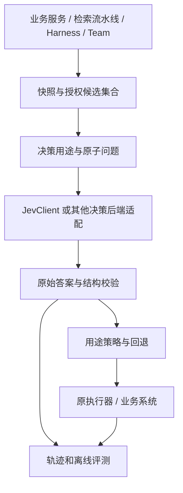

# 现状、目标架构与改造边界

更新：本页保留调研与设计背景；当前已实现的API和限制见[增量实现使用指南](guides/harness-runtime.md)，不要将旧基线描述作为最新行为。

## 已有能力与缺口

以当前仓库代码为准，源码索引见[参考项目及来源](references.md)。

| 层 | 当前实现 | 下一步 |
| --- | --- | --- |
| HTTP 与题型 | `agentscope-extensions-judge/agentscope-extensions-jev` 中的 JevClient、Choice/Noul/Score、校验和重试 | 补总预算、错误分类、请求关联和批量调度；不再引入第二套客户端 |
| 工具筛选 | `example.JevToolSelectionMiddleware`，onReasoning；默认最多3个可选工具 | 已区分none、故障和不确定；后续做业务召回验证 |
| 模型路由 | `example.JevModelRouterMiddleware`，onAgent选择、onModelCall使用 | 保留调用内粘性，加入可测量的任务画像和回退记录 |
| Auto预检 | `example.JevAutoModeMiddleware`，onActing | 已补缺状态拒绝、确认绑定、影子模式；后续做端到端验收 |
| 状态与上下文 | RuntimeContext、AgentState、Compaction/MemoryFlush/ToolResultEviction Middleware | 增加快照、准入及恢复策略，不直接改写共享Agent状态 |
| 团队 | TeamsMiddleware、TeamClient、TeamTask | 对委派与交付增加建议和独立验收，不让模型直接推进资源生命周期 |
| RAG | core/rag/Knowledge已标记废弃并建议应用层集成 | 新后处理器放应用检索链路，不扩展旧RAG接口 |
| 通用Judge/业务方案 | 已实现独立Noul JevJudge与客服影子示例；完整策略信封及业务流水线未实现 | 见[API与案例](guides/judge-api.md)，三项Middleware与Service观察已接入；业务自动接线仍需独立实施 |

## 总体架构（部分已实现）

模型负责相关性、意图、证据充分性等语义判断；代码负责权限、金额、时区计算、幂等、版本和状态迁移。Score是概率加权等级，不是离散标签；若场景要求等级分类，应明确取argmax而非随意四舍五入。

## 依赖与包组织建议

保持现有模块先完成首批试点，在 `io.agentscope.extensions.judge.jev` 下按职责增设 `decision`、`judge`、`rag`、`middleware` 等包；这些包名为设计建议。业务数据结构和业务副作用留在应用。等出现第二个真实后端后，再评估抽取独立的无供应商决策SPI；不预先扩张core依赖。

spring-ai-typesafe把客户端和Spring AI适配分层，值得借鉴。但本项目已有HttpTransport、Jackson及Reactor，不为复用Advisor引入Spring AI或Jackson 3依赖。JevClient不实现生成式Model；它不是主模型的替代品。框架集成以当前项目为实现载体，协议与业务契约保持可复用。

## 控制点与顺序

`MiddlewareBase`有onAgent、onReasoning、onActing、onModelCall四个洋葱拦截点及onSystemPrompt变换。`order()`数值越大越靠外；同值按注册顺序，返回阶段顺序反向。不能假定“自定义中间件总在内置之前”。三个Jev示例均返回0，组合时必须实测顺序。

`ActingInput`携带工具调用列表，不可假设一次只有一个调用。筛除调用时需要为其补匹配callId的工具结果；未执行、拒绝、失败与成功要分别记录。RuntimeContext的属性只在当前调用内存在，跨Run恢复要使用持久化状态或存储层。

## 与自有平台的关系

AgentScope Service承接Workspace、运行资源与配置的集成规划；Harness执行循环；TeamHarness负责协作；评估与实验纳入Service集成规划。本文提出的是SDK/应用可落地能力，平台控制面字段、注册API、Team任务状态机接入须独立核验。Managed Agents仅作为工具/事件/成果验收的产品参考，不是本方案运行依赖。
