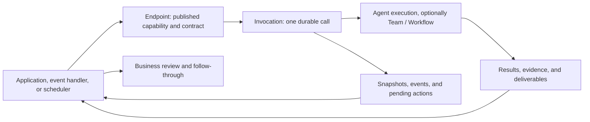

<Note>
These are preview docs. The formal release is not yet available.
</Note>

**AgentScope Service is an Agent as a Service platform for business applications. Developers publish Agent capabilities through APIs so applications can submit work, follow progress, handle human interaction, and retrieve results and deliverables.** It serves work that involves research, tools, system operations, and repeated verification: preparing customer proposals, checking documents, investigating order exceptions, or turning a diagnosis into a repair PR.

Users can stay in their existing product: assign work on a task board, request an investigation from an order page, supply missing details in a support conversation, and review the result in the same interface. Service runs and coordinates Agents in the background. The application owns its business objects, user experience, authorization, and use of the results.

## How Service relates to Harness: two ways to use Agents

**With AgentScope, you can develop your own Agent application using the Harness SDK, or use managed Agent services directly through the Service platform.** The SDK embeds Agent execution in application code. Service runs and manages those capabilities centrally for applications to consume through APIs. With Managed Agents, you can start without building a separate SDK application or a runtime service for every Agent application.

**Managed Agents in AgentScope Service are built on the AgentScope HarnessAgent core.** HarnessAgent provides reasoning and tool loops, context, workspaces, and sessions. Service adds configuration, publishing, invocation, task management, and operational controls on top of this core. Configure instructions, models, tools, and resources on the platform to publish an Agent as a callable business service.

| Decision | Harness SDK: build your own application | Service: use managed Agent services |
| --- | --- | --- |
| Best fit | Deep Java / Spring Boot integration, custom runtime behavior and application lifecycle | Integrate assistants or background tasks and centrally manage execution and invocation across Agents |
| Development | Compose Harness, business tools, and application logic in code | Configure and publish a Managed Agent on the platform, then call it through APIs |
| Runtime ownership | The SDK provides execution capabilities; the application team owns runtime services, deployment, scaling, and operations | Service handles Agent execution, sessions, tasks, and interaction; the platform team maintains shared infrastructure and execution resources |
| Application team's focus | Agent implementation, business integration, and application operations | Instructions and tools, business data and authorization, product interaction, and acceptance |

For example, to generate a customer proposal in a CRM, the SDK approach embeds Harness in your Java service and leaves deployment with your team. With Service, you publish a proposal Agent on the platform; the CRM calls its API, displays progress, and retrieves the proposal. You can also combine the approaches: an existing Harness application can connect as an [External Agent](/v2/en/service/register-agentscope-agent), retaining its own process while using the platform's publishing, invocation, and task coordination capabilities. Start with the [Harness quickstart](/v2/en/docs/quickstart) for SDK development or the [Service API quickstart](/v2/en/service/first-session) for managed services.

## Applications it serves

| Application need | Integration pattern | Delivery |
| --- | --- | --- |
| Add “complete this work for me” to a SaaS or internal product | A button or task transition starts a background Job | Proposals, reports, files, reviewable changes |
| Handle exceptions that cannot be fully enumerated in advance | A business process calls an investigation, verification, or resolution step | Structured findings, evidence, recommendations, execution receipts |
| Provide an assistant that needs ongoing conversation | The application maintains a Conversation and submits turns | Contextual replies, tool results, questions requiring input |
| Research, inspect, or process many business objects | A scheduler or event handler submits independent Jobs | A traceable result or exception for each object |
| Let another Agent use a specialist capability | A parent Agent or tool adapter calls an Endpoint | A specialist result with an input/output contract |

These patterns can be combined. An order investigation may start as a background Job, ask the application to notify a designated decision maker, continue after approval, and return an execution receipt to the order system. See [Use cases](/v2/en/service/usecases) for inputs, integration flows, and acceptance criteria.

## One API path from task to delivery

Consider “generate a customer proposal” inside a CRM. The application collects requirements and authorized source material, calls the published proposal service, and saves the Invocation ID. The user can leave the page. On return, the application reads a snapshot and resumes events to display progress, questions, and artifacts. A business reviewer checks the proposal and its sources before deciding whether to send it.

1. **Define the capability.** Configure instructions, models, tools, and resources, or connect an existing Agent application.
2. **Publish the service.** An Endpoint defines the address, input/output schemas, authentication policy, and release.
3. **Submit work.** Use a Job for an independent background task or a Conversation for a session-capable Agent. Each task or conversation turn produces an Invocation.
4. **Stay involved.** Read status, snapshots, events, and artifacts through the same Invocation. Handle additional input, pending actions, and cancellation according to capabilities.
5. **Continue the business process.** Use queries, SSE, or Webhooks to receive changes, validate delivery, and update business systems.

Acceptance of a request, completion of execution, and business approval are distinct stages. A page refresh restores the existing Invocation; submission retries reuse the same idempotency key. External effects performed by tools also need idempotency and reconciliation in the business system.

## What Service owns

Service provides capability publishing, caller identity and quotas, durable task coordination, execution state and events, human interaction, and artifact access. For Managed Agents, Service hosts Agents built on the AgentScope HarnessAgent core and manages their execution and session lifecycles. You can deploy the platform on your own infrastructure; managed execution means Service runs the Agent and does not require a particular public cloud.

Application teams still provide business tools and data connections, map user permissions to calls, design the interface, and define acceptance and writeback rules. Publishing an Endpoint does not automatically grant access to a CRM, GitHub, or an order system.

APIs are the primary interface: applications, scripts, and SDKs can manage Agents, resources, orchestration, and releases as well as submit work. Console is the visual interface to these capabilities. Business users can consume Agents inside their own products without opening Console.

## Choose execution and coordination for the task

First decide what the service must deliver, then select an execution model:

| Execution model | Starting point | Responsibility |
| --- | --- | --- |
| [Managed](/v2/en/service/create-managed-agent) | Configure instructions, models, tools, and resources for a specialist Agent | Service hosts the HarnessAgent core; tools execute in the configured Environment |
| [External](/v2/en/service/register-agentscope-agent) | Reuse an Agent application, custom business logic, or your own framework | The application owns its process and implements task execution, reporting, and supported controls |
| [Hosted](/v2/en/service/connect-hosted-agent) | Reuse a Coding Agent such as Codex or Claude Code | Runtime Host starts the provider, manages the work directory, and reports execution |

A focused service can use a single Agent. Use a **Team** for dynamic delegation or a **Workflow** for explicit steps, conditions, and human gates. These are implementation choices behind an Endpoint; callers still retrieve results through an Invocation. Registration, runtime availability, and actual task readiness are separate checks.

A common API does not mean every runtime supports the same interactions. Teams and Workflows currently provide Jobs. Conversations require a session-capable single Agent. Read capabilities before enabling controls; Managed native checkpoint, file, and subagent operations use their own protocol.

## Understand the public API objects

| Object | Meaning for an application |
| --- | --- |
| Endpoint / Release | Published address and contract; a Release fixes the selected target and configuration |
| Application / Credential | Business caller identity, credentials, permissions, and usage limits |
| Invocation | One logical call with state, events, interactions, results, and artifacts |
| Conversation | A multi-turn session, with a separate Invocation for each turn |
| Required action / Artifact | A pending interaction or an actual deliverable |

Agents, Bindings, and runtime instances define capabilities and locate execution. Workspaces, Environments, Memory, and Vault configure resources. A Team's Issues, Tasks, and Attempts, and a Workflow's Runs and Nodes, coordinate internal work. Applications normally integrate through Endpoints and Invocations, viewing internal progress when useful without reproducing the task coordinator.

An Application represents the calling application. Different credentials belonging to the same Application do not automatically isolate different end users. The application backend must check access to tasks and source material. Namespaces, resource visibility, and approval permissions have their own boundaries.

| Operation | Interface | Guide |
| --- | --- | --- |
| Manage Agents, Teams, Workflows, resources, and releases | Management APIs, primarily `/api/v1/` | [Publish an Endpoint](/v2/en/service/endpoints) |
| Invoke a published service | `/invoke/v1/` | [Unified service API](/v2/en/service/service-api) |
| Use Managed-specific session and recovery capabilities | Native APIs such as `/api/v1/agent-sessions` | [Managed sessions and tasks](/v2/en/service/session-event-log) |

Identities, resource IDs, and event cursors are not interchangeable between protocols. See [API reference](/v2/en/service/api-reference).

## Where to start

Choose a business entry point in [Use cases](/v2/en/service/usecases), then complete a publish–invoke–retrieve cycle with the [API quickstart](/v2/en/service/first-session). Use [Console](/v2/en/service/console/index) for visual configuration and diagnosis. For deployment, see [Local installation](/v2/en/service/quickstart) and [Production installation](/v2/en/service/kubernetes).
