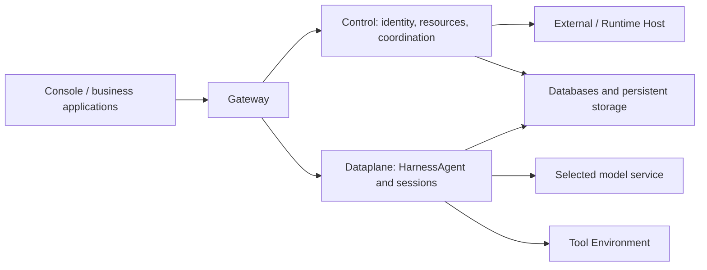

<Note>
The current release is `2.1.0-BETA1`, a prerelease. Validate your deployment before using it in production.
</Note>

This guide covers production deployment with Kubernetes and Helm. The published Service Chart installs Gateway, Control, Dataplane and Scheduler. You manage PostgreSQL, storage, domain and TLS. Components default to one replica with Recreate updates; plan maintenance windows.

## 1. Prepare dependencies

Prepare Kubernetes, Helm and reachable PostgreSQL. Workspaces need an RWX StorageClass or an existing shared PVC because several components mount them. Artifacts default to RWO. Single-node RWO behavior does not establish shared access across nodes.

You can install the Chart directly from the public Helm repository, without cloning the source. Download the matching configuration template and initialization SQL:

```bash
curl -sS --fail-with-body -LO https://chickenlj.github.io/helm-charts/examples/2.1.0-BETA1/kubernetes.env.example
curl -sS --fail-with-body -LO https://chickenlj.github.io/helm-charts/examples/2.1.0-BETA1/postgres-init.sql
```

Execute the SQL in the target database as its application owner to create `cp`, `rt` and `dp`. Plan backups for the database, files and keys. For an offline installation, download `agentscope-service-2.1.0-BETA1-kubernetes.tar.gz` and `SHA256SUMS` from the [GitHub Release](https://github.com/agentscope-ai/agentscope-java/releases/tag/v2.1.0-BETA1), verify the checksum and extract the bundle. It includes the Chart and the same configuration files.

## 2. Create a Secret

Copy `kubernetes.env.example` to a private file and replace every placeholder: database connections, random JWT/internal/Vault secrets, bootstrap password and required model credentials. URL-encode URI passwords and provide the raw JDBC password separately. Configure TLS according to database certificates.

```bash
kubectl create namespace agentscope
kubectl -n agentscope create secret generic agentscope-service --from-env-file=/private/path/service.env
```

Keep plaintext configuration and rendered Secrets out of the repository.

## 3. Configure values

Use this `production-values.yaml` starting point. Replace domain, storage classes, Ingress class and TLS Secret. Provision the TLS Secret beforehand or through your certificate controller.

```yaml
existingSecret: agentscope-service
allowLocalEnvironment: false
publicURL: https://agentscope.example.com
persistence:
  workspaces:
    storageClass: shared-rwx
    size: 20Gi
  artifacts:
    storageClass: standard
    size: 20Gi
ingress:
  enabled: true
  className: nginx
  host: agentscope.example.com
  tls:
    - hosts: [agentscope.example.com]
      secretName: agentscope-service-tls
```

Use `existingClaim` for retained PVCs. Configure `imagePullSecrets` for private images and controller-specific annotations for SSE timeouts and buffering. Tune requests and limits under `control`, `dataplane`, `scheduler` and `gateway` using measured workload requirements.

## 4. Install a pinned version

Add the public Helm repository and refresh its index. Repository access needs no login:

```bash
helm repo add agentscope https://chickenlj.github.io/helm-charts
helm repo update agentscope
helm search repo agentscope/agentscope-service --versions --devel
```

The published [Helm repository](https://github.com/chickenlj/helm-charts) hosts the index and archives on GitHub Pages. Pin `--version 2.1.0-BETA1`; `--devel` in the search command includes prereleases. The Chart supplies the matching image tag through `appVersion`.

Install a specific Chart version with the matching image namespace:

```bash
helm upgrade --install service agentscope/agentscope-service \
  --version 2.1.0-BETA1 \
  --namespace agentscope \
  --set imageRepository=sca-registry.cn-hangzhou.cr.aliyuncs.com/agentscope \
  -f production-values.yaml \
  --wait --timeout 10m
```

For an offline installation, replace `agentscope/agentscope-service` and `--version 2.1.0-BETA1` with the downloaded `./agentscope-service-2.1.0-BETA1.tgz`. Keep Chart and component image versions aligned. The Chart creates workloads in your cluster; Helm repository publication does not deploy a running Service.

## 5. Verify user workflows

```bash
kubectl -n agentscope get pods,pvc,svc,ingress
kubectl -n agentscope port-forward service/service-agentscope-gateway 18080:8080
```

Confirm Bound PVCs and Ready Pods. Sign in through the public domain with the bootstrap administrator and change its password. Verify the model, Environment, first Chat, Issue delivery and streaming. Port-forwarding helps diagnosis but does not validate public callbacks.

## Maintain the installation

Restart affected Deployments after Secret updates. Follow [operations](/v2/en/service/operations) before upgrading and retain prior Charts, values and image versions. PVCs are retained on uninstall; explicitly select them with existingClaim on reinstall.

This Chart runs complete Service standalone HTTP. Kubernetes-native ControlPlane/ASDP is a separate deployment mode, requiring deliberate SDK connectivity planning rather than blindly combining Charts. The single-replica installation does not guarantee zero-downtime migrations or multi-replica HA.

<span id="self-hosting"></span>
<span id="three-deployment-boundaries"></span>
<span id="choose-a-deployment-path"></span>
<span id="hand-over-a-usable-platform"></span>
<span id="operate-the-platform"></span>

## Deployment boundaries and production planning

The Compose commands in [quickstart](/v2/en/service/quickstart) deploy the complete Service. Users access it through Gateway; Control manages identity and resources and coordinates work; Dataplane runs HarnessAgent and sessions; and Scheduler handles scheduling work. Databases and persistent storage preserve the data these services need. Operating this shared installation is the responsibility that comes with self-hosting the platform.

Tool execution resources can be prepared separately from platform services. Even when file or Shell tools use a sandbox, remote file backend, or `self_hosted` Worker, Dataplane still runs Managed Agent reasoning. Connecting External or Hosted Agents also involves the existing application or Runtime Host. These resources connect to the deployed Service to provide their respective execution capabilities.



After choosing deployment locations, check where each component actually connects. A self-hosted Service can still call a remote model, and its tools may access external systems through MCP or other interfaces. Plan networking around the selected model, tools, and storage to understand where data travels, and provide incoming routes for callbacks such as OAuth when needed.

For local evaluation, use the Compose [quickstart](/v2/en/service/quickstart). A platform team maintaining a longer-term installation can choose Kubernetes to suit its infrastructure. The table below summarizes the resources required by each path; users of an existing team platform normally need only account and execution-environment setup.

| Path | Current use | Prerequisites |
| --- | --- | --- |
| Docker Compose | Local evaluation, development, and integration | Release bundle, Docker, model credentials, persistent disk |
| Kubernetes / Helm | Installation operated by a platform team | PostgreSQL, shared Workspace storage, Artifact storage, Secrets, domain, and TLS |
| Existing team platform | Direct use by application developers | Service address, account, authorized scope, available model and Environment |

The current complete Service Chart configures one replica per component and uses Recreate updates, so upgrades require a maintenance window. Do not assume this installation provides multi-replica high availability or upgrades without downtime. Kubernetes-native ControlPlane/ASDP is a separate deployment mode for the corresponding SDK and runtime transport requirements; it is not an additional set of mandatory components to install over the complete Service Chart.

When handing the platform over to an application team, administrators provide an accessible Service address and account and explain which Namespace the account can use. Users also need to know whether the default model is ready, which tool environment to select, and where business materials reside and how to access them. With this information, they can verify the model and file tools through [Their first managed Agent](/v2/en/service/create-managed-agent), then check application calls through the [Session API integration guide](/v2/en/service/service-api).

Before production use, verify that users can receive execution events continuously, restore existing content after a page refresh, and download delivered files with the appropriate permissions. If the application relies on Webhooks, confirm that the receiving endpoint gets notifications. Pair database and file backups with recovery exercises, including how unfinished work will be handled. These checks establish that the platform behaves as intended during normal use and recovery.

## Network surfaces

By default, Compose exposes only Gateway at the host address `127.0.0.1:18080`. User requests enter there and are forwarded to internal services, while the other components communicate over the internal network. Their container ports and exposure are listed below.

| Component | Container port | Exposure |
| --- | --- | --- |
| Gateway | 8080 | Host `127.0.0.1:18080` by default |
| Control | 8081 | Internal network |
| Dataplane | 8082 | Internal network |
| Scheduler | 8083 | Internal network |
| PostgreSQL | 5432 | Internal network |

A reverse proxy on the same host can forward requests to `127.0.0.1:18080`. If it runs in another container, its `localhost` refers to the proxy container itself, so configure a shared network or a host address reachable from that container. The public entry point should still target Gateway, with internal services and the database available through the private network.

## Enable remote access

To access the deployment from another device or test public OAuth or Channel callbacks, configure an HTTPS entry point for Gateway. Prepare a domain and TLS certificate, then forward requests through a reverse proxy. Set `BUILDER_OAUTH_PUBLIC_URL` in `.env` to the actual external address, such as `https://agentscope.example.com`. If Gateway also needs a different listening address or port, change `BIND_ADDRESS` and `GATEWAY_PORT`, then recreate the containers to apply the configuration.

Execution progress travels over a long-lived SSE connection, so the proxy needs to forward events promptly, disable event-stream caching, and allow sufficiently long read timeouts. After configuration, verify login and run a task that produces content over time. Check that events arrive incrementally, the page can reconnect after a refresh, and the callbacks your application uses are working.


## Install the published Docker Compose bundle

Without Kubernetes, install the published Compose bundle. It uses released images with authentication and authorization enabled, requiring no source or Java/Go build tools. Prepare Compose v2, Bash, curl, and OpenSSL, then download and verify:

```bash
curl -fLO https://github.com/agentscope-ai/agentscope-java/releases/download/v2.1.0-BETA1/agentscope-service-2.1.0-BETA1-compose.tar.gz
curl -fLO https://github.com/agentscope-ai/agentscope-java/releases/download/v2.1.0-BETA1/SHA256SUMS
awk '$2 == "agentscope-service-2.1.0-BETA1-compose.tar.gz"' SHA256SUMS > compose.sha256
if command -v sha256sum >/dev/null 2>&1; then
  sha256sum -c compose.sha256
else
  shasum -a 256 -c compose.sha256
fi
```

```bash
tar -xzf agentscope-service-2.1.0-BETA1-compose.tar.gz
cd agentscope-service
./init-env.sh 2.1.0-BETA1 sca-registry.cn-hangzhou.cr.aliyuncs.com/agentscope
```

Set `DASHSCOPE_API_KEY` in the generated `.env` and keep `BUILDER_LOCAL_DEV=false`. Prepare an Environment meeting your isolation needs; a trusted local evaluation may set `BUILDER_ALLOW_LOCAL_ENVIRONMENT=true`, running tools inside Dataplane.

```bash
docker compose pull
docker compose up -d --wait --wait-timeout 600
docker compose ps
curl -fsS http://localhost:18080/actuator/health
```

Open `http://localhost:18080`, sign in with the bootstrap administrator from `.env`, change the password, and configure API access below. Stop with `docker compose down` to retain volumes; see [operations](/v2/en/service/operations#compose-operations) for backups and upgrades.

<span id="production-api-access"></span>

## Authentication and authorization

Keep `BUILDER_LOCAL_DEV=false` in production. The published-image Compose configuration disables local mode by default, and the complete Service Helm Chart disables it too. Sign in to Console using `CONTROL_PLANE_BOOTSTRAP_ADMIN` and `CONTROL_PLANE_BOOTSTRAP_PASSWORD` from your `.env` or Secret, then change the password in Profile.

Local tutorials omit authentication headers. Before using their APIs in production, sign in and select an authorized namespace:

```bash
export BASE_URL="https://agentscope.example.com"
```

Enter your platform username and password. On a new deployment, use `admin` and the password from `.env`, or the password you changed in Profile.

```bash
printf 'Username: '
IFS= read -r LOGIN_USER
printf 'Password: '
IFS= read -r -s LOGIN_PASSWORD
printf '\n'

LOGIN_JSON=$(
  jq -n --arg username "$LOGIN_USER" --arg password "$LOGIN_PASSWORD" \
    '{username: $username, password: $password}' \
  | curl -sS --fail-with-body "$BASE_URL/api/auth/login" \
      -H "Content-Type: application/json" \
      --data-binary @-
)
unset LOGIN_PASSWORD
TOKEN=$(jq -er '.token' <<< "$LOGIN_JSON")

curl -sS --fail-with-body "$BASE_URL/api/v1/me/namespaces" \
  -H "Authorization: Bearer $TOKEN" \
  | jq '.items[] | {tenant, name}'
```

Choose a namespace from the response and use its `tenant` and `name` for `TENANT` and `NAMESPACE` above. The user token manages resources; see [application integration](/v2/en/service/service-api) for application credentials.

```bash
export TENANT="YOUR_AUTHORIZED_TENANT"
export NAMESPACE="YOUR_AUTHORIZED_NAMESPACE"
```

Include these headers on management requests. Scope fields in the body and query must match the selected scope:

```bash
curl -sS --fail-with-body "$BASE_URL/api/v1/agents" \
  -H "Authorization: Bearer $TOKEN" \
  -H "X-AgentScope-Tenant: $TENANT" \
  -H "X-AgentScope-Namespace: $NAMESPACE"
```

See [production access management](/v2/en/service/access) for accounts, namespace roles, resource grants, and private work. Tool confirmations and designated approvals require the authorized human's identity; an application key does not represent that human. Model, tool, and OAuth providers keep their own credentials in local mode too.

<span id="production-application-credentials"></span>

## Application credentials

Keep an actual `AGENT_ID` from [creating an Agent](/v2/en/service/create-managed-agent). The Application owner performs these management operations.

Use your platform Bearer token while developing. For a business backend, create an Application and issue an API key with explicit grants for the Agents, Teams or Workflows it may use. Credentials belong to the Application: replacing a key preserves access to its Sessions, while another application cannot read those Sessions simply because it uses the same Agent. Keep keys in your backend and check the business user's permissions there.


```bash
set -euo pipefail

APPLICATION_JSON=$(
  curl -sS --fail-with-body "$BASE_URL/api/v1/applications" \
    -H "Authorization: Bearer $TOKEN" \
    -H "X-AgentScope-Tenant: $TENANT" \
    -H "X-AgentScope-Namespace: $NAMESPACE" \
    -H "Content-Type: application/json" \
    --data-binary @- <<JSON
{
  "tenant": "$TENANT",
  "namespace": "$NAMESPACE",
  "name": "report-application"
}
JSON
)
APPLICATION_ID=$(jq -er '.application.id' <<< "$APPLICATION_JSON")
```

Issue a credential that can call this Agent:

```bash
KEY_JSON=$(
  curl -sS --fail-with-body "$BASE_URL/api/v1/applications/$APPLICATION_ID/credentials" \
    -H "Authorization: Bearer $TOKEN" \
    -H "X-AgentScope-Tenant: $TENANT" \
    -H "X-AgentScope-Namespace: $NAMESPACE" \
    -H "Content-Type: application/json" \
    --data-binary @- <<JSON
{
  "name": "backend",
  "scopes": [
    "invoke",
    "read",
    "interact",
    "cancel",
    "webhooks:write"
  ],
  "targets": [
    {
      "type": "agent",
      "id": "$AGENT_ID"
    }
  ]
}
JSON
)
AGENTSCOPE_API_KEY=$(jq -er '.apiKey' <<< "$KEY_JSON")
CREDENTIAL_ID=$(jq -er '.credential.id' <<< "$KEY_JSON")
```

A key is returned in plaintext only when it is issued. To rotate it, create a replacement, update and verify your application, then revoke the previous credential. The scopes are `invoke`, `read`, `interact`, `cancel` and `webhooks:write`. An application key does not become a designated human approver merely because it has `interact`.

<Accordion title="List and revoke old credentials">

```bash
curl -sS --fail-with-body "$BASE_URL/api/v1/applications/$APPLICATION_ID/credentials" \
  -H "Authorization: Bearer $TOKEN" \
  -H "X-AgentScope-Tenant: $TENANT" \
  -H "X-AgentScope-Namespace: $NAMESPACE"
```

Issue and verify a replacement with the creation request above. Then replace `OLD_CREDENTIAL_ID` with the old credential ID from the list. This disables that key.

```bash
OLD_CREDENTIAL_ID="OLD_CREDENTIAL_ID_FROM_LIST"
curl -sS --fail-with-body -X DELETE "$BASE_URL/api/v1/applications/$APPLICATION_ID/credentials/$OLD_CREDENTIAL_ID" \
  -H "Authorization: Bearer $TOKEN" \
  -H "X-AgentScope-Tenant: $TENANT" \
  -H "X-AgentScope-Namespace: $NAMESPACE"
```

</Accordion>

For application Session API calls, add `-H "X-API-Key: $AGENTSCOPE_API_KEY"` to the unauthenticated requests in local tutorials. Use the authorized user's Bearer token for human approval. Python callers use `ServiceClient(BASE_URL, AGENTSCOPE_API_KEY)`; management clients use a user token.


### Application limits

Read the current version before updating concurrency and token limits:

```bash
APPLICATION_JSON=$(
  curl -sS --fail-with-body "$BASE_URL/api/v1/applications/$APPLICATION_ID" \
    -H "Authorization: Bearer $TOKEN" \
    -H "X-AgentScope-Tenant: $TENANT" \
    -H "X-AgentScope-Namespace: $NAMESPACE"
)
APPLICATION_VERSION=$(jq -er '.application.version' <<< "$APPLICATION_JSON")

curl -sS --fail-with-body -X PATCH "$BASE_URL/api/v1/applications/$APPLICATION_ID" \
  -H "Authorization: Bearer $TOKEN" \
  -H "X-AgentScope-Tenant: $TENANT" \
  -H "X-AgentScope-Namespace: $NAMESPACE" \
  -H "Content-Type: application/json" \
  --data-binary @- <<JSON
{
  "version": $APPLICATION_VERSION,
  "maxConcurrent": 5,
  "tokenBudget": 1000000
}
JSON
```

<span id="production-cli-install"></span>

## Install the production CLI and Runtime Host

Prepare Go 1.26+ on the target Linux/macOS host and install both published commands using the standard Go module version:

```bash
go install github.com/agentscope-ai/agentscope-java/agentscope-service/service-controlplane/v2/cmd/as@v2.1.0-BETA1
go install github.com/agentscope-ai/agentscope-java/agentscope-service/service-controlplane/v2/cmd/agentscope-runtime-host@v2.1.0-BETA1
as connect https://agentscope.example.com
```

Configure PATH using the [Runtime Host guide](/v2/en/service/runtime-host#install-with-go), substitute your actual Service URL, and follow CLI login or short-lived enrollment prompts. Install and authenticate the provider separately.
