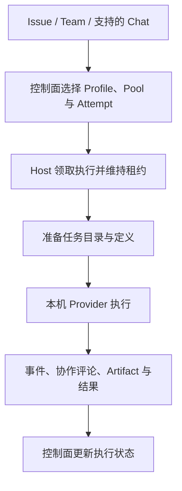

<Note>
此为预览文档，正式版本尚未发布。
</Note>

Hosted 的执行进程位于 Runtime Host 所在电脑或服务器。Service 保存工作和调度记录，Host 管理 provider 进程、任务目录与事件回传。

## 主机注册和任务选择

连接时 Host 注册稳定身份、范围、池、provider 描述与容量。调度结合 Agent 绑定、能力要求和运行策略产生 Attempt；Host 领取符合条件的工作并维持租约。Host 在线、provider 能 probe、Agent 可派发是三个不同检查点。

Runtime Profile 决定 provider 参数，Pool 提供可选执行主机。并发受 Host capacity 和上层调度策略共同约束。

## 准备与执行

Host 为执行准备任务工作目录，将平台支持的指令和能力文件映射到 provider 格式，再用该目录启动 provider。它不会默认切换到用户正在编辑的本地仓库；仓库、输入资料与分支需要在任务准备中明确。

任务范围凭据和工作上下文通过环境及 MCP/CLI 提供给执行者。provider 可以读取工作、发表评论和上传产物。把文件留在 Host 磁盘上并不等于其他协作者可以访问，应使用 Artifact 交付需要共享的结果。

## 事件、确认与恢复

适配器将 provider 事件转换为平台执行记录。支持的平台确认由 Host 转发工具请求并等待决定；不支持的平台确认必须按 provider 自身的权限方式处理。

Host 保留日志、provider 会话标识和 checkpoint，用于支持的恢复路径。重启时保留状态目录与 Host 身份；只声明 Resume 支持不能保证任意中断都能恢复，目标 provider 的会话仍需存在且可访问。OpenClaw 当前适配器不提供 Session resume。

## 重试和取消

取消会向执行链路传播，应检查 Attempt 终态以及 provider 进程是否结束。重试是新的 Attempt；只有符合恢复条件时才使用原 provider 会话。跨后端 fresh fallback 依赖持久 Issue、评论和 Artifact 重建上下文，不能搬迁进程内记忆。

使用 `agentscope runtime logs -f` 配合 Task/Attempt 诊断。若无任务可领，检查范围、池、绑定、容量与所需能力；若领取后失败，检查 provider 登录、参数、工作目录和工具依赖。

相关：[安装连接](/v2/zh/service/runtime-host) · [支持的 provider](/v2/zh/service/hosted-agent-providers) · [Team 协作](/v2/zh/service/team-collaboration)。

## 使用 API 跟踪和控制工作

平台账户通过 Issue 或 Endpoint 分派任务；Host 凭据仅用于 daemon 领取、续租和回报。业务调用者无需接触 `leaseToken` 或 provider 进程。

| 场景 | API 与参数 | 响应/用途 |
| --- | --- | --- |
| 读取 AgentTask | `GET /api/v1/agent-tasks/{taskId}` | 当前任务状态与执行关联 |
| 查询物理尝试 | `GET /api/v1/execution-attempts?tenant=...&namespace=...&taskId=...`，可选 `state`、`limit` | `attempts`，每次重试有独立记录 |
| 读取单个 Attempt | `GET /api/v1/execution-attempts/{attemptId}` | `attempt`，包含 backend、Host、租约、失败与恢复信息 |
| 请求任务取消或重试 | `POST /api/v1/agent-tasks/{taskId}/cancel`、`/retry` | 按 [Issue API](/v2/zh/service/issues) 提交版本等参数；随后读取最终状态 |
| 查看 Workflow 运行过程 | `GET /api/v1/orchestration-runs/{runId}/graph`、`/events` | 节点图和运行事件，反映 Host 的执行结果 |
| 恢复应用画面 | `GET /invoke/v1/invocations/{invocationId}/snapshot`，再连接 `/events/stream` | 按 snapshot 游标接续 SSE；使用对应业务调用凭据 |

Host 运行协议中的 `/checkpoint` 保存 `providerSessionId` 和 checkpoint，供适配器与任务恢复路径使用。它不是供应用任意选择 checkpoint 并恢复所有后端的接口。统一 invocation 的 `checkpoint_restore` 当前为 false；Hosted conversation 支持取消，补充输入、审批与 resume 则不能套用 Managed 的能力承诺。始终读取 `/invoke/v1/invocations/{invocationId}/capabilities` 的 `available_commands` 后再显示交互操作。

SSE 断线续传只恢复已经记录的输出，不重新执行工具，也不等于恢复 Host 进程。需要保留的交付物应上传为 Artifact；Host 磁盘、provider 会话和框架内部状态仍有各自生命周期。Host 接口与参数见 [Runtime Host API](/v2/zh/service/runtime-host#runtime-host-协议接口)。
