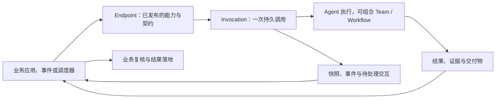

<Note>
此为预览文档，正式版本尚未发布。
</Note>

**AgentScope Service 是面向业务应用的 Agent as a Service 平台。开发者将 Agent 能力发布为 API，让应用能够提交任务、持续跟踪进度、处理人工交互，并获取结果与交付物。** 它面向需要研究、使用工具、操作系统和反复验证的工作，例如生成客户方案、核查文档、调查订单异常，或把故障分析转化为修复 PR。

业务用户可以始终留在原有产品中：在任务看板上分派工作，在订单页发起调查，在客服窗口补充信息，再在同一界面检查结果。Service 在后台承接 Agent 的运行与协作；应用负责自己的业务对象、用户体验、授权和结果落地。

## 与 AgentScope Harness 的关系：两种使用方式

**使用 AgentScope，你可以通过 Harness SDK 开发自己的 Agent 应用，也可以直接使用 Service 平台提供的托管 Agent 服务。** 前者把 Agent 的运行能力嵌入应用代码；后者将这些能力交给平台统一运行和管理，让应用通过 API 使用。选择 Service 的 Managed Agent 时，无需先开发一个独立的 SDK 应用，也无需为每个 Agent 应用分别建设和维护运行服务。

**AgentScope Service 上的托管 Agent（Managed Agent）基于 AgentScope HarnessAgent 内核。** HarnessAgent 提供推理与工具循环、上下文、工作区和会话等执行能力，Service 在这一内核之上提供配置、发布、调用、任务管理与运行治理。你在平台配置指令、模型、工具和资源，即可将 Agent 发布为业务可调用的服务。

| 如何选择 | Harness SDK：自主开发应用 | Service：使用托管 Agent 服务 |
| --- | --- | --- |
| 适合的需求 | 在 Java / Spring Boot 中深度集成，自定义运行逻辑和应用生命周期 | 快速接入专业助手或后台任务，统一管理多个 Agent 的运行与调用 |
| 开发方式 | 在代码中组合 Harness、业务工具和应用逻辑 | 在平台配置并发布 Managed Agent，业务应用通过 API 调用 |
| 运行责任 | SDK 提供执行能力；应用团队负责运行服务、部署、扩缩容和运维 | Service 承接 Agent 运行、会话、任务和交互；平台团队统一维护基础设施与执行资源 |
| 业务团队关注点 | Agent 实现、业务集成与应用运行 | 指令和工具、业务数据与授权、产品交互和结果验收 |

例如，同样是在 CRM 中生成客户方案：使用 SDK 时，将 Harness 集成进自己的 Java 服务并管理其部署；使用 Service 时，在平台发布方案 Agent，CRM 调用 API、展示进度并接收方案。两种方式也可以组合：已有 Harness 应用可以作为 [External Agent](/v2/zh/service/register-agentscope-agent) 接入 Service，保留自主管理的进程，复用平台的发布、调用与任务协调能力。SDK 开发入口见 [Harness 快速开始](/v2/zh/docs/quickstart)，托管服务入口见 [Service API 快速开始](/v2/zh/service/first-session)。

## 面向哪些应用场景

| 应用需求 | 使用形态 | 交付 |
| --- | --- | --- |
| 为 SaaS 或内部系统增加“帮我完成这项工作” | 页面按钮、任务状态变化触发后台 Job | 方案、报告、文件、可审阅的修改 |
| 让业务流程处理难以预先枚举的异常 | 流程中的调查、核验或处置节点调用 API | 结构化结论、证据、建议及执行回执 |
| 提供需要连续沟通的业务助手 | 应用维护 Conversation，逐轮提交请求 | 带上下文的回复、工具结果、待确认事项 |
| 定期研究、巡检或批量处理业务对象 | 调度器或事件处理器提交一批独立 Job | 每个对象可追踪的结果与异常 |
| 让另一个 Agent 使用专业能力 | 上层 Agent 或工具适配器调用 Endpoint | 有输入输出契约的专业任务结果 |

这些形态可以组合。一次订单异常调查可以先作为后台 Job 运行，在需要决策时由应用通知指定人员，收到批准后继续执行，最后把回执写回订单。详细输入、接入流程和验收方式见[场景案例](/v2/zh/service/usecases)。

## 从任务到交付的一条 API 链路

以“在 CRM 中生成客户方案”为例：应用读取客户需求及获准使用的资料，调用已发布的方案服务，保存返回的 Invocation ID。用户可以离开页面；再次打开时，应用读取快照并继续订阅事件，展示执行进度、待答问题和产物。完成后，应用展示方案与来源，由业务人员复核并决定是否发送给客户。

1. **定义能力。** 为任务配置指令、模型、工具和资源，或接入已有的 Agent 应用。
2. **发布服务。** 用 Endpoint 固定调用地址、输入输出 schema、认证策略和发布版本。
3. **提交工作。** Job 适合独立后台任务；Conversation 适合支持会话的 Agent。每次任务或会话轮次生成一个 Invocation。
4. **持续交互。** 用同一个 Invocation 读取状态、快照、事件和产物；按能力处理补充输入、待办与取消。
5. **接回业务流程。** 应用通过查询、SSE 或 Webhook 获取变化，校验交付并更新业务系统。

请求被接受、执行结束和业务验收通过是不同阶段。页面刷新应恢复已有 Invocation；重试提交使用相同幂等键。工具操作造成的外部副作用，还需要业务系统自己的幂等与核对机制。

## Service 负责什么

Service 提供能力发布、调用身份与配额、持久任务协调、运行状态和事件、人工交互以及交付物访问。使用 Managed Agent 时，Service 托管基于 AgentScope HarnessAgent 内核的 Agent，管理其执行与会话生命周期。平台可以部署在自己的基础设施中；“托管”指由 Service 管理 Agent 运行，不要求使用特定公有云。

应用团队仍需提供业务工具和数据连接、将业务用户权限映射到调用、设计交互界面，并定义结果验收与写回规则。发布一个 Endpoint 不会自动获得 CRM、GitHub 或订单系统的访问能力。

API 是平台能力的主要入口：应用、脚本和 SDK 可以管理 Agent、资源、编排与发布，也可以直接提交工作。Console 是这些能力的可视化操作界面。使用者可以通过自己的业务产品使用 Agent，无需进入 Console。

## 按任务选择执行与组织方式

先确定服务需要完成什么，再选择运行方式：

| 运行方式 | 适合的起点 | 责任边界 |
| --- | --- | --- |
| [Managed](/v2/zh/service/create-managed-agent) | 配置指令、模型、工具和资源，直接运行专业 Agent | Service 托管 HarnessAgent 内核；工具在配置的 Environment 中执行 |
| [External](/v2/zh/service/register-agentscope-agent) | 已有 Agent 应用、专用业务逻辑或自己的框架 | 应用自主管理进程，实现接单、事件回报与相应控制操作 |
| [Hosted](/v2/zh/service/connect-hosted-agent) | 复用 Codex、Claude Code 等 Coding Agent | Runtime Host 启动 provider、管理工作目录并回报执行 |

一个聚焦的服务可以只使用一个 Agent。需要动态分工时用 **Team**；需要固定步骤、条件和人工关卡时用 **Workflow**。它们是 Endpoint 背后的实现选择，调用方仍围绕一个 Invocation 获取结果。注册成功、运行时在线和能够实际接单，需要分别验证。

统一接口不代表所有运行时都支持相同交互。Team 和 Workflow 当前提供 Job；Conversation 需要具备会话能力的单 Agent。启用操作前读取 capabilities；Managed 原生 checkpoint、文件和子 Agent 接口按其独立协议使用。

## 理解公开 API 中的几个对象

| 对象 | 对应用的意义 |
| --- | --- |
| Endpoint / Release | 发布地址与契约；Release 固定所选目标及配置 |
| Application / Credential | 业务调用方及其凭证、权限与用量限制 |
| Invocation | 一次逻辑调用，关联状态、事件、交互、结果和产物 |
| Conversation | 多轮会话；每一轮产生独立 Invocation |
| Required action / Artifact | 等待处理的交互，以及实际交付物 |

Agent、Binding 和运行实例用于定义能力与定位执行；Workspace、Environment、Memory 和 Vault 用于配置执行资源。Team 内部的 Issue、Task、Attempt，以及 Workflow 的 Run / Node，用于协调工作。应用通常从 Endpoint 和 Invocation 接入，按需查看内部进度，无需自行复制平台的任务协调。

Application 是调用应用身份。共享一个 Application 的不同凭证不会自动形成不同终端用户的数据隔离；业务应用应在服务端校验用户对任务与资料的访问权限。Namespace、资源可见性和人工审批权限也各有边界。

| 操作 | 接口 | 指南 |
| --- | --- | --- |
| 管理 Agent、Team、Workflow、资源与发布 | 管理 API，主要为 `/api/v1/` | [发布 Endpoint](/v2/zh/service/endpoints) |
| 调用已发布的服务 | `/invoke/v1/` | [统一服务 API](/v2/zh/service/service-api) |
| 使用 Managed 特有的会话与恢复能力 | `/api/v1/agent-sessions` 等原生 API | [Managed 会话与任务](/v2/zh/service/session-event-log) |

各协议的身份、资源 ID 和事件游标不可互换。接口细节见 [API 参考](/v2/zh/service/api-reference)。

## 从哪里开始

先在[场景案例](/v2/zh/service/usecases)选择业务入口，再按 [API 快速开始](/v2/zh/service/first-session)完成一次“发布—调用—取回结果”。需要配置或排查时使用 [Console](/v2/zh/service/console/index)；部署参见[本地安装](/v2/zh/service/quickstart)与[生产安装](/v2/zh/service/kubernetes)。
