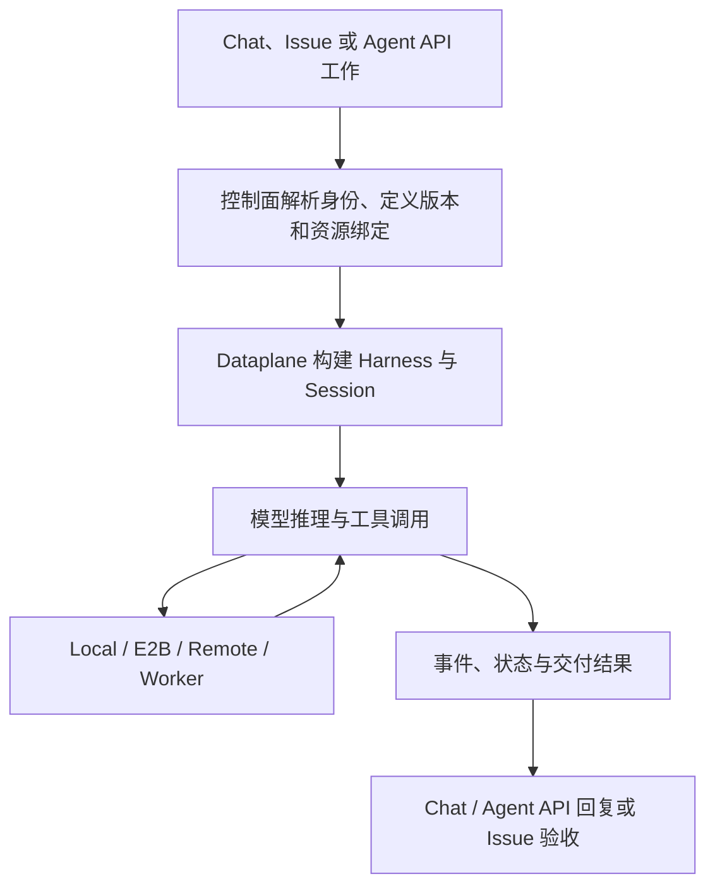

<Note>
此为预览文档，正式版本尚未发布。
</Note>

Managed 模式由 Service 持有 Agent 的运行生命周期。业务应用或浏览器通过 API 提交工作和查看事件；模型循环在 Dataplane 中运行，文件与 Shell 工具按 Environment 路由。

## 创建运行上下文

控制面解析 Agent 定义、版本、环境及知识与凭据引用。Dataplane 将定义文件准备到会话目录，构建 Harness，并连接持久状态存储。定义快照、执行文件和共享资源各有自己的生命周期：保存 Agent 配置不等于修改正在执行的所有实例。

Workspace 保存能力定义；Environment 决定文件和命令在哪执行；Memory Store 是共享知识；Vault 在连接工具前解析凭据。资源用法集中在本分类的四个资源页面。

## 模型与工具循环

Harness 使用显式 Model 或部署默认 Model，按指令进行推理、请求工具并读取结果。`maxIters` 限制迭代，工具权限决定操作能否执行。需要确认时任务可能等待用户决定；这时重复发送相同工作可能造成额外执行。

Local 工具在 Dataplane 环境执行，sandbox 使用 E2B，remote 使用共享文件存储，self_hosted 将工具工作交给 Worker。self_hosted 中模型仍由 Dataplane 驱动；Worker 的职责是接收工具工作并返回结果。

## 持久化与恢复

会话状态、事件和协调记录存储在部署配置的持久存储中。多副本使用协调租约约束执行；恢复仍依赖数据库、工作文件、所选环境和外部工具可用。一次工具成功后的外部副作用不会因服务重启自动撤销。

共享 Memory 是按需访问的实时平台知识，不应理解为每次调用都完整复制进模型提示。修改它需要按共享知识维护流程处理，不能假设 Agent 定义版本同时固定所有外部知识。

## 通过统一 API 观察发布的服务

Managed 作为 Endpoint 目标时，与其他 Agent 使用同一套 Invocation API。提交 Job 或 Conversation 后，读取 `/invoke/v1/invocations/{id}/snapshot`，从 `as_of` 续读 `/events/stream`。输入和控制使用 `/inputs`、`/actions`、`/cancel`、`/resume`，POST 命令携带 `Idempotency-Key`，并以 capabilities 和当前状态为准。

调用状态与执行细节分别服务于不同需求：`invocation.status` 和 `result` 用于业务结果；关联的 Run、Attempt 和 Managed session 用于追踪执行。业务应用不需要绕过 Invocation 直接向内部任务上报完成。接口和参数见[统一服务 API](/v2/zh/service/service-api)。

## 通过 Agent API 接入 Managed Agent

自建前端或业务系统可在 Gateway 使用 `/api/v1/agent-sessions`：创建 session，携幂等键 POST turns，GET snapshot 后从 as_of 订阅 events/stream。运行与观察连接分离，浏览器断线不取消任务。Console 的 Execution 页签提供这一流程。

Service 保存执行历史和 checkpoint。应用通过公共快照与事件恢复消息、工具卡和待办，包括进行中内容的已提交部分；不需要读取底层日志或连接到原来的运行副本。完整接入过程见[可恢复聊天示例](/v2/zh/service/agent-api-chat)。

浏览器刷新只恢复观察；工具确认通过 actions 回传；执行中断后检查结果并显式 resume。工具已分派但结果未知时必须先核对，不能靠重试规避。会话与任务操作见 [Agent API 指南](/v2/zh/service/session-event-log)，事件目录、工具展示和续传代码见 [SSE 接入](/v2/zh/service/sse-events)。

Managed 原生会话 API 还提供运行中 steer/inject、结构化及文件输入、进行中消息与工具快照、子会话读取、checkpoint 恢复/fork、Webhook 和用量预算。按业务场景选择操作见 [Agent API 使用指南](/v2/zh/service/session-event-log)；前端恢复和事件字段见 [SSE 文档](/v2/zh/service/sse-events)。

## 完成不等于验收

Chat 的一轮回复结束与 Issue 的业务验收不同。Issue/Team 执行需记录 Attempt 结果；协调角色还需完成或失败对应 Run node。需要人工复核时，检查产物后通过 Issue accept/reject API 提交验收决定。细节见[Managed 任务结果](/v2/zh/service/managed-harness-task-outcomes)。

排障时先区分：模型连接失败、工具等待确认、Worker 离线、工具权限被拒绝、执行已结束但业务尚未验收。保留 Session、Run 和 Attempt 标识用于关联日志。
