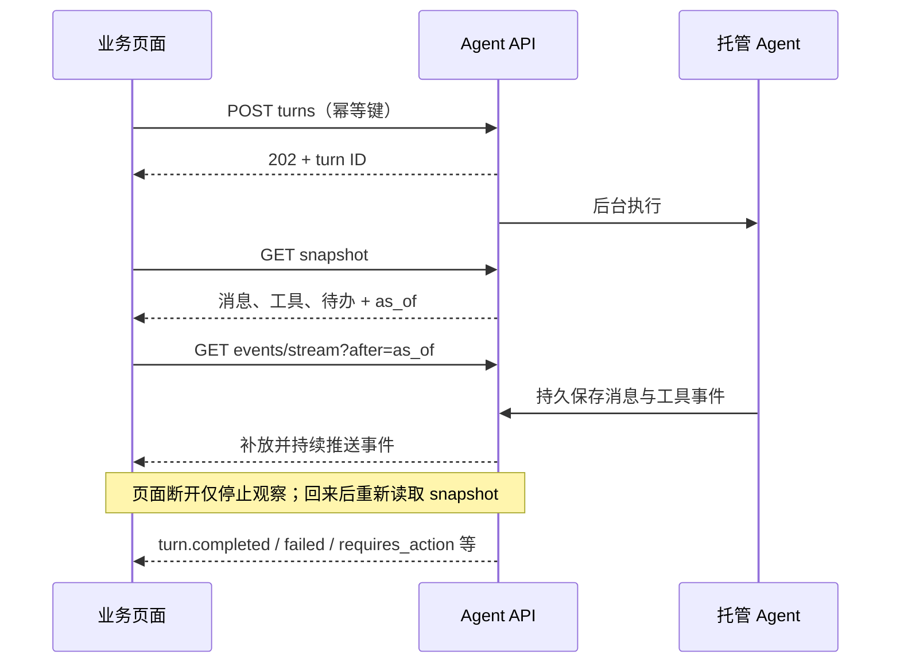

通过 AgentScope Service 调用 Agent、Team 或 Workflow 时，应用用 HTTP 提交任务，用 SSE 观察执行。一次任务可以产生多条助手消息、多个工具调用，并暂停等待用户答复。关闭 SSE 只停止观察；停止任务需要调用 cancel API。

已发布服务从[统一服务 API](/v2/zh/service/service-api)取得 Invocation。直接操作 Managed 原生会话时，按[会话指南](/v2/zh/service/session-event-log)取得 `SESSION_URL`、`TOKEN` 和 `TURN_ID`。先选定事件资源，再接入对应快照和 SSE。

## 先选择事件协议

| 使用场景 | 入口 | 协议 |
| --- | --- | --- |
| Managed Agent 的托管会话 | `/api/v1/agent-sessions/{id}/events/stream` | 本页的持久 session 事件，用户 Bearer token |
| 已发布 Endpoint 的调用 | 调用响应的 `eventsUrl` | 统一 Invocation 协议；使用 Endpoint 凭据 |
| 自己的 Java 进程内运行 Agent | AgentSession / agent.streamEvents | [SDK 使用指南](/v2/zh/docs/harness/session-log)，不是 HTTP SSE |

## Endpoint 协议范围

已发布的 Agent、Team、Workflow 使用统一的 **Invocation 事件协议**。提交 Job 或 Conversation 后，使用响应中的 snapshotUrl 和 eventsUrl；完整流程见[统一服务 API](/v2/zh/service/service-api)。

| 对比 | Managed session API | 公共 Invocation API |
| --- | --- | --- |
| 身份 | session_id，事件中可包含 turn_id/run_id | invocation_id，成员执行使用 execution_id |
| 事件入口 | `/api/v1/agent-sessions/{id}/events/stream` | `/invoke/v1/invocations/{id}/events/stream` |
| 快照资源 | 事件 envelope 数组 | 按资源 ID 索引的累计数据对象 |
| 事件续传 | session 的不透明 cursor | Invocation 自己的不透明 cursor |
| 交互 | 原生 turn 的 steer/actions/cancel/resume | Invocation 的 inputs/actions/cancel/resume |
| 恢复边界 | UI、原生会话与 checkpoint 能力 | 业务调用视图及公共操作；原生 checkpoint 独立使用 |

两者都采用 snapshot + as_of + SSE，但不能交换 cursor 或直接复用不同形状的快照。Invocation 复用 item.*、tool.*、required_action.* 等事件语义，另外提供 invocation.*、step.updated / step.failed、command.* 等服务事件。

```text
id: <invocation-cursor>
event: tool.completed
data: {"schema_version":1,"id":"event-id","type":"tool.completed","invocation_id":"invocation-id","created_at":1790928000000,"cursor":"<invocation-cursor>","data":{"execution_id":"member-execution","tool_call_id":"lookup-1","output":[{"type":"text","text":"已完成核对"}]}}
```

统一使用响应中的 Invocation URL。历史 Job/Conversation 事件入口已经移除，公共观察通过 Invocation snapshot 和不透明事件 cursor 完成。cursor 过期返回 410/cursor_expired，应重载 snapshot 并从新的 as_of 续订。TypeScript 客户端与累计视图见 `serviceInvocations.ts`，可运行示例见 `aistio/examples/service-api`。

以下章节介绍 **Managed 原生会话** 的事件与前端接入。调用统一服务时，请使用上面的 Invocation 资源与对应客户端。

## 一个聊天页面需要接入哪些能力

| 用户操作或界面 | HTTP 操作（相对 session URL） | 主要事件 / 状态 |
| --- | --- | --- |
| 发送新问题 | POST `/turns` | turn.accepted、turn.running、item.*、tool.*，最后读取目标 turn 结果 |
| 打开或刷新会话 | GET `/snapshot`，再 GET `/events/stream?after=as_of` | 先恢复完整视图，再更新增量 |
| 修改当前任务要求 | POST `/turns/{turn}/steer` | input.accepted、input.applied / input.rejected |
| 确认工具或回传外部结果 | POST `/turns/{turn}/actions` | required_action.accepted、resolved / rejected |
| 停止 / 继续执行 | POST `/turns/{turn}/cancel` 或 `/resume` | turn.cancel_requested → 明确结果；恢复后继续同一 turn |
| 展开子 Agent | GET `/subagents/{child}/snapshot` 和 `/events/stream` | 独立子会话的事件，使用自己的 as_of |
| 下载交付物 | GET `/artifacts`、`/files/{file}/content` | artifact.published / artifact.deleted |
| 展示消耗 / 离线通知 | GET `/usage`；注册 `/webhooks` | usage.recorded / budget.exceeded；Webhook 通知后读取事件详情 |

可运行的创建、提交和页面生命周期代码见[可恢复聊天示例](/v2/zh/service/agent-api-chat)。所有请求通过 Gateway；Managed 原生会话 API 使用用户 Bearer token，业务后端也可代为访问。客户端提交动作，SSE 负责反馈，两者不共用一条连接。



## 先认识四种标识

| 标识 | 用途 |
| --- | --- |
| session_id | 会话范围；一个流可覆盖多个任务 |
| turn_id / run_id | 逻辑任务 / 一次实际执行；答复或恢复可沿用 turn 并产生新 run |
| item_id / tool_call_id | 更新某条消息 / 某个工具卡；工具卡按 turn_id + tool_call_id 分组 |
| id / cursor | 事件去重 / 断线后读取的位置；cursor 不透明且只属于一个 session |

一次模型调用的 item.started、item.delta、item.completed 使用相同 item_id。同一 turn 内的多个助手输出拥有各自的 item_id。不要把全部片段拼成一条消息。

## 加载历史，再接收新事件

```bash
SNAPSHOT=$(curl --fail-with-body -sS "$SESSION_URL/snapshot" -H "Authorization: Bearer $TOKEN")
CURSOR=$(printf '%s' "$SNAPSHOT" | jq -er '.as_of')
curl --fail-with-body -N -G "$SESSION_URL/events/stream" \
  -H "Authorization: Bearer $TOKEN" --data-urlencode "after=$CURSOR"
```

先渲染 snapshot，再消费 as_of 后的事件。两次请求之间产生的事件也会补放，无需提前打开连接缓冲。快照内各资源共享这个事件水位；session 元数据是当前值。

| 快照字段 | 如何使用 |
| --- | --- |
| items | 完整消息和进行中消息的已提交前缀；读取 data.item |
| tools | 工具参数、运行进度、输出与状态；读取 data |
| turns / runs | 最新任务状态 / 各执行尝试状态 |
| required_actions | 当前需要用户处理的请求，包括仍待处理的答复投递失败 |
| action_commands / inputs | 已提交答复、steer/inject 的状态 |
| artifacts / subagents / usage | 发布产物、子会话关联、模型用量 |
| as_of | 后续 SSE 的起点 |

资源里的 item.updated、tool.updated 是累计视图 envelope，**不是事件日志中新产生的事件**。可直接用其 data 初始化界面。items/tools 包含工具循环期间已提交的状态，刷新时无需从头扫描所有事件。

### 持久事件帧

```text
id: <opaque-cursor>
event: item.delta
data: {"schema_version":1,"id":"e1","type":"item.delta","session_id":"s1","created_at":1790726400000,"cursor":"<opaque-cursor>","data":{"turn_id":"t1","run_id":"r1","item_id":"item_model_m1","model_call_id":"m1","position":8,"message_id":"msg1","content":[{"type":"text","text":"正在核实"}]}}

```

SSE id 与 JSON cursor 相同；event 与 JSON type 相同。created_at 是 Unix 毫秒。事件有时没有 turn_id/run_id，例如产物发布。内部 native source 不出现在公共 envelope 中。

更新内容后再保存 cursor；按事件 id 去重。重连可传 after 或 Last-Event-ID，同时传入时使用经校验后的较新位置。省略 cursor 从头读取。非法/跨 session cursor 返回 400，超前于当前已保留历史的位置返回 409，修正请求并重新取快照。15 秒 comment 心跳不包含业务数据，不推进 cursor。连接结束不代表任务结束。

### 增量内容如何恢复

item.delta 和 tool.delta 都是持久事件，默认输出、可跨副本补放；不再依赖当前 worker 的临时预览。旧 preview 参数仍可传入，但不改变行为。已经提交的增量可恢复；模型刚生成但尚未提交的片段不在已承诺的历史里。

将 item.delta.content 中的 text 片段追加到对应 item。tool_use 的 content 是参数字符串片段；按 call ID 归组，连续省略 ID 的片段沿用该 item 的 active_tool_call_id。快照包含这个关联，刷新后仍能接上参数生成。tool.requested/dispatched 中的 input 是已解析参数；tool.delta.output 为工具进度；tool.completed.result 是最终结果。item.completed 用完整内容替换同 ID 的累计消息，迟到/重复片段不能覆盖已完成内容。

工具卡与消息卡是不同视图。工具结果可同时存在于 tool.completed 和消息的 tool_result 块，按调用 ID 更新同一工具卡即可。

## 有哪些持久事件

### 任务与执行状态

| 事件 | 含义与处理 |
| --- | --- |
| turn.accepted / turn.queued | 已接收 / 等待派发；任务还未完成 |
| turn.running | 已派发运行；显示任务执行中 |
| turn.requires_action | 等待用户确认或外部执行结果 |
| turn.interrupted / turn.failed | 中断 / 失败；按原因处理后显式 resume |
| turn.cancel_requested / turn.cancelled | 请求停止 / 已取消；前者不是停止结果 |
| turn.completed | 目标逻辑任务成功完成 |
| run.started / run.ended | 单次尝试边界；run.ended 的 status 可能是 suspended、interrupted、failed 等 |

turn 事件包含 turn_id；run 事件包含 run_id，通常也带 turn_id。较早未完成任务会阻挡同 session 后续 turn。答复后重新排队会产生 turn.queued，因此快照不再停留在旧 requires_action。

### 消息与工具

| 事件 | 关键字段 | 前端处理 |
| --- | --- | --- |
| item.started | item_id、item、model_call_id | 创建 in_progress 消息 |
| item.delta | item_id、position、content | 去重后累加文字/工具参数 |
| item.completed | item_id、item，可选 final_output | 完整替换；final_output 仍不代替 turn.completed |
| tool.requested | tool_call_id、name、input | 显示工具及参数 |
| tool.dispatched | tool_call_id、name、input | 标记已开始执行 |
| tool.delta | tool_call_id、output | 累加进度内容 |
| tool.completed | tool_call_id、result、status | 显示最终结果；检查 result.state/status，完成不等于成功 |
| model.completed | model_call_id、model、status | 没有报告 usage 的模型调用结束 |

公开 content 支持 text、image、audio、video、data、file、tool_use 和 tool_result；不会导出原始 thinking、系统消息、内部 hint block 或完整请求 prompt。工具自己的业务输出仍可能包含敏感数据，开发工具时决定哪些内容适合展示。

### 人工确认与外部结果

| 事件 | 关键字段 | 含义 |
| --- | --- | --- |
| required_action.created | request_id、kind、tool_call、turn_id | 新待办；kind 为 confirmation 或 external_execution |
| required_action.accepted | request_id、command_id | 答复已持久接收 |
| required_action.resolved | request_id、kind | 运行时已处理 |
| required_action.rejected | request_id、command_id、reason、pending | 答复投递失败；pending=true 时恢复待办，附 kind/tool_call |

不要把 rejected 当成用户拒绝，也不要把 accepted 当成已批准执行。恢复页面时可读 snapshot.required_actions 与 action_commands。答复格式见 [Agent API 人工交互](/v2/zh/service/session-event-log#回答-required-action)。

### 其他执行信息

| 事件 | 关键字段与含义 |
| --- | --- |
| input.accepted / input.applied / input.rejected | input_id 或 input_ids、kind/status/reason；区分保存与实际应用 |
| usage.recorded | model_call_id、model、usage、scope；按调用去重，不按每条事件累加 |
| budget.exceeded | limit、model_call_id；本次模型调用被预算拒绝 |
| subagent.started / subagent.completed | childSessionId、childAgentId；通过子会话公共 API 查看详情 |
| artifact.published / artifact.deleted | artifact_id，以及 file_id/uri 等发布信息 |
| context.compacted | 上下文已调整；不发送私有上下文全文 |
| session.context_initialized | items、coverage=baseline_only；导入/fork 的上下文基线 |
| session.restored | checkpoint_id、operation_id、reason；保留旧审计历史的状态恢复 |
| session.status_created / session.status_running / session.status_idle | 会话创建、执行中或空闲 |
| session.status_rescheduled / session.status_requires_action | 会话重新调度或等待交互 |
| session.status_terminated / session.status_archived | 会话终止或归档 |
| session.error / session.hint | 会话错误或展示提示；不能替代根 turn 结果 |

保留未知 type 的 cursor 并忽略不认识的展示字段，便于客户端兼容新增信息。子 Agent 有独立事件流与 cursor；需要聚合用量时显式使用 `/usage?include_children=true`。公共日志与导出都不包含原始 checkpoint；诊断权限见 [trace 接口](/v2/zh/service/session-event-log#管理员检查-checkpoint-与工具结果)。

## 一次工具交互会看到什么

```text
turn.accepted T1 → turn.running T1 → run.started R1
item.started M1 → item.delta M1（文字、工具参数）→ item.completed M1
required_action.created A1 → run.ended R1 suspended → turn.requires_action T1
用户提交 actions → required_action.accepted A1 → turn.queued T1
turn.running T1 → run.started R2 → required_action.resolved A1
tool.dispatched C1 → tool.delta C1 → tool.completed C1
item.started M2 → item.delta M2 → item.completed M2
run.ended R2 completed → turn.completed T1
```

这是挂起式交互示例；在线等待式确认可以在同一个 run 中完成。工具与消息顺序由实际执行决定。用户在任意位置离开页面，返回后从 snapshot 的消息、工具卡及待办继续更新，而非只展示返回后的后半段文字。

## 前端接入示例

Console 的 fetch 客户端支持 Bearer header、SSE 帧解析、网络重连与 cursor；原生 EventSource 不能直接设置这里的 Authorization header。下面代码在 Console 模块内使用，独立应用可移植客户端并替换认证与 URL。

```typescript
import { getAgentSessionSnapshot, streamAgentSession } from './api/agentSessions';
import { AgentSessionView } from './api/agentSessionView';

const controller = new AbortController();
async function observe(sessionId: string) {
  const snapshot = await getAgentSessionSnapshot(sessionId, controller.signal);
  const view = new AgentSessionView(snapshot);
  render(view.snapshot());
  await streamAgentSession(sessionId, {
    after: snapshot.as_of,
    signal: controller.signal,
    onEvent(event) {
      view.apply(event);
      render(view.snapshot());
    },
  });
}
function render(snapshot: ReturnType<AgentSessionView['snapshot']>) {
  // 用 snapshot.items/tools/required_actions 更新业务 UI。
  console.log(snapshot);
}
// 页面进入时 observe(sessionId)，卸载时 controller.abort()。
```

AgentSessionView 按 item/call 身份归并完整记录与增量，恢复工具参数生成状态，并处理 action 投递失败、子任务和产物。页面刷新重新取 snapshot；短暂网络断开由客户端保留内存 cursor 重连。只持久化 cursor 而丢弃对应 UI 状态会缺少前缀，不能用于刷新恢复。

waitForAgentTurn 只判断目标 turn 的明确结果，requires_action/interrupted 也会返回交由调用者处理。答复或 resume 成功排队后可重新等待同一 turn。工具循环中的 run.ended 不作为成功结果。

### 需要历史工具时间线时

snapshot.tools 是当前累计卡片。需要每个请求、分派和进度的原始顺序时，分页读取 `/events`，按事件 id 去重，再从最后 next_cursor 继续 SSE。当前消息界面直接用 snapshot + reducer 即可。长历史资源列表使用 `/resources/{resource}` 的固定快照分页。

## 连接异常怎么处理

| 情况 | 处理 |
| --- | --- |
| 401 / 403 | 修复登录或权限，不无限重试 |
| 400 / 409 cursor 错误 | 核对 session 并重新取 snapshot |
| 410 资源分页过期 | 从第一页重新读，不把资源分页 cursor 用于 SSE |
| 网络中断 / EOF | 保留已应用 cursor 重连；不创建新任务 |
| 没有新片段 | 查看运行状态和心跳；模型/工具未必输出增量 |
| run.ended 后仍无 turn 结果 | 继续观察；后台需提交对应任务结果 |

完整 HTTP 契约见 `agentscope-service/docs/agent-api/openapi-v1.json`，事件 schema 见同目录的 `public-event-v1.schema.json`。实现客户端时使用本文的 AgentScope 协议。
