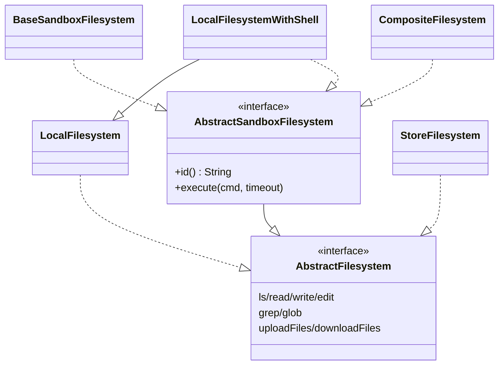

# 文件系统（Filesystem）

## 作用

把 agent 可见的文件操作从“本地磁盘”中抽象出来，提供统一的 `ls / read / write / edit / grep / glob / upload / download` 接口；在沙箱场景下额外打开 `execute` 能力。同一份上层逻辑（`WorkspaceManager`、`FilesystemTool`、`ShellExecuteTool`）可以在本地、远程沙箱、内存 KV 之间透明切换。

## 触发

| 时机 | 动作 |
|------|------|
| `HarnessAgent.build()` | 未显式设 `abstractFilesystem` 时默认创建 `LocalFilesystemWithShell(workspace)` |
| `WorkspaceManager` 读写 | `readWithOverride` 优先走 filesystem；append / upload 全走 filesystem |
| Tool 调用 | `FilesystemTool` 直接调用；`ShellExecuteTool` 仅在后端是 `AbstractSandboxFilesystem` 时注册 |
| `WorkspaceContextHook` | 调 `RuntimeContextAwareHook.setRuntimeContext()` 后，namespaceFactory 读到的 `userId` 就是当前请求的租户 |

## 关键逻辑

### 两层接口



- `AbstractFilesystem` 是最小接口；带 shell 执行的后端额外实现 `AbstractSandboxFilesystem`，HarnessAgent 据此决定是否注册 `ShellExecuteTool`。
- `read(filePath, offset, limit)` 中 `limit <= 0` 意味默认（本地后端读全文，sandbox 后端读到 `Integer.MAX_VALUE` 行）。

### 后端入门定位

| 后端 | 适用场景 | 关键参数 / 限制 |
|------|---------|-----------------|
| `LocalFilesystem` | 只需读写本地，不要 shell | `(rootDir, virtualMode, maxFileSizeMb, namespaceFactory)`；`virtualMode=true` 时锁定在 `rootDir` 内 |
| `LocalFilesystemWithShell` | **HarnessAgent 默认**；本地读写 + `sh -c` | `(rootDir, virtualMode, timeout, maxOutputBytes, env, inheritEnv, namespaceFactory)`；**不受限制执行**，仅限受信任的本地/CI |
| `BaseSandboxFilesystem` | 远程沙箱 / 容器后端的实现基类 | 只需覆盖 `id / execute / uploadFiles / downloadFiles`，`ls/read/grep/glob` 默认走远程 Unix 命令 |
| `StoreFilesystem` | 基于 `BaseStore` 的 KV，多租户 / 跨线程共享 | 静态 namespace 或 `NamespaceFactory`；不提供 shell |
| `CompositeFilesystem` | 按路径前缀路由多个后端 | 最长前缀优先匹配；`isSandbox()` 仅当 default backend 实现 sandbox 接口时为 true |

### `BaseSandboxFilesystem` 的取巧

实现者只需交付 `execute / uploadFiles / downloadFiles / id`，`ls / read / grep / glob / edit / write` 都会被默认实现转为远程 shell 命令：

- `ls` → `for f in <path>/*; do ... done`
- `read` → `sed -n 'a,bp' <path>`（二进制文件走 `base64`）
- `grep` → `grep -rHnF`
- `glob` → `find <path> -type f -name <pattern>`
- `edit` → 补下 base64-encoded `python3` 脚本做字符串替换
- `write` → 先 `[ -e ]` 检查存在性，再 `uploadFiles`

意义：只要沙箱环境有标准 Unix 工具链 + Python3，集成代价几乎为零。

### `NamespaceFactory`—多租户透明隔离

```java
@FunctionalInterface
public interface NamespaceFactory { List<String> getNamespace(); }
```

- **每次文件操作都调用**一次，返回当前请求的路径段 tuple（例如 `["users", "alice"]`）。
- `LocalFilesystem` / `LocalFilesystemWithShell` / `BaseSandboxFilesystem` / `StoreFilesystem` 都能接受；上层逻辑对路径无感。
- 典型用法：结合 `RuntimeContext.userId` 动态生成。

```java
AtomicReference<String> currentUserId = new AtomicReference<>("default");
NamespaceFactory ns = () -> List.of("users", currentUserId.get());

LocalFilesystemWithShell fs = new LocalFilesystemWithShell(workspace, ns);
// agent.call() 前更新 currentUserId，所有文件操作自动落在 workspace/users/<userId>/...
```

## 配置

```java
HarnessAgent agent = HarnessAgent.builder()
    .name("MyAgent")
    .model(model)
    .workspace(workspace)
    .abstractFilesystem(myFilesystem)  // 不传默认为 LocalFilesystemWithShell(workspace)
    .build();
```

几个常见组合：

```java
// 1. 本地开发（默认）
new LocalFilesystemWithShell(workspace);

// 2. 不要 shell 的只读写场景
new LocalFilesystem(workspace, /*virtualMode=*/ true, /*maxFileSizeMb=*/ 10);

// 3. 本地 + 远程记忆库组合
new CompositeFilesystem(
    new LocalFilesystemWithShell(workspace),
    Map.of("/memories/", new StoreFilesystem(redisStore, ns)));
```

## 相关文档

- [工具](./tool.md) — `FilesystemTool` / `ShellExecuteTool` 的入参
- [工作区](./workspace.md) — `WorkspaceManager` 上层怎么利用文件系统走两层读
- [架构](./architecture.md) — `ShellExecuteTool` 注册条件在哪里检查
