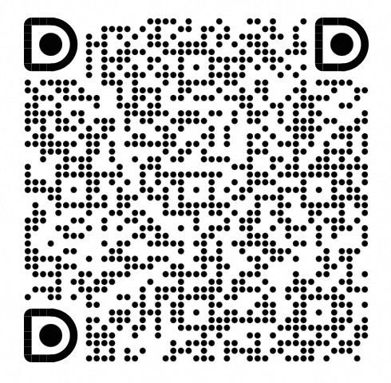

# AgentScope Java

**面向智能体的 LLM 应用开发框架**

---

## 什么是 AgentScope Java？

AgentScope Java 是一个强大的框架，使开发者能够使用面向智能体的编程范式构建 LLM 驱动的应用程序。它提供了完整的工具集，用于创建具有工具调用、内存管理、多智能体协作等功能的智能体。

## 核心特性

- **多模型支持**：支持 DashScope（通义千问）、OpenAI 等多种 LLM 提供商
- **工具系统**：基于注解的工具注册和执行，自动生成工具模式
- **响应式架构**：基于 Project Reactor 构建，提供高效的非阻塞操作
- **内存管理**：支持短期内存和长期内存（集成 Mem0 等外部后端）
- **多智能体管道**：支持顺序和并行的智能体工作流，处理复杂任务
- **状态管理**：基于会话的持久化和恢复机制，使用 JSON 存储
- **钩子系统**：可扩展的事件驱动定制化，用于监控和控制
- **MCP 支持**：集成模型上下文协议，增强工具能力

## 系统要求

- **JDK 17 或更高版本**
- Maven 或 Gradle

## 快速开始

按照以下步骤开始使用 AgentScope Java：

1. **[安装](quickstart/installation.md)** - 在您的项目中配置 AgentScope Java
2. **[核心概念](quickstart/key-concepts.md)** - 理解核心概念和架构
3. **[构建第一个智能体](quickstart/agent.md)** - 创建一个可工作的智能体

## 快速示例

```java
import io.agentscope.core.ReActAgent;
import io.agentscope.core.model.DashScopeChatModel;
import io.agentscope.core.message.Msg;

// 创建智能体并内联配置模型
var agent = ReActAgent.builder()
    .name("Assistant")
    .model(DashScopeChatModel.builder()
        .apiKey(System.getenv("DASHSCOPE_API_KEY"))
        .modelName("qwen-plus")
        .build())
    .sysPrompt("你是一个有帮助的助手。")
    .build();

// 调用智能体
Msg userMsg = Msg.builder()
    .textContent("你好！")
    .build();

Msg response = agent.call(userMsg).block();
System.out.println(response.getTextContent());
```

## 高级主题

熟悉基础知识后，探索这些高级功能：

### 模型集成
- **[模型集成](task/model.md)** - 配置不同的 LLM 提供商

### 工具与知识
- **[工具系统](task/tool.md)** - 使用基于注解的工具注册创建和使用工具
- **[MCP](task/mcp.md)** - 模型上下文协议支持，实现高级工具集成
- **[RAG](task/rag.md)** - 检索增强生成，提供知识增强的响应

### 智能体定制
- **[钩子系统](task/hook.md)** - 使用事件钩子监控和定制智能体行为
- **[内存管理](task/memory.md)** - 管理对话历史和长期内存
- **[计划](task/plan.md)** - 复杂多步骤任务的计划管理

### 多智能体系统
- **[管道](task/pipeline.md)** - 使用顺序和并行执行构建多智能体工作流
- **[状态管理](task/state.md)** - 跨会话持久化和恢复智能体状态

## 社区

- **GitHub**: [agentscope-ai/agentscope-java](https://github.com/agentscope-ai/agentscope-java)

| [Discord](https://discord.gg/eYMpfnkG8h) | DingTalk                                 |    WeChat    |
|------------------------------------------|------------------------------------------|------------------------------------------|
|                              |      |     |

## 许可证

AgentScope Java 基于 Apache License 2.0 发布。

---

**准备好构建智能体了吗？从[安装指南](quickstart/installation.md)开始吧！**
