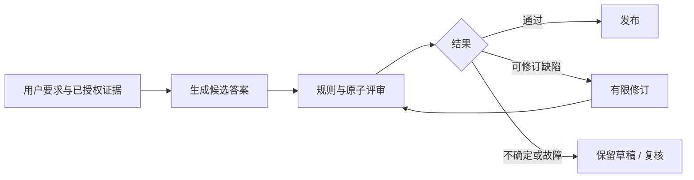

**状态：部分实现。** 独立Noul Judge及客服影子示例已实现，见[API与案例](/v2/zh/jev/guides/judge-api)。本页的自动修订、输出拦截、证据关联仍待开发。参考spring-ai-typesafe的JevJudge和SelfRefineAdvisor，把确定性检查与原子语义问题组合；不复制Spring Advisor调用链。[来源](/v2/zh/jev/references)

## 适用流程

已支持独立`judge(state, definition)`应用调用，后续增加最终产物拦截适配。拟议输出为每个criterion的`PASS/FAIL/INCONCLUSIVE/ERROR`、证据引用和原因码；总判定由代码归约，重要失败不能被其他高分平均抵消。

## 问题模板

| criterion | 输入 | 判定职责 |
| --- | --- | --- |
| requirement_coverage | 目标清单、候选答案 | 每项必须内容是否实际覆盖 |
| evidence_support | 候选声明、来源片段及版本 | 有无证据支持，而非“听起来合理” |
| commitment_boundary | 用户条件、候选承诺、动作状态 | 是否把计划或条件性操作说成已完成 |
| artifact_checks | 构建/测试/业务查询结果 | 确定性代码消费，Jev不能改写失败结果 |

客服答案“已退款”只有真实业务成功记录才能通过。编码答案“测试通过”要求具体测试执行证据。报告引用须引用已读取的证据，不能仅做语言流畅度评分。

## 如何接入当前循环

异步质量统计放onAgent完成后的轨迹消费者，不改变用户已看到的输出。同步最终答案审核需要缓冲候选文本及最终事件，审核后再发布；不能先把完整流推给用户，再用结尾事件宣称已经拦截。工具事件与用户答案需要分流，不应把整个Run无限缓存。

自动修订优先在应用草稿流程中实现，设最大次数、总token/耗时预算、缺陷不变停止条件。禁止对含有写操作的整个`next.apply(input)`循环盲目重试：这可能重复发信、扣款或提交代码。保留工具执行账本，修订只重生成答案或明确允许的只读步骤。

## 失败策略与验收

评审不可用时返回“未评审”，由业务选择草稿、原流程或人工复核；不得记录为合格。记录每轮候选版本、失败criterion和真实验证结果。先用[客服试点](/v2/zh/jev/applications/customer-support)中的越权承诺反例做离线验证，再影子运行。

验收看误放、误拒、修订后真实质量、重复副作用次数（必须为0）、额外P95和费用。不要只看两个评审模型的一致率；本次Hard答案审查17题只是选型线索，不能替代业务验收。[评测口径](/v2/zh/jev/evaluation)
