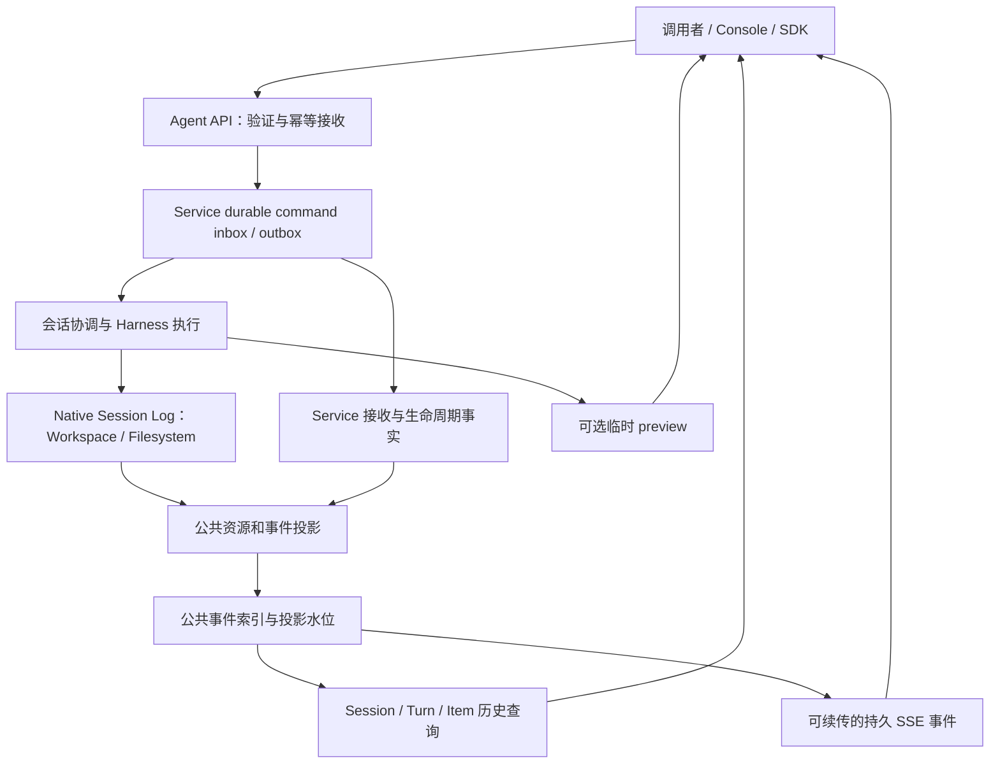

# Agent as a Service：Session Log、公共 Agent API 与 SSE 的统一设计补充

> 实施补充（2026-09-30）：当前已删除 SHADOW、重复 transcript 写入及隐式旧状态加载；以[兼容链路收缩记录](session-log-compat-cleanup-20260930.md)和用户文档为准。以下保留原始规划背景。
日期：2026-09-27。状态：规划，尚未实现。

本文件补充 [Session Event Log 实施计划](session-event-log-redesign-20260927.md)。实施目录仍为 `/Users/ken/agentscope-3/agentscope-java`，当前核对分支为 `harness-context-redesign`。涉及公共身份、turn、入站接收、断线和 SSE 的约束，以本补充的细化为准；不改变 Workspace/Filesystem 默认存储方案。

## 1. 结论与参考分工

需要从现在全局设计：Harness 的事件语义、可靠 Session Log、Service 的会话执行、公共 API、历史查询和 SSE 是同一条链路。内部持久格式、公共资源模型与线上流式格式分别版本化，以明确映射连接，避免内部实现类直接成为永久 API 契约。

参考依据及本次实际核对范围：

| 参考 | 采用的设计思想 | 已核实的边界 |
| --- | --- | --- |
| DeepSeek 本地 session、checkpoint-policy、repair | 日志派生历史、执行检查点、保留已提交前缀、结果未知语义 | 内存 append 与 durable flush 分开；其部署条件不能直接代替 AgentScope 多实例协议 |
| DeepSeek session-projection 源码与 projection/command RFC | init/apply/view、stateVersion、asOfSeq、历史基线与增量投影、命令结果可记录 | RFC 标为 proposed，已有源码实现的部分单独确认；不把整份规划说成全部已实现 |
| DeepSeek apiproxy EventsApi | 日志、投影、临时状态、控制帧分开 | 当前 mux 的 since 在接口中声明未实现；queued inbox 在被 Agent claim 前非 durable，不能照搬为托管接收保证 |
| OpenAI Agents API | 托管执行框架与执行环境分开，Session/Turn/Item 为调用者可查询对象 | 官方事件指南明确直播流不补放漏掉事件，重连依靠已保存 items 重建 |
| Claude Managed Agents | 入站命令、持久事件和 stream-only preview 分开；最终记录对齐预览 | preview 不持久化、无法补放；不能由字段相似推断与 Messages API 或其他厂商相容 |

官方依据（检索日 2026-09-27）：[Agents API 发布说明](https://openai.com/zh-Hans-CN/index/introducing-the-agents-api/)、[OpenAI Events and items](https://developers.openai.com/api/docs/guides/agents-api/sessions/events)、[OpenAI Sessions](https://developers.openai.com/api/docs/guides/agents-api/sessions)、[Claude Session event stream](https://platform.claude.com/docs/en/managed-agents/events-and-streaming)。这里只引用其公开行为，不推断厂商内部存储采用了哪种 event sourcing 实现。

DeepSeek 本地依据：

- `/Users/ken/agentscope-2/deepseek-harness/packages/core/session/src/index.ts`、`types.ts`、`repair.ts`。
- `packages/session/session-checkpoint-policy/src/index.ts`。
- `packages/session/session-projection/src/index.ts`。
- `packages/host/apiproxy/src/api/events.ts`。
- `.agents/notes/proposed/architecture/2026-07-27-session-projection-and-command-log.md`。

AgentScope 的选择是：内部默认保留可用原生 chunk 与语义日志；公共流对已提交业务事件承诺游标恢复，低延迟 preview 单独声明可丢。这个保证是我们的产品决策，不声称由 OpenAI 或 DeepSeek 当前接口直接提供。

## 2. 先固定公共资源和身份

| 对象 | 对外含义 | 与内部关系 |
| --- | --- | --- |
| Agent / AgentVersion | 可调用的配置与能力版本 | 与现有 Catalog/Binding/发布治理对齐 |
| Session | 稳定、可继续的托管交互实例 | 不等于单次 HTTP 请求、进程、sandbox 或本地目录 |
| Turn | 一轮逻辑工作及其 outcome | 保持稳定 turnId；重连不创建 turn；执行重试/worker 交接不自动变成新 turn |
| Item | 可保存、检索的消息、工具调用/结果等工作记录 | 稳定 itemId，关联原生 messageId/toolCallId；不等于 eventId |
| RequiredAction | 等待用户确认、工具结果或其他外部输入 | 关联 interaction requestId，响应可幂等提交 |
| Subagent | 父会话内可发现的委派关系 | 指向独立 native child session；子完成不自动代表根 turn 完成 |
| Environment | 当前执行环境及其状态 | 环境替换不自动删除 session 历史，日志恢复不承诺进程/文件环境自动恢复 |
| Artifact | 显式发布的输出文件及其版本 | 与内部所有 blob 分开，内部内容不自动成为公开可下载产物 |

turn 的触发由显式输入策略决定：idle 时新输入可开始新 turn；running 时的输入可选择 steering、排队或拒绝。第一版应有明确默认和能力声明，不让每个入口自行猜测，也不把每条 steering 消息计为一个新 turn。无法实现 steering 的运行时返回能力限制或采用调用者明确选择的 queue 策略。

命名需要消歧：公共 turnId、平台 orchestration runId、Harness executionRunId、工具 actionId、模型 attemptId 各自有定义。原计划 run/start 中的 runId 指 Harness 执行身份，不能与 Service 已有 Run/ExecutionAttempt ID 混用。一个公共 turn 可能关联多个执行尝试；公共契约不直接暴露每个内部调度细节。

会话至少区分 idle/running/requires_action/terminated/failed 等状态，turn 单独表达 queued/running/waiting/completed/failed/cancelled。最终状态枚举由 P0 状态机固定，不依赖名字相似进行映射。HTTP 连接关闭、session idle、工具 returned、task verification passed 是不同事实。

## 3. 事实归属和端到端链路



每个事实只有一个权威写入者，但无需强迫平台事实与 runtime 事实物理存于同一个文件：

- Service 拥有身份认证后接收、排队、调度前取消、环境生命周期、平台策略等事实；Harness 尚未启动时，它们已经可能发生。
- Harness 拥有真实模型/工具执行、上下文变换、工作消息与内部状态事实。
- 命令以 commandId/inputId 跨层关联。Service accepted 与 Harness applied 是不同阶段，不重复伪装成同一条用户消息。
- 公共 Items、状态和事件由这些来源做明确投影；保留内部 source reference 和 projectorVersion，以便重建、去重和排查。
- 原生文件日志、Service 数据库读模型允许是两份物理表示，但不能独立决定同一个模型响应或工具结果的内容。
- 投影更新、公共 event 分配及投影 checkpoint 的提交必须具有一致性保证。不能先向 SSE 发 completed，再让 GET items 读不到该 turn 的最终 item。

public cursor 反映公共读模型提交，不等于 native durableSeq。不同来源暂时延迟时显示诚实的 queued/running 状态，不提前合成成功；利用 cause 引用确保公共 completed 在其最终 item 和 required actions 状态之后可见。

## 4. 公共事件覆盖面

原计划的 native 事件目录保留，并新增 Service 负责的事实/公共投影。下面是分类，具体 wire 名称由公共 schema 一次性固定；不要求客户端读取 native `request/prepared` 或 core Java 对象。

| 公共事件族 | 对应内容 | 来源 |
| --- | --- | --- |
| Session lifecycle | 创建、运行、空闲、等待操作、失败、终止、配置版本变化 | Service 状态机 + runtime 边界 |
| Input / command lifecycle | 已接收、排队、被应用、被拒绝/撤回 | durable inbox + native input/interaction |
| Turn lifecycle | queued/started/waiting/completed/failed/cancelled | 公共 turn 状态机；真实执行/取消结果为依据 |
| Item lifecycle | 消息、工具调用/结果等 item 创建/更新/完成；部分输出明确标记 incomplete | native message/tool + 公共 projector |
| Required action | confirmation/external result 等 requested/resolved | interaction 状态和返回命令 |
| Subagent | 创建、可查询身份、委派进度和结束 | 父子日志关联 |
| Environment | provisioning/ready/failed/reset 等实际环境事实 | Service/environment owner |
| Artifact | 输出产物发布、更新或删除 | 发布记录，非任意内部 blob |
| Usage | turn/session 的版本化累计快照 | 按 model attempt 去重的 native usage；子 Agent 汇总范围明确 |
| Trace（独立权限） | model/tool/context/verification 等细粒度追踪 | 原生记录的授权投影 |
| Preview（临时） | text/tool output 等实时增量与关联身份 | 低延迟输出，与最终 item 对齐 |

usage 是观测/核算输入；收费与结算应独立定义，不能把一次 SSE 传输或客户端重复接收当成新增消耗。完整 request、内部策略、provider thinking、原始工具输出只在明确授权的 trace 视图提供，不因内部记录完整而自动公开。

Item 对象状态可以变化，但事实日志仍不可变。公共 GET 返回当前投影及 revision；事件记录 item 的状态迁移。输入 processedAt 同理从后续 applied/failed 事实计算，不能为更新展示而回改原始事件。

## 5. SSE 契约需要明确的选择

### 5.1 公共 envelope 与版本

建议 envelope 字段：apiVersion、eventId、type、createdAt、sessionId、可选 turnId/itemId/subagentId/requiredActionId，以及类型化 data。timestamp 不作为排序依据。

SSE 的 `id` 是公共流的 opaque resume cursor，JSON 的 eventId 是该公共事件的稳定身份；itemId 标识被更新的资源。native seq 与内部 source reference 默认留在 trace/服务端，不直接作为所有公共流的游标。旧 API 的数字 seq 可由旧 adapter 保留。

示例仅表达拟议字段关系，不表示已确定路由或与第三方 wire-compatible：

```text
id: cursor_example_421
event: item.completed
data: {"apiVersion":"v1","eventId":"evt_example","type":"item.completed","createdAt":"2026-09-27T00:00:00Z","sessionId":"session_example","turnId":"turn_example","itemId":"item_example","data":{"item":{"id":"item_example","kind":"message","status":"completed","role":"assistant","content":[{"type":"text","text":"完成。"}]}}}
```

对 preview 不发送 SSE `id`，不推进持久 cursor；其 payload 带稳定 itemId、content block index 和连接内片段位置。最终持久 item 替换预览缓存；结束/失败但无最终正文时清理 preview 并标示 incomplete，而非永久显示半段为完成。

log schema、public API schema、projector/stateVersion 分别管理。兼容客户端可以保留未知 informational 事件并按规则推进已消费游标；影响处理的未知版本必须明确报错，不能假装完成。

### 5.2 重连和快照的一致性

- 公共持久流在保留期内支持 after cursor/Last-Event-ID 的至少一次交付。重复事件按 eventId 幂等折叠，不承诺网络只投递一次。
- GET 历史/items/session snapshot 带一致性水位；客户端从该水位之后接 SSE。服务端实现 replay-to-live 的无缺口切换，不能要求调用者依靠请求时间凑顺序。
- 支持先订阅缓冲再拉快照的客户端，也须比较 snapshot 水位和 item revision，防止旧增量覆盖新终态。
- 单 session、turn filter、子 Agent 聚合、trace filter 的 cursor scope/version 必须可验证。过滤后数字不连续并不自动说明丢数据；新契约不得要求所有过滤视图逐条检查 seq+1。
- cursor 过期、跨 session 或过滤条件不匹配返回明确错误及重新建立 snapshot 的路径，不能默默从最新开始导致遗漏。
- 心跳只维持连接，不推进业务 cursor。慢消费者允许断开并用 cursor 恢复，不能让它阻塞 Agent 或造成无界内存。
- 临时 preview 默认不补放，即使原始 chunk 在内部日志中仍然存在。逐 chunk 历史回放属于明确授权的 trace 功能，不能与普通实时预览混成一个保证。
- 断开 SSE 不取消托管执行；显式 cancel/interrupt 才提出停止请求。combined submit-and-stream 是同一异步任务的便捷入口，不能把执行资源绑定到 HTTP subscriber。
- session stream 可以跨 turn 存活；turn-scoped helper 可以在目标根 turn 终态后关闭。子 Agent 结束、idle 和 socket EOF 均不能被 SDK 统一解释为成功。

## 6. 入站 Agent API 与可靠接收

资源操作至少覆盖：创建/读取/继续 session，提交 input/steer，取消目标 turn，提交 confirmation/tool result，查询 turns/items/required actions/artifacts，读取历史事件与 SSE。公共 URL 与现有 `/invoke/v1`、`/api/v1` 的归属在 P0 固定，不在该规划中凭空宣布新路由已可用。

输入命令与输出事实采用不同 schema。客户端只能提出 message/cancel/answer 等允许的命令，不能上传任意 `tool/result`、`context/replaced`、`turn/completed` 事实来改变权威历史。外部 tool result 需对应真实 pending RequiredAction，并验证调用方权限、关联 ID 和状态。

可靠接收顺序：

1. 校验身份、AgentVersion/SessionKey、能力、目标 turn/action、输入结构与幂等键。
2. 在 Service 的持久事务中保存 command、admission/queued 事实和待派发 outbox，然后返回稳定 commandId、sessionId、必要的 turnId 和状态查询位置。
3. Worker 以 commandId 幂等消费；Harness 记录实际应用事实，绑定真正的 turn/step；Service 跟进公共投影。
4. Worker/进程崩溃后已受理命令仍可发现与继续派发。同幂等键同内容返回同一命令，不同内容返回冲突；受理 ACK 不表示模型已开始或取消已完成。
5. 外部操作响应、取消及 steering 都走同一可追踪接收链路；显式记录 applied/rejected 等结局，不伪造执行成功。

原计划的 input/received 只覆盖 Harness intake；服务端 acceptance 必须单独由 Service owner 持久记录。DeepSeek 的 transient queue 可以借鉴 UI snapshot 设计，不能替代这里的 durable inbox。

## 7. 当前 Service 的复用与缺口

已核对现有代码：

- `service-common/.../managed/SessionEventTypes.java` 已有 user/system、agent、session、span 和 stream-only event_start/event_delta 分类。
- `service-common/.../managed/service/SessionEventLog.java` 已有数据库事件、seq 冲突重试、幂等追加入口、通知驱动补读；其 appendOnce 当前把 processedAt 设置为写入时间，不能直接代表新的异步命令真正 applied。
- `service-dataplane/.../api/DataSessionApiController.java` 已接受 after/Last-Event-ID，持久事件与 preview 合流；toSse 仅为正 seq 设置 id。
- `service-dataplane/.../managed/SessionEventMapper.java` 与 Control Plane observer 是需接通新原生来源的适配点。
- 现有 Endpoint Gateway 已有 conversation/job 与 invocation 语义；公开 Agent API 应明确复用哪些入口，不能无意把 Agent Session、Work Issue 和 Job 合并。
- `agentscope-service/docs/controlplane/unified-conversation-contract.md` 已要求保留 native facts 并做 conversation projection。本次是完成源端与公共契约的闭环，不推翻该方向。

需要新增的主要能力是稳定公共资源身份、durable admission、明确的状态机与错误、类型化 API schema/SDK、一致水位的 items/snapshot、跨 native/transport 的映射，以及所有终态/断线/并发情形的协议测试。现有浏览器 Event DTO 不自动等同于适合长期对外发布的 Agent API。

公共原生 API 默认采用 AgentScope 的版本化契约。将来若要提供 OpenAI/Claude 兼容层，单独用 adapter 和 contract tests 证明行为兼容；仅采用相同字段或事件名不能宣称兼容。

## 8. 对原实施计划的调整

| 阶段 | 增加或前移的工作 |
| --- | --- |
| P0 | 同时固定 public Session/Turn/Item/RequiredAction、身份映射、命令接收策略、终态、SSE 重连/preview、权限和兼容范围；产出 OpenAPI/JSON Schema 草案与样例轨迹 |
| P1 | native schema 与 public DTO 独立版本化；定义 projector/adapter seam 和 golden fixtures，先验证映射，不把 Java 类序列化直接作为公共协议 |
| P2 | 在 native commit 之外定义 Service durable inbox/outbox 与 public projection checkpoint；各事实 owner 的提交承诺清晰 |
| P3 | Hosted execution 与 HTTP/SSE subscriber 解耦；命令 ID 传递到 Harness；模型/工具检查点维持原要求 |
| P4–P5 | projection 基线与 asOfSeq、public items、重启/恢复/子 Agent/required action 的一致性联动验收 |
| P6 | 实现公共 endpoints/SSE、SDK、Console 与 Control Plane 的全链路接入；协议设计不再拖到此阶段才开始 |
| P7 | 补公共 API 兼容、游标保留期、背压、成本与规模验证，明确发布级支持矩阵 |

无需立刻重写所有 Service 页面。先固定并验证对外契约，再按现有阶段迁移实现；这样能避免内部完成后才发现必须补回 item identity、command lifecycle 或稳定 public turn。

## 9. 联合验收场景

1. 接收输入并返回 ACK 后立即重启，输入不丢且不会因重复派发执行两次同一 admission。
2. 开始模型推理后关闭 SSE，Agent 继续执行；重连看到持久终态，preview 缺失不会损坏最终 item。
3. running 时分别发送 steering/queue/cancel，turn 归属与命令状态符合显式策略。
4. cancel ACK 与实际取消完成分开；工具无法及时停止或结果未知时，状态不谎报为成功。
5. tool confirmation/result 重复提交幂等，错误 session/action 身份或已过期请求被拒绝。
6. 恢复期间替换 worker/environment，session 与公共 turn 保持稳定；native execution 身份变化可在 trace 中追踪。
7. 原生 commit、public projection、SSE 通知之间各点断电，重启可补读/重投影；不重复呈现，不提前发布 completed。
8. GET items 与 SSE 并发，终态 item 不会被旧 preview 或旧 revision 覆盖；历史尾页加 live 无缺口。
9. 根/子 Agent 并发、过滤流、cursor 过期和 scope 不匹配均符合协议；子完成不会误终止根 SDK helper。
10. 普通调用者无法从公共事件取得内部完整 request 或不属于自己的 artifact；授权 trace 保留完整来源信息。
11. 一条基准执行同时生成 native log、public durable events、items snapshot 和可选 preview，golden fixtures 验证四者一致。

本次只核对参考资料并更新设计文档，没有实现新 API、修改执行代码、运行构建或部署。
