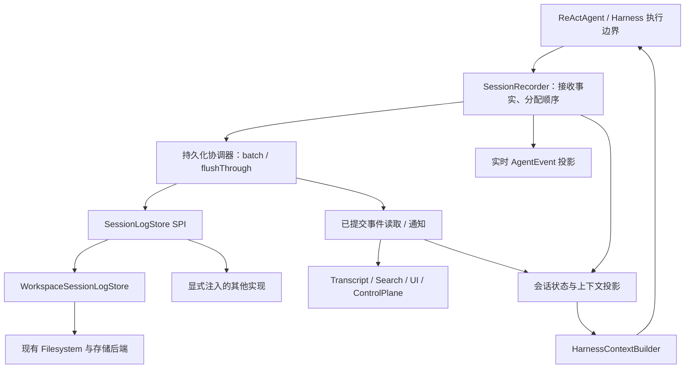

# AgentScope Session Event Log 实施与改造计划

> 实施补充（2026-09-30）：当前已删除 SHADOW、重复 transcript 写入及隐式旧状态加载；以[兼容链路收缩记录](session-log-compat-cleanup-20260930.md)和用户文档为准。以下保留原始规划背景。
日期：2026-09-27。状态：待实施的设计与执行计划，不代表功能已完成。

全局设计补充：[Agent as a Service：公共 API、Session Log 与 SSE](agent-as-a-service-event-contract-20260927.md)。公共 Session/Turn/Item、入站接收和流式恢复契约前移到 P0，与内部日志共同设计；本计划的事件名是 native 逻辑词汇，不直接作为公共 API 名称。公共协议、原生日志格式和 projector 版本分别演进。

## 1. 工作位置、基线与范围

- 唯一实施目录：`/Users/ken/agentscope-3/agentscope-java`。
- 本次核对的当前分支：`harness-context-redesign`。沿用当前目录和分支；不创建 worktree，不切回旧的 agentscope-2 项目。
- 工作区已有较多未提交变更，其中包括 compaction 策略与实现。后续实施前记录相关文件基线，保留这些变更，不把无关内容混入提交。
- 对照代码实际位于 `/Users/ken/agentscope-2/deepseek-harness`、`master`；用户最初提供的 agentscope-3 对照路径不存在。参考其日志、投影、检查点和恢复语义，不移植 Cordis 插件框架。
- 本计划覆盖 core、harness、现有存储扩展、Control Plane、Service、前端会话消费、文档与示例；不包含现在就发布或部署。

目标是让 Session Event Log 成为 Harness 交互历史和可恢复会话状态的权威来源。Workspace/Filesystem 继续作为默认存储底座，AgentEvent 保留实时消费接口；模型上下文、会话展示、检索和遥测从已记录的事实派生。

“可恢复状态”不包括 JVM 对象、打开的进程、网络连接、沙箱活跃句柄等外部运行资源。它们需要根据日志中的资源引用重新连接或显式标记不可恢复。事件回放也不等于重新调用模型或重新执行工具。

## 2. 当前代码基础与改造落点

| 现有组件 | 已有能力 | 本次处理方式 |
| --- | --- | --- |
| `core/event/AgentEvent`、`ReActAgent.buildAgentStream` | 实时事件；call 与 streamEvents 共享入口 | 保留 API，以执行事实记录为源逐步统一投影；补齐执行身份和终止语义 |
| `AgentState`、`AgentStateStore` | 会话状态、版本化保存、失败保存 | 先保留，完成日志重建后将已覆盖字段变成带日志水位的 checkpoint |
| `ModelRequestPreparer`、`HarnessContextBuilder` | 最终请求准备、上下文校验、ContextManifest | 复用入口，记录请求内容与转换事实；manifest 仍是可公开的元信息视图 |
| `SessionTranscriptWriter`、`TranscriptMiddleware` | 正常完成后从 context 派生 JSONL | legacy session 保留；新模式改由日志投影产生 transcript |
| `SessionTree`、`SessionEntry` | 追加消息、工具条目、压缩类型定义、远程镜像 | 保留旧格式读取，退出新模式的权威写入路径 |
| `TranscriptStore` | 不可变 segment、Filesystem/ObjectStore 实现 | 复用底层分段能力，演进到有提交语义的日志存储；旧接口作为迁移适配边界 |
| `WorkspaceManager`、`AbstractFilesystem` | 路径、namespace、local/remote/sandbox 等后端 | 默认存储入口，不另建一套租户路由或对象存储客户端 |
| `BaseStore`、`StoreItem` | version、putIfVersion | 复用 CAS；审计各实现的真正原子性和成功语义 |
| Control Plane `EventJournal` | 本地持久 outbox、ACK、重传 | 保留传输职责，消费已提交的原生日志，补上持久化导出游标 |
| Service 会话事件、SSE、conversation projection | 服务端持久历史与续传 | 保留 transport seq，关联 native seq，统一读取已提交事件 |

已确认的约束：`BaseStore.putIfVersion` 默认返回 false，并非所有实现都天然提供 CAS；`AbstractFilesystem` 目前没有统一暴露带版本的更新接口。不能把“支持远程存储”误当成“每个后端都已支持日志提交”。另外，`ObjectStoreTranscriptStore.appendSegment` 目前未逐项校验 `uploadFiles` 返回的结果，`listSegments` 存在失败返回空列表的路径；新日志链路必须区分失败和真正的空会话。

## 3. 必须保持的设计约束

1. **Workspace 默认承载日志。** Filesystem 的远程存储、namespace 和 sandbox 路由继续复用。显式注入其他 SessionLogStore 仍然允许，但数据库原生实现不作为第一阶段的前置工作。
2. **一个 session 只有一个权威历史模式。** legacy 模式以原状态体系为准；event-log 模式以日志为准。禁止失败时悄悄退回另一份历史。
3. **一个 session 同时只有一个逻辑写入者。** 同一进程内串行；跨实例由有验证能力的租约/所有权与 fencing token 约束。不同 session 可以并发，子 Agent 使用独立 session。
4. **内存接收、持久化提交、上报 ACK 分开。** 实时事件已发出不等于 durable；本地提交不等于控制面已收到。
5. **模型可见内容可解释、请求可重建。** 最终归一化请求包含的消息、系统指令、工具 schema、已解析模型配置，都有日志内容或持久 blob 支撑；只存哈希不算重建。
6. **执行边界受持久化检查点约束。** 模型请求与工具 dispatch 之前提交对应前缀；失败就不开始后续调用。普通 UI/遥测观察者失败不能损坏事实日志。
7. **原始历史不被 compaction 覆盖。** 上下文压缩是带来源引用的追加变换，物理 segment 合并是另一项存储维护操作。
8. **跨服务和工具副作用不承诺 exactly-once。** 日志提交可以幂等，工具副作用仍需工具本身的幂等键、外部查询或人工决定。
9. **身份、隔离沿用现有语义。** tenant、namespace、user 隔离与 agent/session 标识集中解析，不能在异步写入时丢失 RuntimeContext，也不重复拼接现有隔离前缀。
10. **扩展类型有读取规则。** 未识别且影响重建的事件必须拒绝恢复；明确声明 informational/ignorable 的事件才允许跳过。

## 4. 目标分层与依赖



依赖规则：core 定义日志协议、最小存储 SPI、执行记录入口及基础投影，不依赖 harness 的 Workspace。harness 实现 Workspace 后端、存储装配、context/compaction/task/plan 等领域投影。服务端与 Control Plane 作为消费者和导出适配器。实时投影可以看见尚未持久化的事件，但它不能冒充可续传的持久历史。

建议代码位置（类名在 P0 契约审查时一次性固定）：

- `agentscope-core/.../session/`：`SessionKey`、`SessionEvent`、`SessionHeader`、`SessionRecorder`、`SessionEventCodecRegistry`、`SessionLogStore`、基础 reducer。
- `agentscope-harness/.../session/`：`WorkspaceSessionLogStore`、写入协调、恢复、迁移、完整会话投影。
- `agentscope-harness/.../filesystem/`：可选的版本读/条件写能力适配；复用 BaseStore，不把日志业务塞入 FilesystemTool。
- `agentscope-harness/.../transcript/`：旧接口适配与新 transcript projection，逐步废弃旧权威写入链。

避免与现有 `io.agentscope.extensions.controlplane.model.SessionEvent` 混淆：两者属于原生协议与传输模型，通过显式 adapter 转换，不互相继承。

## 5. 事件协议、内容与扩展

### 5.1 身份和 envelope

- `SessionKey` 持有解析后的 scope、agentId、sessionId；可导出的逻辑 key 与物理路径分离。
- `SessionHeader` 保存 formatVersion、创建时间、历史模式、父 session/分叉点、必要的 agent 配置版本引用，以及 imported/coverage 信息。
- 每条事件保存 schemaVersion、eventId、seq、occurredAt、type、data。runId/turnId/stepId、modelCallId、attemptId、toolCallId 等只在相关事件上携带。
- 建议原生 seq 从 1 开始，`after=0` 表示从头读取。它是 session 内顺序，不是全局时钟；分布式因果通过显式引用表达。
- eventId 在重试时不变。持久化前 snapshot 并验证 payload，可变的 AgentEvent/Msg 不能作为共享可变对象直接进入日志。
- 未持久化 seq 不是稳定的断线续传游标。持久化 SSE 只发布已提交前缀；实时 preview 使用 eventId/执行身份，并显式标注临时性质。

### 5.2 第一版事件族

| 事件族 | 必须记录的事实 |
| --- | --- |
| run / turn / step | 开始、结束、原因、失败、取消、恢复中断；边界不能只依赖 Reactor complete |
| message | 原始用户输入、steering、外部结果输入、assistant 完整内容块；附来源和稳定 messageId |
| context / request | 构建成功或失败、manifest、最终请求快照/引用、模型配置、工具 schema、上下文来源版本 |
| model | request prepared/dispatch、attempt、adapter 输出 chunk、完整结果、usage、失败及重试关联 |
| tool | 模型提出的调用、获准 dispatch、执行结果、错误、取消；工具参数保留原文及解析结果（如可用） |
| interaction | 用户确认、外部执行等待/响应及 requestId，用于重启后恢复 pending 状态 |
| context transform | compaction、eviction、replacement 的输入范围、输出内容、原因和来源事件 |
| harness state | task、plan、权限配置等影响后续行为的状态变化；沿用领域版本与引用 |
| subagent | spawn、父子 session 关联、结果、失败和继续执行关联 |
| recovery / migration | 恢复补齐、迁移基线、原记录来源及历史覆盖缺口 |

工具“拟调用”与“即将 dispatch”分开：assistant 输出调用不证明工具已执行；提交 dispatch 记录也只证明可能已执行。没有持久结果时恢复为 outcome_unknown，不能推断成功或自动重试。

### 5.3 内容保真和成本

- 完整事件保留 content blocks、工具参数与模型实际收到的工具结果；取消当前 transcript 中 500/1,000 字符截断对权威日志的影响。
- 大文本、图片、音频、文档等使用同一 scope 下的 immutable blob 引用，包含 hash、长度、媒体类型。仅保存可能过期的外部 URL，必须标明无法保证重建。
- 工具内部完整输出与送给模型的截断/spill 后输出明确区分；前者可作为 artifact，后者必须精确可重建。
- 默认记录 adapter 已暴露的流式 chunk 与完整消息，采用批量写与压缩控制开销；不承诺还原 provider 未暴露的 wire 数据。若允许关闭 chunk，header 必须标明只能做语义回放，不能宣称流式逐片回放。
- chunk 与完整消息通过来源引用关联，reducer 只消费一次完整消息，不双重累加文本或 token。
- 内容访问沿用 session 授权。ContextManifest 保持 metadata-only；完整请求留在受控日志，不能因记录请求而自动送进现有通用 observer/遥测。
- 会话日志属于运行数据，不进入 Workspace 定义发布内容；模型文件工具不应拥有修改权威日志、提交头和 blob 的权限。导出的 transcript 可以只读访问。

### 5.4 确认后的逻辑事件目录

下面固定第一版的逻辑词汇和记录范围；Java 类名与枚举可以在 P0 一次性映射，不能改变事实语义。只有实际发生的行为产生事件，不为未使用的能力写空记录。

事件有三个消费维度：M = 参与模型输入或历史重建，S = 参与会话/领域状态恢复，T = 过程与界面追踪。它们可以重叠。必需与可忽略仍由 codec 的重建语义决定，不简单由是否出现在聊天窗口决定。

| 逻辑事件 | 写入时机与最小内容 | 消费 |
| --- | --- | --- |
| `run/start`、`run/end` | 实际 Agent 调用/恢复执行的边界；agent 配置引用、触发来源、最终状态/原因、最终 messageId；end 覆盖 success/failed/cancelled/suspended/interrupted | S/T |
| `run/stop_requested` | 接收到用户或 runtime 的停止请求；发起方、原因、作用范围。它不证明执行已经停止 | S/T |
| `turn/start`、`turn/end` | 一轮输入/继续信号驱动处理的边界；输入关联、结束原因 | S/T |
| `step/start`、`step/end` | 一次推理与由其触发的工具处理周期；iteration、所属 turn、结果/原因 | S/T |
| `input/received`、`input/discarded` | Harness intake 已收到的输入或拒绝/撤回；inputId、来源、原内容或引用、拒绝原因。接收记录不自动进入模型历史 | S/T |
| `message/user` | 输入被接纳进入有效历史；完整 Msg/content blocks、messageId、inputId、source=human/steering/injection/external 等 | M/S/T |
| `message/assistant` | 接受的完整模型消息或 runtime 合成回答；原 content blocks、messageId、来源 modelCallId/attemptId/chunk 引用或 source=returnDirect/summary 等 | M/S/T |
| `context/build` | 一次构建完成或失败；callId、purpose、manifest、source revision、预算、选择/变换说明和校验结果 | T |
| `request/prepared` | 所有已知请求变换完成后、实际模型 dispatch 前；最终消息/正文引用、系统内容、工具 schema、模型路由、有效配置、历史截止位置、purpose、内容 hash | M/T |
| `model/dispatch`、`model/end` | 一次可观测的 provider 尝试；attemptId、request 引用；结束时记录 status、finishReason、usage、耗时、错误、完整响应/消息引用 | S/T |
| `model/chunk` | adapter 实际暴露的有序片段；attemptId、chunkIndex、block 身份、类型及 payload，包含 text/thinking/data/tool arguments 等 | T |
| `model/retry` | 明确决定重试时；前一 attemptId、原因、策略、等待、下一次 attempt 关联。等待后被取消也保留这次决定 | T |
| `tool/requested` | 完整调用形成时；toolCallId、name、模型原始 arguments、解析结果、来源 assistant/block 或 runtime 来源；引用原消息避免重复解释 | S/T |
| `tool/decision` | 工具策略给出执行/拒绝/等待确认/交由外部执行的决定时；规则/版本引用、原因、有效参数或变更引用 | S/T |
| `action/start`、`action/end` | 现有 ActionObservations 的一次 action 生命周期；actionId、toolCallId、parentActionId（如有）、evidenceBinding、开始/结束时间、状态、executionDetails、完整结果/错误引用 | S/T |
| `tool/dispatch` | 真正即将调用工具执行器/工具体之前；actionId、toolCallId、实际 name/arguments、调用环境引用、幂等键（已有时）。必须先完成持久化检查点 | S/T |
| `tool/chunk` | 工具实际产出的增量结果；actionId、chunkIndex、内容块或引用，保留输出顺序 | T |
| `tool/result` | 被接受为模型历史的完整工具结果；toolCallId、actionId、完整 ToolResult Msg/blocks、状态、结果来源、实际模型输出及内部完整结果引用 | M/S/T |
| `interaction/requested`、`interaction/resolved` | 用户确认/外部执行请求与响应；kind、requestId、目标调用、问题/选项/待执行内容、应答/决定、来源、过期或取消状态 | S/T |
| `compaction/start`、`compaction/end` | 摘要工作本身的边界；compactionId、源事件范围、策略、summary call 关联、结果引用、耗时和状态 | T |
| `context/replaced` | 候选转换被接受，实际改变持久模型历史时；变换原因 compaction/eviction 等、被替换的有效节点、替换内容、sourceEventSeqs、变换版本 | M/S/T |
| `task/changed`、`plan/changed`、`permission/changed` | 领域状态被接受变更时；领域 ID、前后 revision、可重建状态值/确定性操作、原因与触发事件 | S/T |
| `verification/result` | 现有 VerificationService 的结果被接受时；verificationId、requirementId、actionId、verifierId、outcome、evidenceBinding、报告/证据引用 | S/T |
| `subagent/spawned`、`subagent/completed` | 子会话建立及其任务结果被父会话接受时；taskId、child SessionKey、模式、配置引用、结果引用或失败 | S/T |
| `recovery/applied`、`migration/baseline` | 持有写入权后接受恢复修复/旧状态迁移；源日志水位/版本、修复对象、基线状态和历史缺口。配套的工具结果/结束边界仍用正常事件并标注 synthetic 来源 | S/T |
| `presentation/hint` | 原 HINT_BLOCK 等用户可见提示；内容、作用对象、来源和级别，纯展示提示不进入模型历史 | T |
| 注册的扩展事件 | 业务插件或自定义 middleware 的明确领域事实；namespaced type、schema、payload、版本、required/ignorable 规则 | 按注册定义 |

输入入口与实际消费分开：一个被收到但后来取消的输入只产生 received/discarded，不伪造 `message/user`。若 Harness 没有独立队列，received 与 message/user 可以紧邻发生。Core 日志不伪称覆盖尚未到达 Harness 的平台消息接收过程。

run 表示 Harness 实际调用/恢复执行，turn 表示一轮逻辑工作，step 表示一个推理与工具周期。普通单次调用中 run 与 turn 常一一对应；托管服务中的重连、worker 重试和交接不能自动创建新的公共 turn，steering 也可归入当前 turn。Harness executionRunId 与 Service orchestration runId 分开映射。等待交互结束本次调用时明确 suspended；下一次继续调用用新 executionRun 关联未决 request 和原公共 turn，不重新记一次原工具请求。排队、steering、新 turn 与拒绝策略在 P0 统一定义。

三个去重原则：

1. `message/assistant` 是消息投影来源，`model/chunk` 只用于流式追踪；`model/end` 关联消息并拥有该 attempt 的 usage，不能再从每条消息重复累计 usage。summary 等辅助调用同样计入自身 attempt。
2. `tool/requested` 引用 assistant 的原始工具块，不再增加一条模型消息；只有 `tool/result` 把最终工具输出加入历史。执行成功与任务验证通过分别由 action 和 verification 表达。
3. compaction/end 表示摘要工作结束，不自动改变历史；只有被接受的 context/replaced 改变有效历史。仅当次请求的选材/预算裁剪记录在 request 与 manifest 中，不永久改写历史。

### 5.5 现有 AgentEvent 的处理与执行语义修正

| 当前接口 | 新日志关联 |
| --- | --- |
| AGENT_START / AGENT_END / AGENT_RESULT | 从 run 边界与最终消息引用投影；补齐明确 terminal reason；不把结果重复作为第二条 assistant 消息 |
| MODEL_CALL_START / MODEL_CALL_END | 从 model attempt 边界投影，补 modelCallId/attemptId/request 引用 |
| TEXT / THINKING / DATA BLOCK START、DELTA、END | 由记录的 model chunk 与内容块顺序投影；同一事实不再把每个派生 UI 事件作为第二份权威日志保存 |
| TOOL_CALL_START / DELTA / END | 表示模型生成工具调用名称/参数的过程，对应 model chunk 与 tool/requested；不表示工具执行 |
| TOOL_RESULT_START / TEXT_DELTA / DATA_DELTA / END | 对应实际 action/tool output/result；旧 START 在当前批处理链路中可能先于实际工具执行，不能直接当 dispatch 证据 |
| REQUIRE_USER_CONFIRM / USER_CONFIRM_RESULT | interaction kind=confirmation 的 request/resolution |
| REQUIRE_EXTERNAL_EXECUTION / EXTERNAL_EXECUTION_RESULT | interaction kind=external_execution，带最终结果来源与稳定 requestId |
| REQUEST_STOP / EXCEED_MAX_ITERS / ALL_TOOLS_DENIED | 停止请求、边界结束原因、逐工具 decision/result；不丢失原原因信息 |
| SUBAGENT_EXPOSED | 子 session/task 关联投影；子事件保留自己的原始 seq，不在父日志重复作为 child 执行事实 |
| HINT_BLOCK / CUSTOM | 提示进入 presentation/hint；已知 context_build/action_observation/task_verification 转为明确原生类型；其他按扩展 registry 处理 |

代码核对的重要限制：当前 ActionObservations.observe 也包裹 synthetic denied 等路径，因此它的 STARTED 表示 action 尝试开始，不证明工具体已经执行。新增 tool/dispatch 必须放在策略和检查点之后、实际调用之前；不能机械地把 ActionObservation.STARTED 重命名为工具已执行。ActionObservation.RETURNED 也不表示业务目标成功，verification/result 才记录相应验证结论。

现有 ActionObserver 已有 acknowledged persistence 语义。接入新日志时统一其权威写入与 actionId/evidenceBinding，旧 StateStoreActionObserver 成为兼容实现/投影，不要求同一事实永久写两个权威存储。VerificationService 同样需要原子接受日志事实与更新领域投影，不能只截获事后 CustomEvent。

### 5.6 哪些必须持久化，哪些不进入业务日志

- 上表实际产生的语义事件默认全部持久化，日志保留完整内容或持久 blob 引用。只有 model/tool chunks 可在显式 semantic-only 记录模式下关闭，并在 session header 标明 replay coverage；默认保留系统实际暴露的片段。
- 模型看到的 prompt、message、schema、工具最终结果不能因 UI 截断而丢失；provider 未暴露的内部内容不在记录承诺内。若部署选择脱敏或不保存正文，应明确降低重建能力，不能仍宣称无损回放。
- 文件读取/修改、shell、网络等通过工具发生时记录其真实参数和结果；工作目录版本、diff、退出码、artifact、外部操作 ID 等由工具已有结构化信息提供，不凭空补齐进程内部系统调用轨迹。
- 不把 SSE heartbeat、连接重试、普通 debug 日志、Reactor 内部信号写成会话业务事实；诊断它们仍使用运行日志/metrics。
- fsync、segment 上传重试、head 更新、export ACK、水位、writer lease 续期属于存储/传输控制信息，按后端元数据和运维观测记录，不逐次追加 SessionEvent。
- middleware 不统一记录所有方法进入/退出。影响请求、工具决定、领域状态的结果必须进入对应语义事件；其额外调试耗时可由可选 trace 观察器采集。
- 身份鉴权凭据不属于模型请求的语义内容，不直接写入 session payload；引用配置身份而非保存访问密钥。

## 6. Workspace 存储协议

### 6.1 默认布局

以下是 runtime Workspace 内的逻辑相对布局，实际 namespace 前缀与后端寻址由现有路由决定：

```text
agents/{agentId}/sessions/{sessionId}/
    session.json                   # 固定格式与会话元信息
    head.json                      # 后端管理的提交头和写入 epoch
    commits/{commitId}.json         # 不可变提交描述、前驱、segment/blob 引用
    events/{segmentId}.jsonl        # 不可变事件分段，可选透明压缩
    blobs/{contentHash}             # 大内容
    snapshots/{projectorVersion}/  # 派生状态与 asOfSeq
    exports/transcript.jsonl        # 可重建的人类可读历史
```

保留现有 `{sessionId}.jsonl` / `.log.jsonl` 作为 legacy 数据，迁移时不原地覆盖。新路径由 WorkspaceManager 集中解析。无 workspace 的纯 core 用法可显式使用内存 store 或注入 store，不偷偷创建磁盘目录。

`commits/`、`head.json` 是存储内部元数据，不是业务 SessionEvent，不要求非文件后端实现相同文件结构。不可变提交链避免每次重写随历史线性增长的 manifest；后续可增加可重建的分段索引。

### 6.2 接口职责

| 接口层 | 操作与保证 |
| --- | --- |
| `SessionRecorder` | append 接收一个不可变事实，分配内存位置；按 session 串行 |
| 写入协调器 | 按字节/条数/最大等待窗口 batching；有界队列；`flushThrough(seq)` 等待固定前缀持久化，不等待整条流结束 |
| `SessionLogStore` | open/readHead、带 expectedRevision/epoch/batchId 的 commitBatch、readAfter；提交结果返回 durableSeq 与 revision |
| blob 存储 | 先写后引用；检查返回状态和 hash；读失败不能伪装成空内容 |
| projector/checkpoint | projectorVersion、asOfSeq、对应日志 revision；失败可以重新折叠日志 |
| 订阅/通知 | 通知用于唤醒，日志用于补读；通知可丢，已提交事件不可因通知丢失而不可见 |

core 的异步执行边界使用 Reactor 异步接口；现有同步 Filesystem 访问在专用有界调度器上运行，不阻塞模型流或网络线程。对用户的 builder 暴露 store 与持久化策略，底层读写策略留在实现中。

### 6.3 一次 durable commit

1. 取得或验证当前 writer epoch 和 expected head revision，准备固定 batchId、连续 seq 范围与校验和。
2. 写入新 blobs、不可变 segment 和 commit descriptor；逐项检查成功。重试复用同一身份，同身份不同内容必须冲突。
3. 以 CAS 将 head 从预期 revision 推进到新的 commitId、durableSeq、writer epoch。只有这一步成功才对外承诺提交。
4. 若提交响应丢失，重读 head/提交链确认 batchId；已提交则返回原结果，未提交则重试，禁止重新分配事件 ID 或重复推进 seq。
5. 读者沿已提交的 head 与引用读取，不使用目录 listing 猜测真实提交顺序。没有被引用的 segment 是未提交数据，不能拿来自动拼历史。
6. 任一步失败保留待写前缀，checkpoint 将错误返回调用者。后台错误不能被清队列或空列表吞掉。

本地实现使用经过验证的独占锁、原子更新和 fsync 顺序；支持远程 CAS 的实现复用 BaseStore 或后端原子 API。对象写入与 head 不需要跨对象事务，但被 head 引用前数据必须已经满足后端声明的可读和持久化约束。

需增加可选版本读/条件写能力，并显式区分“后端不支持”与“版本冲突”。Local、Remote、Composite/Overlay、namespace wrapper、pinned sandbox 等均需核对能力传递，不能通过 Java 方法存在就推断支持。未通过分布式契约的后端只允许声明单写模式；请求多实例切换时明确拒绝，不能降级成 last-writer-wins。纯临时 sandbox 后端不能被标成跨销毁可恢复。

lease/epoch 能防止旧 writer 提交新日志；无法撤销已派发的外部副作用。失去所有权后禁止新模型/工具 dispatch，尽力取消在途调用，并将未知结果留给恢复决策。

### 6.4 水位、上报与维护

- `acceptedSeq`：当前进程内接收位置。
- `durableSeq`：权威后端提交位置。
- `exported/ackedSeq`：某个消费者已处理/控制面已确认的位置，每个消费者独立保存。
- 不为每次 fsync 追加业务“已提交”事件，避免提交记录的递归问题。
- 本地缓存或 outbox 默认只是加速/传输层；分布式模式下，本地成功不能代替权威远端 commit 成功。
- 第一版不启用自动删除历史。segment 合并通过新提交头替换物理引用，旧读者安全后再回收；与模型上下文压缩分开实现。
- 孤儿数据回收采用保守宽限期并保护活跃写入、读者与 fork 引用；物理维护失败不得改变逻辑事件顺序。

## 7. 执行链路与请求重建

### 7.1 一次执行的顺序

```text
绑定 SessionKey 与 writer epoch
  → 记录 turn/start、输入消息
  → 构建候选上下文与变换
  → 校验、记录被接受的变换及最终 request/prepared
  → flushThrough(request position)
  → 派发模型请求
  → 记录 chunk、完整响应、usage、工具拟调用
  → 工具策略/确认处理
  → 记录 tool/dispatch 并 flushThrough(dispatch position)
  → 执行工具，记录完整 result
  → 下一模型调用前提交前缀
  → 记录 step/turn 结束并提交最终前缀
  → 持久模式调用才报告正常完成
```

模型、工具失败与取消都经过统一 terminal recorder；不要只依赖 concatWith/doFinally 写入。存储故障时无法保证把故障本身再写进故障存储，应通过调用错误/运行状态报告，恢复时依据已提交前缀判断。

客户端取消订阅不应直接取消必要的收尾写入。定义由会话协调器拥有的有界 finalize/drain，与执行取消分离；进程被强杀时依靠 durable prefix 恢复，不承诺最后一个 checkpoint 后的事件不丢。

### 7.2 接入当前 context redesign

- 使用当前 `HarnessContextBuilder` 和 `ModelRequestPreparer`，保留 source selection、budget、tool-pair validation、history/task revision 检查。
- 构建期间只创建候选变换；检查通过后记录并提交转换，再更新投影。失败构建仅记录失败事实，不污染下一次有效上下文。
- ContextManifest 当前仅有 hash/来源/预算，新增完整 normalized request 或 immutable 内容引用，且保持 manifest 观察接口不暴露正文。
- 最终记录点覆盖所有 model middleware 后的输入；审计 model formatter、adapter 默认参数与重试逻辑，必要时在 provider dispatch 边界补充 effective config，不能把尚会改变的中间请求称为最终请求。
- reasoning、summary、compaction、辅助模型调用标注 purpose；每次真正网络尝试有独立 attemptId，不能把失败/重试合并成一次。
- 精确回放测试的对象是 Harness 发给 adapter 的归一化请求及已捕获的有效参数；provider 私有网络行为不属于可重建保证。

## 8. 派生状态、恢复和分支

### 8.1 投影

第一批 projector：Conversation（完整交互）、ModelHistory（当前有效消息）、RequestInspection（某次请求）、ExecutionTimeline（turn/step/model/tool）、PendingInteraction、Task/Plan/Permission。分别定义输入事件、版本、输出与 asOfSeq。

动态 workspace/context source 的历史版本通过 request 记录重建当时请求；新的请求可按现有 policy 读取新材料并记录新版本。不要把全部动态输入永久重复插入对话历史。

`AgentState.context` 在 event-log 模式下成为 ModelHistory 的兼容视图，收敛内置代码的直接 `contextMutable()` 写入。第三方 middleware 的历史修改必须通过可记录的 mutation API 或明确的 compatibility adapter；对已开启强重建模式的未记录改写要检测并报错，不能只靠文档约定。

AgentState 其他字段逐项分类：可由事件重建的状态、可重建缓存、需要外部恢复的资源句柄。只有第一类才迁到日志权威；checkpoint 绑定 schema/projector version 和 asOfSeq，过期时重放，ahead-of-log 时拒绝使用。未知的用户扩展状态继续走显式 state-store SPI，并披露其恢复覆盖边界。

### 8.2 恢复

1. 读取 header、已提交 head 和事件前缀，校验版本、连续性、hash、必要 blob 与领域不变量。
2. 纯 inspect 不写恢复事件；只有取得新 writer 所有权后的 resume 才提交修复。活跃 session 不得被另一个观察者误判为崩溃。
3. 优先加载匹配 checkpoint，再从 asOfSeq 向后折叠；无匹配 snapshot 则全量重建。
4. 对未闭合模型/step/turn 追加 interrupted/failed 边界。对未完成的工具派发区分 not-dispatched 与 outcome-unknown，结果保持 provider 可接受的工具配对。
5. pending confirmation/external execution 恢复为等待，不能自动批准；子任务与外部进程按稳定引用查询现实状态，查不到时显示未知。
6. 提交 recovery 事实与新运行边界，然后接收新输入。恢复是幂等操作，多次重启不重复补齐。

不静默跳过日志中部损坏、未知必需事件或丢失 blob；只对确定未提交的文件尾/孤儿片段做安全清理。文件半行修复与逻辑 turn 修复属于不同层。

### 8.3 Fork 与子 Agent

- 子 Agent 有自己的 seq 和日志；父日志保存 spawn/complete 及 child SessionKey、taskId。转发到父流的子事件带原始身份，不能作为第二份 child 事实重复记账。
- Fork 指定已提交的边界及 lineage；第一版选择完整可读前缀复制，或有明确引用保留规则的不可变前缀共享。默认优先完整复制以减少 GC 耦合。
- UI 可合并时间线，不能把不同 session 的 seq 当全局顺序。

## 9. Service、Control Plane 与外部消费

1. 在 Harness 中保留原生事件，不把原生日志先转换为当前 UI message 再保存。Service 继续执行现有的 native log + conversation projection 约定。
2. Control Plane 的已提交日志 exporter 以持久游标读取；先可靠进入现有 outbox，再推进该消费者游标。进程崩溃后可以从日志补导出，避免 commit 成功但 onNext 尚未执行造成永久漏报。
3. 控制面 ACK 后按现有规则清理 outbox。原生事件使用 `(SessionKey, nativeSeq)`/eventId 去重；transport seq 和 native seq 同时保留，不能假定数值一致或覆盖现有平台入站事件的序号。
4. 一对多投影的显示项使用稳定子标识；流式 preview 与完整消息、工具结果关联，避免重复卡片和重复 token 统计。
5. 持久 SSE 使用平台现有的连续 transport cursor；若提供原生日志读取接口，其游标明确属于 native seq。API 响应中不混淆这两种位置。
6. 历史加载、SSE 重连、掉通知补读和 UI reducer 共用同一投影规则。实时临时内容与持久历史分开处理，页面刷新以后以已提交历史为准。
7. `SessionSearchTool`、Operate、Paw 等已有读取方迁移到 projection/read API；工具结构、错误、compaction、子任务关联均可以查询。旧 session 由 legacy reader 读取。
8. 遥测可以采样、脱敏或失败，但只处理副本；不能以遥测采样策略删除恢复所需日志。已有仅接收 AgentEvent 的第三方消费者继续可用。

## 10. 迁移和回退策略

### 10.1 三种明确状态

| 模式 | 权威来源 | 适用阶段 |
| --- | --- | --- |
| legacy | 现有 AgentStateStore；旧 transcript 为派生历史 | 现有 session 和尚未切换的部署 |
| shadow | 同 legacy；新日志只用于验证，明确不可恢复 | 集成阶段的对照，不对用户宣称日志已具备恢复能力 |
| event-log | 新日志；状态与 transcript 为投影/带水位 checkpoint | 通过完整验收后的新 session 或显式迁移的 session |

shadow 失败不能被误当作 event-log 正常运行；进入 event-log 后提交失败不能自动降级为 legacy。格式和权威模式保存到 session 元信息中，避免不同副本使用不同配置解释同一会话。

### 10.2 旧 session 的两种处理

- 已结束旧会话：保留原文件并继续只读展示，不要求批量迁移。
- 需要继续使用的旧会话：在静止且独占状态下迁移。优先从版本匹配的 AgentState 建立新的可恢复基线，旧 JSONL 作为历史档案导入或链接；导入事件保存 provenance 和缺失标记。
- 若只有截断 JSONL 而无完整 state，不将其作为无损恢复源。可以展示或创建明确的不完整历史新会话，不能假造原始参数、时间、模型请求和工具结果。
- 迁移过程中记录源 state version、旧文件 hash、目标 durableSeq，重复迁移复用同一身份。先验证新格式，再原子切换模式；源文件保留。
- 旧上下文与 transcript 不一致时明确报告，不按时间戳猜测拼接“完整事实”。baseline 表示迁移时的已知状态，不伪装为过去逐条发生过的事件。

### 10.3 回退

- 首先按新 session、测试 namespace 和指定部署逐步启用，不在运行中的会话上热切换权威来源。
- 未切换 session 可直接继续 legacy；shadow 可关闭，不影响原来源。
- event-log session 回退只能暂停后导出经过校验的完整 legacy state，并明确哪些原生事件无法映射；不能让旧二进制直接打开新格式或宣称无损降级。
- 保留格式版本、导出器和只读旧 reader。旧 writer 的删除发生在所有内置读写方迁移之后。

## 11. 分阶段实施计划

所有阶段均在当前项目和分支实施；“批次”表示可独立审查的修改范围，不表示自动创建分支、PR、提交或部署。

### P0：冻结协议和基线

**工作**：盘点执行事件生产点、模型调用、工具调用、contextMutable 写入点、确认/外部执行/子 Agent 状态，以及 workspace 路由和全部现有 transcript 读者。建立 event type → producer → projector → consumer 表。确认每个后端 CAS、持久化、隔离能力；固定接口名、事件示例和错误分类。同时固定公共 Agent API 的 Session/Turn/Item/RequiredAction、命令接收/幂等、状态机、身份映射、SSE 游标/preview/断线语义与 schema 草案，不能等 P6 才设计这些约束。

**产物**：native/public 协议说明与映射、OpenAPI/JSON Schema 草案、存储能力矩阵、当前请求/调用链基线 fixture、待替换调用点清单。使用当前 ContextManifest 和 compaction 代码作为基线，不恢复旧实现。公开路径的命名归属与已有 Endpoint Gateway 一并确定。

**验收**：一个普通回合、一个多工具回合、一个带 compaction 的回合能画出完整生产和消费路径；每个影响模型请求或可恢复状态的字段都找到记录归属；未覆盖点明确列出。

### P1：core 日志协议和内存执行模型

**范围**：新增 core session 协议、codec registry、内存 recorder/store、基础 reducer；增加 RuntimeContext 中的 session recorder 绑定。

**工作**：实现不可变 payload、连续 seq、eventId、schema/required 类型处理、bounded read、基础消息和 turn/step 投影。纯 core 用法可显式选择内存或外部 store，暂不改变默认已有调用行为。公共 DTO 与 native schema 分开定义，用 golden fixtures 验证 adapter 映射和稳定 item/turn 身份，不把 core Java 类直接序列化为公共协议。

**验收**：序列化往返保真，未知必需事件拒绝读取，未知 informational 事件可跳过；外部对象修改不影响已记录事件；并发提交到同 session 时唯一顺序；已有 core 测试不退化。

### P2：Workspace 持久化与提交协议

**范围**：WorkspaceSessionLogStore、Filesystem 条件写能力、BaseStore 适配、现有 transcript segment 复用、local/remote 后端测试。

**工作**：实现 immutable segment/blob、commit descriptor、head CAS、固定 batchId 重试、flushThrough、有界队列、失败保留、reader 和 writer epoch。明确 UnsupportedCapability、Conflict、Unavailable、Corruption 等错误。Service 侧同步确定 durable command inbox/outbox 及公共投影 checkpoint 的事务保证，平台接收与 Harness 应用通过 commandId 关联，各自事实来源明确。

**验收**：本地后端与至少一个真实远程 BaseStore 后端运行同一套提交/读取契约；模拟响应丢失、远程返回失败、blob 失败、CAS 冲突、双 writer 和旧 writer 恢复都不能产生错误的成功 ACK。需要分布式能力的配置在不支持后端上被明确拒绝。

**交付注意**：远程 mock 可以覆盖故障注入，但不能替代真实后端的原子性契约测试；没有运行条件的后端保留未认证状态，不宣称已经支持。

### P3：执行事实与持久化检查点

**范围**：ReActAgent、统一模型调用入口、工具执行入口、middleware 生命周期、AgentEvent 兼容投影。

**工作**：记录输入、最终请求、模型输出/usage、工具 dispatch/result、terminal facts。覆盖 call、streamEvents、structured output、returnDirect、重试、失败、取消、超出迭代数、用户拒绝、外部执行。检查点在 provider/tool 调用真正开始之前，最终正常完成之前等待结束前缀提交。托管执行资源由会话执行服务持有，与 HTTP/SSE subscriber 生命周期分离；断开观察连接不会隐式取消已受理工作。

**验收**：可从日志重建完整 timeline 和 normalized request；检查点失败时 provider/tool 的调用计数为 0；call 与 streamEvents 的语义事件一致；取消不跳过可执行的 bounded drain；没有提前报告 durable success。

**里程碑 A**：新链路已能可靠记录、按序读取、检查请求和工具过程。此时可以进行 shadow 对照，但尚不把未完成的状态覆盖宣称为可恢复 session。

### P4：上下文、compaction 和状态投影

**范围**：HarnessContextBuilder、ModelRequestPreparer、CompactionMiddleware、ConversationCompactor、tool-output eviction、AgentState 读写以及内置 task/plan/permission mutation。

**工作**：候选 context transform 的提交入口、完整 request 内容引用、消息/模型上下文双投影、所有内置 history 写入收敛、AgentState checkpoint 带 asOfSeq。动态 material 的历史快照与下一请求的新材料清晰区分。补齐 harness 领域事件与 reducer。

**验收**：逐次请求对照当前行为，包括摘要调用、工具 schema 变化、动态材料、预算拒绝、history/task conflict；丢弃 checkpoint 后从日志产生等价消息和领域状态；compaction 后仍能查看压缩前全部事实。

### P5：恢复、交互、子 Agent 与格式迁移

**范围**：resume/inspect、恢复修复器、待确认状态、外部任务引用、subagent、legacy reader/importer、模式配置。

**工作**：冷恢复与只读检查分离，补齐未闭合执行，处理工具结果未知，恢复 pending interaction，验证 writer 交接，完成 legacy baseline 导入和明确的降级导出。父子 session 日志各自权威。

**验收**：关键检查点逐个 crash-injection；重启后状态一致且不盲目重跑副作用工具；重复恢复/迁移幂等；活跃 session 不被 inspect 修复；三种模式不发生双权威或静默切换。

**里程碑 B**：event-log 模式成为完整可用的 Harness 会话模式；会话、上下文、内置可恢复状态均可通过日志恢复。只有到此阶段才对选定新 session 启用该模式。

### P6：Service、Control Plane、查询和 UI 接通

**范围**：ControlPlaneObserverMiddleware/原生日志 exporter、EventJournal、Service SessionEventMapper、持久事件 API/SSE、conversation reducer、SessionSearchTool 和相关历史读取方。

**工作**：实现 P0/P1 已固定的公共 Agent API、类型化事件、SDK、Items/Turn 查询与 SSE 契约；持久导出游标与 outbox 衔接、native/transport 身份映射、保留原 payload、timeline/request 检查接口、projection 统一、历史分页与增量读取。旧 AgentEvent 消费者继续使用兼容接口；新 API 的 opaque cursor 与旧数字 seq 通过版本化 adapter 区分。

**验收**：commit 后导出前崩溃可补报，ACK 丢失不重复呈现，断线重连/跳号补洞/刷新页面结果一致；工具结构、失败、取消、compaction、子 Agent 可查看；history/SSE 不把临时 preview 当已提交事实。

**里程碑 C**：本地 Harness 与 Service 基于同一份原生执行事实完成追踪、恢复、查询和展示。

### P7：性能、部署适配与文档收尾

**范围**：性能与压力用例、所有宣称支持后端的契约验证、文档/示例、builder 配置、旧写入链收敛。

**工作**：测量长会话、chunk 洪峰、大输出、多个 session 并发、远程延迟下的队列与 checkpoint；实现必要索引、snapshot 与压缩，避免整文件同步和每次读取全历史。日志保留/删除策略显式配置，第一版默认不自动清理历史。更新迁移、扩展后端、故障排查和恢复边界文档。

**验收**：待写队列受上限约束且事件不被静默丢弃；每次追加不会重写全历史；readAfter 只读取必要 segment；snapshot 命中减少重放工作；所有内置旧写入方已明确处于 legacy 或新 projection 路径，无第三份权威 transcript。

## 12. 验证矩阵与发布门槛

| 类别 | 必测用例 | 正确结果 |
| --- | --- | --- |
| 协议 | 多模态、长工具参数、非 JSON 值、未知类型、schema 变化 | 无损或明确拒绝，不能静默截断/跳过必需事实 |
| 顺序/幂等 | 相同 batch 重试、响应丢失、同 ID 不同内容、并发 commit | 无重复事件、无 seq 空洞、冲突可见 |
| 存储 | segment/blob/commit/head 各写入点失败、上传返回失败、读取失败 | 不推进错误水位，不把不可用会话当空会话 |
| 所有权 | 双实例竞争、lease 丢失、旧 writer 恢复、NAS 能力不足 | 只有当前 epoch 可提交；不继续新 dispatch |
| 隔离 | tenant/namespace/user/agent/session，同名会话和异步 flush | 日志、blob、索引、export 游标均不串 scope |
| 请求 | 所有 middleware、动态材料、有效参数、重试、summary | 捕获请求与实际 adapter 入参逐字段匹配 |
| 工具 | 未 dispatch、已 dispatch 无结果、结果已落盘、并行工具 | 恢复配对正确，未知副作用不自动重做 |
| 生命周期 | 正常、模型错误、工具错误、用户拒绝、取消、进程强杀 | terminal 语义明确；恢复保留已提交前缀 |
| 上下文 | compaction/eviction、失败构建、history conflict、缓存丢失 | 原历史保留，候选失败不污染状态，重建等价 |
| 交互/子任务 | pending confirm、external execution、父子重启、fork | 等待与引用可恢复，不重发批准、不重复记账 |
| 传输/UI | commit→outbox 间崩溃、ACK 丢失、SSE 补洞与刷新 | 可补导出、幂等显示、原生和传输游标不混淆 |
| 迁移 | 截断 legacy、state 与 transcript 不一致、重复迁移 | 缺口明确；只有已校验基线能开启恢复 |
| 性能 | 长回合、高 chunk 率、大 blob、远程高延迟、多 session | 有界内存、可观测背压、无全文件 O(N²) 写入 |

验证方式：

- 使用 scripted/fake model 与真实工具入口，断言事件、请求和外部调用次数；不只断言内部方法被调用。
- backend contract suite 针对相同语义运行 Local 与各声明能力的 Remote 实现；故障注入重点覆盖提交前后和 ACK 丢失。
- 至少一个 runnable Harness fixture 覆盖 tool → compaction → restart → resume，另一个覆盖 subagent 与待确认交互。
- 至少一个 Service 集成 fixture 覆盖 durable export → history → SSE reconnect → UI projection；前端验证采用实际仓库已有测试方式。
- 在性能基线建立后固定数据量、并发、后端延迟和资源限制，再确定 P95/P99 及吞吐预算；当前不捏造缺乏测量依据的毫秒指标。
- 实施时按模块运行聚焦测试、相关 Maven reactor 构建和格式检查；前端只在对应改动阶段运行类型检查、测试与构建。已有失败记录为基线，不混入本次变更。
- 本文制定阶段未运行构建、测试或后端认证；以上均为未来必须完成的验收项。

最终完成门槛：一个可恢复模式下的 session，删除可重建缓存并重启后，仅用权威日志、持久 blob 和已明确的外部资源恢复协议，能恢复正确的上下文与待办状态；同时可以检查每次实际模型请求、工具尝试与结果未知边界，UI 与服务端历史不会产生另一套事实。日志格式演进、旧数据读取和后端能力边界均有可运行的验收证据。

## 13. 执行顺序与尚需通过代码验证的决策

主顺序：`P0 → P1 → P2 → P3 → P4 → P5 → P6 → P7`。接口、失败语义与 scope 约束优先冻结，再扩大生产者和消费者覆盖。每阶段交付其代码、必要文档与验收证据，不能以“事件能写 JSONL”代替整个改造完成。

以下问题已确定处理原则，具体实现需在 P0/P2 以代码和契约测试固定，无需现在让用户逐项选择：

1. Filesystem 可选 CAS 能力如何在当前 wrapper/router 链路透传，哪些现有 BaseStore 真正支持跨进程原子提交。
2. 本地文件后端的锁和 fsync 行为在实际部署文件系统上能保证到什么程度；未经验证的 NAS 不继承本地能力声明。
3. 现有 turn gate 与新的 writer 所有权如何由同一权威协调，避免双锁但不能只依赖单 JVM 的串行化。
4. provider 内部重试和参数默认值的最终观测点，以及无法捕获部分的明确覆盖声明。
5. 第三方 middleware 和用户自定义 state 的兼容入口，不把不可记录的任意对象伪装成日志可恢复数据。
6. Service 当前平台入站事件与 Harness native event 的关联方式，确保 transport seq 兼容现有 API。

首个实施批次限定为 P0 + P1：完成协议、生产/消费清单及内存语义，保持现有默认执行路径。随后 P2 提供可证实的提交协议，P3 才接入真实副作用边界；这样后续阶段建立在明确的持久化承诺上。

## 14. Agent as a Service 联合约束

详细设计见 [Agent API 与 SSE 补充](agent-as-a-service-event-contract-20260927.md)。参考分工明确：DeepSeek 继续作为内部日志/上下文投影/检查点/恢复设计基线，OpenAI 与 Claude 的公开文档用于公共托管接口和流式消费的对照。不能从公共 SSE 行为推断厂商内部持久化协议，也不照搬 DeepSeek 尚未实现的 mux since 或非持久 pending queue。

Service 的 durable admission、调度前取消和 environment 生命周期有独立 owner；Harness 执行日志仍由 Workspace/Filesystem 承载。公共资源与事件是多种权威来源的有版本投影，不允许双方独立改写同一个执行事实。

公共 API 需提供稳定 Session/Turn/Item/RequiredAction 身份、显式输入策略、幂等受理、终态与错误，以及 snapshot 水位和可续传持久流。临时 preview 不推进 cursor，完成 item 覆盖 preview；内部 chunk 保存与公共 preview 的补放承诺分别定义。完整内部 request/trace 需要独立授权，不能默认随对外 SSE 暴露。

本补充将公共契约设计前移，不要求现在实施或部署整个 Service。P6 负责接入已共同设计的契约，而非在那时重新设计外部事件。
